---
## Front matter
lang: ru-RU
title: "Лабораторная работа №1"
subtitle: Основы администрирования операционных систем.
author:
  - Бызова М.О.
institute:
  - Российский университет дружбы народов, Москва, Россия
date: 04 сентября 2024

## i18n babel
babel-lang: russian
babel-otherlangs: english

## Formatting pdf
toc: false
toc-title: Содержание
slide_level: 2
aspectratio: 169
section-titles: true
theme: metropolis
header-includes:
 - \metroset{progressbar=frametitle,sectionpage=progressbar,numbering=fraction}
 
## Fonts 
mainfont: PT Serif 
romanfont: PT Serif 
sansfont: PT Sans 
monofont: PT Mono 
mainfontoptions: Ligatures=TeX 
romanfontoptions: Ligatures=TeX 
sansfontoptions: Ligatures=TeX,Scale=MatchLowercase 
monofontoptions: Scale=MatchLowercase,Scale=0.9

---

## Цель работы

Целью данной работы является приобретение практических навыков установки операционной системы на виртуальную машину, настройки минимально необходимых для дальнейшей работы сервисов.

## Выполнение лабораторной работы

Перед началом выполнения лабораторной работы, я скачала необходимый дистрибутив Linux Rocky, воспользовавшись сайтом (рис. 1).

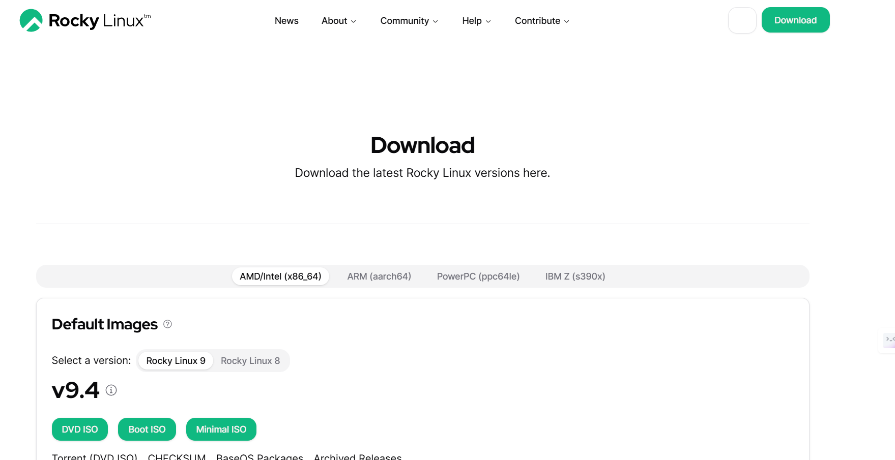{#fig:001 width=70%}

## Выполнение лабораторной работы

После этого мне потребовалось выполнить установку Linux версии Red Hat (64-bit) на виртуальную машину (рис. 2).

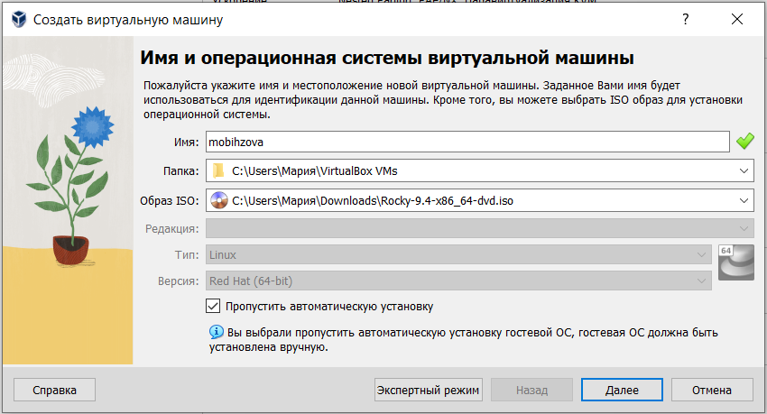{#fig:002 width=70%}

## Выполнение лабораторной работы

Я указала объем объём основной памяти - 2048МБ, а колличество процессоров - 1 (рис. 3).

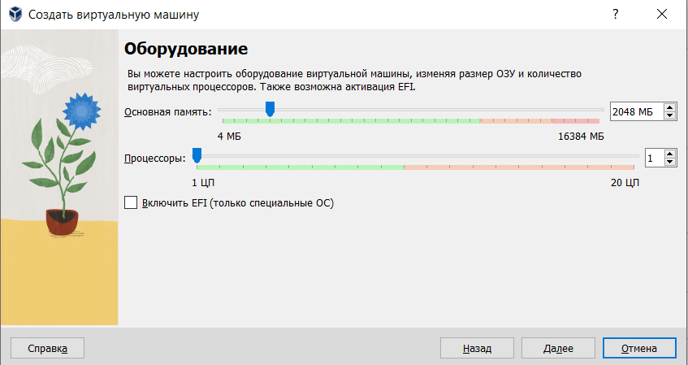{#fig:003 width=70%}

## Выполнение лабораторной работы

В размере виртуального жёсткого диска я поменяла значение на 40,00 Гб (рис. 4).

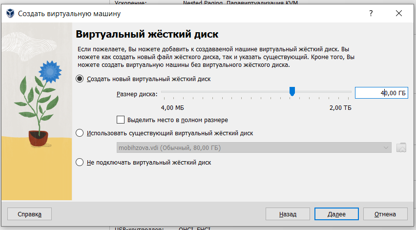{#fig:004 width=70%}

## Выполнение лабораторной работы

После выставления всех требуемых параметров нужно запустить виртуальную машину (рис. 5).

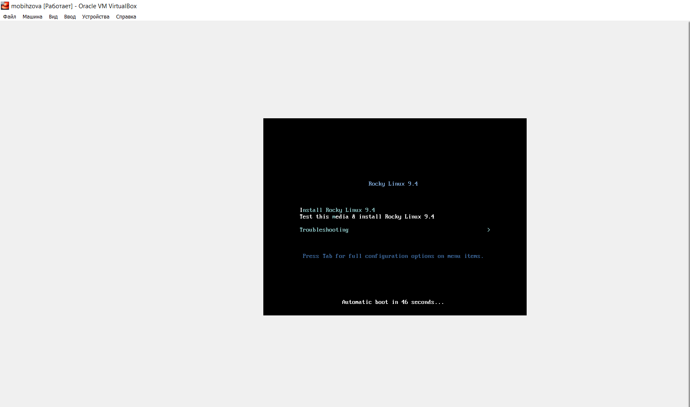{#fig:005 width=40%}

## Выполнение лабораторной работы

Успешно устаналиваем Rocky Linux 9.4 (рис. 6).

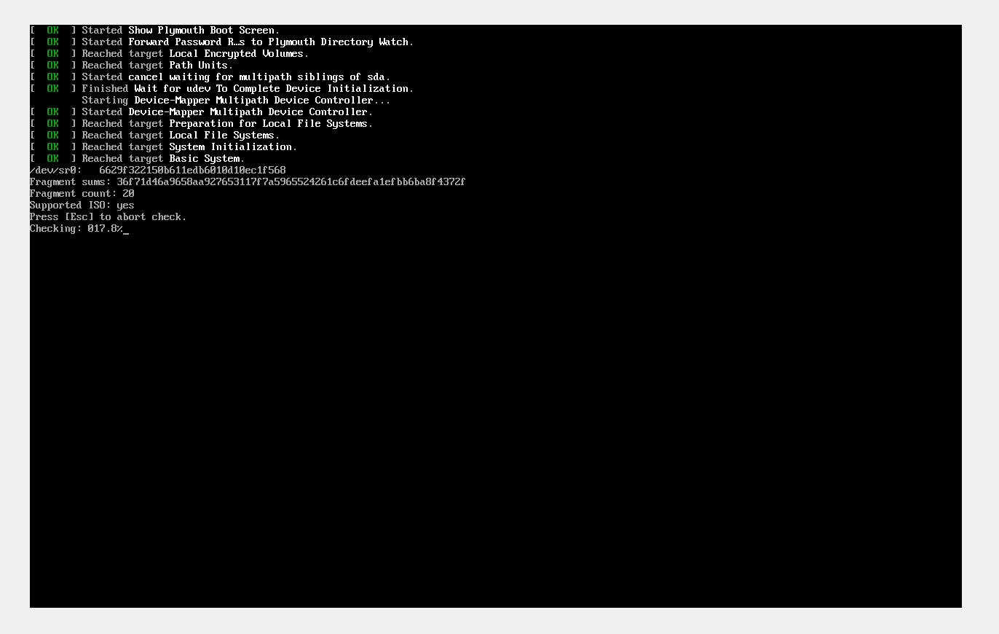{#fig:006 width=40%}

## Выполнение лабораторной работы

После этого я перехожу к настройкам установки операционной системы и выбираю английский язык для интерфейса (рис. 7).

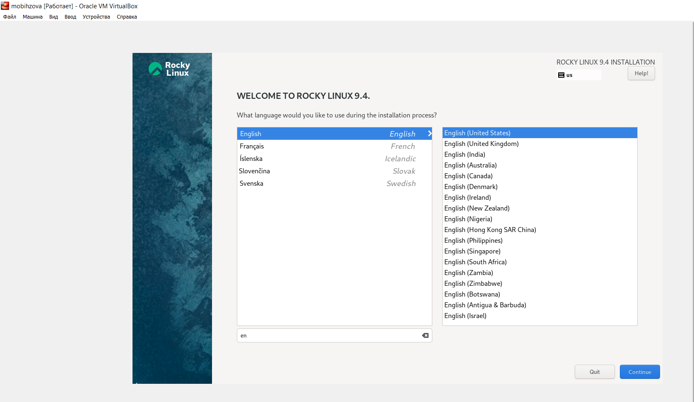{#fig:007 width=40%}

## Выполнение лабораторной работы

При выборе места установки я оставила те параметры, которые были выставлены автоматически (рис. 8).

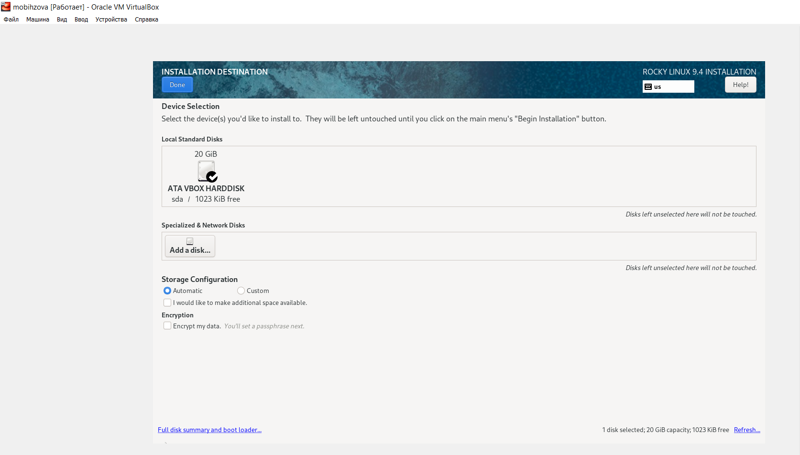{#fig:008 width=50%}

## Выполнение лабораторной работы

После этого я отключила KDUMP (рис. 9).

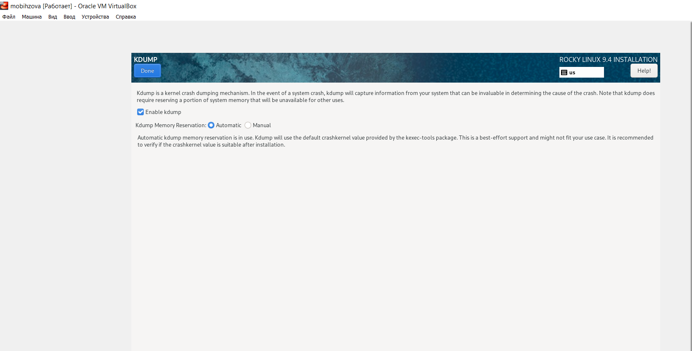{#fig:009 width=70%}

## Выполнение лабораторной работы

Я подключила сетевое соединение и в качестве имени узла указала mobihzova.localdomaim (рис. 10).

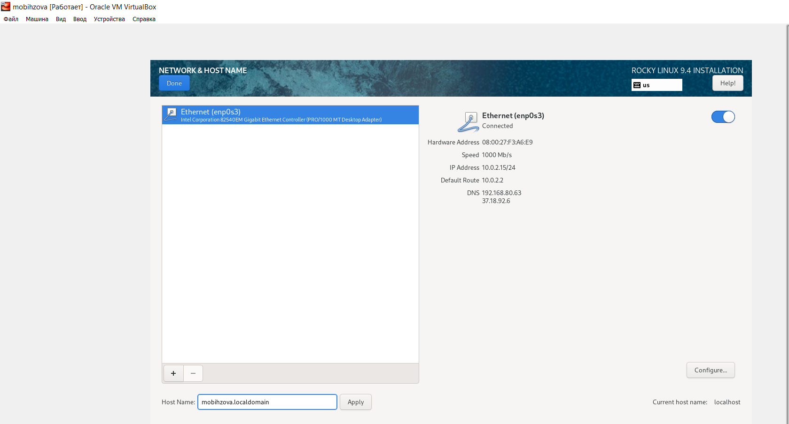{#fig:010 width=70%}

## Выполнение лабораторной работы

Затем я установила пароль для root и пользователя с правами администратора (рис. 11, 12).

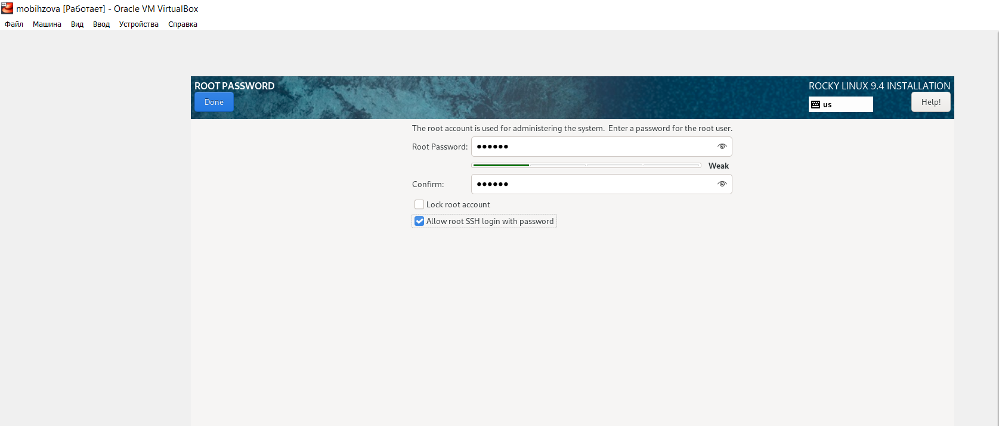{#fig:011 width=70%}

## Выполнение лабораторной работы

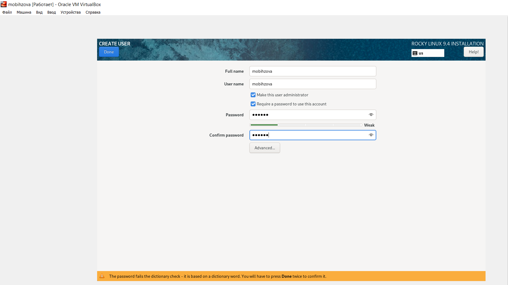{#fig:012 width=70%}

## Выполнение лабораторной работы

После этого я запустила процесс установки ОС (рис. 13).

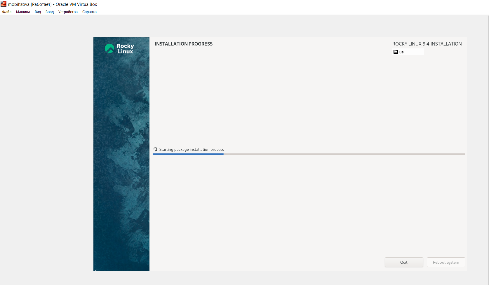{#fig:013 width=70%}

## Выполнение лабораторной работы

Дожидаемся и завершаем установку. После успешной установки я выполнила перезагрузку системы. Последним пунктом нашей лабораторной работы становится подключение образа диска Дополнительной гостевой ОС (рис. 14, 15).

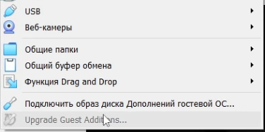{#fig:014 width=50%}

## Выполнение лабораторной работы

{#fig:015 width=70%}

## Домашнее задание

Перед началом выполнения домашнего задания посмотрим вывод команды dmesg (рис. 16).

{#fig:016 width=70%}

## Домашнее задание

1) Версия ядра Linux (Linux version).

Версию ядра можно посмотреть командой dmesg | grep “linux version”. (рис. 17).

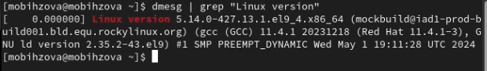{#fig:017 width=70%}

## Домашнее задание

2) Частота процессора (Detected Mhz processor).

Частоту процессора можно посмотреть командой dmesg | grep -I “MHz”. (рис. 18).

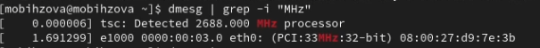{#fig:018 width=70%}

## Домашнее задание

3) Модель процессора (CPU0).

Модель процессора можно посмотреть командой dmesg | grep “CPU0”. (рис. 19).

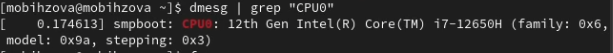{#fig:019 width=70%}

## Домашнее задание

4) Объем доступной оперативной памяти (Memory available).

Объём доступной памяти можно посмотреть командой free -m. (рис. 20).

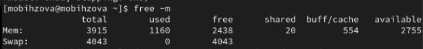{#fig:020 width=70%}

## Домашнее задание

5) Тип обнаруженного гипервизора (Hypervisor detected).

Тип обнаруженного гипервизора можно посмотреть командой dmesg | grep -I “hypervisor detected”. (рис. 21).

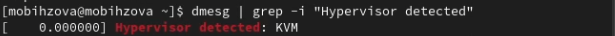{#fig:021 width=70%}

## Домашнее задание

6) Тип файловой системы корневого раздела.

Тип файловой системы корневого раздела можно посмотреть командой dmesg | grep -I “filesystem” (рис. 22).

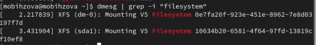{#fig:022 width=70%}

## Домашнее задание

7) Последовательность монтирования файловых систем.

Последовательность монтирования файловых систем можно посмотреть командой dmesg | grep -i “mount”. (рис. 23).

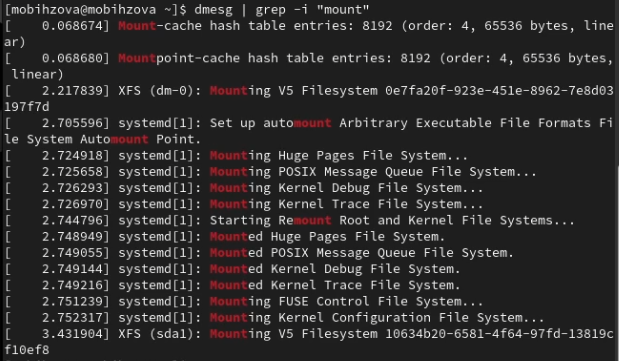{#fig:023 width=40%}

## Выводы

В ходе выполнения лабораторной работы мной были приобретены практические навыки установки операционной системы на виртуальную машину и настройки минимально необходимых для дальнейшей работы сервисов.

## Список литературы{.unnumbered}

1. Кулябов Д.С., Королькова А.В. Основы администрирования операционных систем. Лабораторная работа №1. Установка и конфигурация операционной системы на виртуальную машину. 

