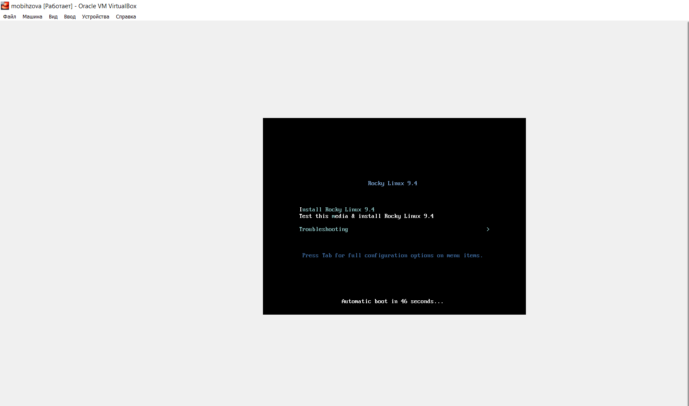

---
## Front matter
title: "Отчёт по лабораторной работе №1"
subtitle: "Дисциплина: Основы администрирования операционных систем"
author: "Бызова Мария Олеговна"

## Generic otions
lang: ru-RU
toc-title: "Содержание"

## Bibliography
bibliography: bib/cite.bib
csl: pandoc/csl/gost-r-7-0-5-2008-numeric.csl

## Pdf output format
toc: true # Table of contents
toc-depth: 2
lof: true # List of figures
lot: true # List of tables
fontsize: 12pt
linestretch: 1.5
papersize: a4
documentclass: scrreprt
## I18n polyglossia
polyglossia-lang:
  name: russian
  options:
	- spelling=modern
	- babelshorthands=true
polyglossia-otherlangs:
  name: english
## I18n babel
babel-lang: russian
babel-otherlangs: english
## Fonts
mainfont: IBM Plex Serif
romanfont: IBM Plex Serif
sansfont: IBM Plex Sans
monofont: IBM Plex Mono
mathfont: STIX Two Math
mainfontoptions: Ligatures=Common,Ligatures=TeX,Scale=0.94
romanfontoptions: Ligatures=Common,Ligatures=TeX,Scale=0.94
sansfontoptions: Ligatures=Common,Ligatures=TeX,Scale=MatchLowercase,Scale=0.94
monofontoptions: Scale=MatchLowercase,Scale=0.94,FakeStretch=0.9
mathfontoptions:
## Biblatex
biblatex: true
biblio-style: "gost-numeric"
biblatexoptions:
  - parentracker=true
  - backend=biber
  - hyperref=auto
  - language=auto
  - autolang=other*
  - citestyle=gost-numeric
## Pandoc-crossref LaTeX customization
figureTitle: "Рис."
tableTitle: "Таблица"
listingTitle: "Листинг"
lofTitle: "Список иллюстраций"
lotTitle: "Список таблиц"
lolTitle: "Листинги"
## Misc options
indent: true
header-includes:
  - \usepackage{indentfirst}
  - \usepackage{float} # keep figures where there are in the text
  - \floatplacement{figure}{H} # keep figures where there are in the text
---

# Цель работы

Целью данной работы является приобретение практических навыков установки операционной системы на виртуальную машину, настройки минимально необходимых для дальнейшей работы сервисов.

# Выполнение лабораторной работы

Перед началом выполнения лабораторной работы, я скачала необходимый дистрибутив Linux Rocky, воспользовавшись сайтом (рис. [-@fig:001]).

{#fig:001 width=70%}

После этого мне потребовалось выполнить установку Linux версии Red Hat (64-bit) на виртуальную машину (рис. [-@fig:002]).

{#fig:002 width=70%}

Я указала объем объём основной памяти - 2048МБ, а колличество процессоров - 1 (рис. [-@fig:003]).

{#fig:003 width=70%}

В размере виртуального жёсткого диска я поменяла значение на 40,00 Гб (рис. [-@fig:004]).

{#fig:004 width=70%}

После выставления всех требуемых параметров нужно запустить виртуальную машину (рис. [-@fig:005]).

{#fig:005 width=70%}

Успешно устаналиваем Rocky Linux 9.4 (рис. [-@fig:006]).

{#fig:006 width=70%}

После этого я перехожу к настройкам установки операционной системы и выбираю английский язык для интерфейса (рис. [-@fig:007]).

{#fig:007 width=70%}

При выборе места установки я оставила те параметры, которые были выставлены автоматически (рис. [-@fig:008]).

{#fig:008 width=70%}

После этого я отключила KDUMP (рис. [-@fig:009]).

{#fig:009 width=70%}

Я подключила сетевое соединение и в качестве имени узла указала mobihzova.localdomaim (рис. [-@fig:010]).

{#fig:010 width=70%}

Затем я установила пароль для root и пользователя с правами администратора (рис. [-@fig:011], [-@fig:012]).

{#fig:011 width=70%}

{#fig:012 width=70%}

После этого я запустила процесс установки ОС (рис. [-@fig:013]).

{#fig:013 width=70%}

Дожидаемся и завершаем установку. После успешной установки я выполнила перезагрузку системы. Последним пунктом нашей лабораторной работы становится подключение образа диска Дополнительной гостевой ОС (рис. [-@fig:014], [-@fig:015]).

{#fig:014 width=70%}

{#fig:015 width=70%}

# Домашнее задание

Перед началом выполнения домашнего задания посмотрим вывод команды dmesg (рис. [-@fig:016]).

{#fig:016 width=70%}

1) Версия ядра Linux (Linux version).

Версию ядра можно посмотреть командой dmesg | grep “linux version”. (рис. [-@fig:017]).

{#fig:017 width=70%}

2) Частота процессора (Detected Mhz processor).

Частоту процессора можно посмотреть командой dmesg | grep -I “MHz”. *рис. [-@fig:018]).

{#fig:018 width=70%}

3) Модель процессора (CPU0).

Модель процессора можно посмотреть командой dmesg | grep “CPU0”. (рис. [-@fig:019]).

{#fig:019 width=70%}

4) Объем доступной оперативной памяти (Memory available).

Объём доступной памяти можно посмотреть командой free -m. (рис. [-@fig:020]).

{#fig:020 width=70%}

5) Тип обнаруженного гипервизора (Hypervisor detected).

Тип обнаруженного гипервизора можно посмотреть командой dmesg | grep -I “hypervisor detected”. (рис. [-@fig:021]).

{#fig:021 width=70%}

6) Тип файловой системы корневого раздела.

Тип файловой системы корневого раздела можно посмотреть командой dmesg | grep -I “filesystem” (рис. [-@fig:022]).

{#fig:022 width=70%}

7) Последовательность монтирования файловых систем.

Последовательность монтирования файловых систем можно посмотреть командой dmesg | grep -i “mount”. (рис. [-@fig:023]).

{#fig:023 width=70%}

# Ответы на контрольные вопросы

1. Содержит информацию об идентификаторе учетной записи пользователя и ее имени, идентификаторе основной группы пользователя и ее названии

2. 

• для получения справки по команде – info "название команды" или
"название команды" --help

• для перемещения по файловой системе – cd "путь"

• для просмотра содержимого каталога – dir либо ls

• для определения объема каталога – du -sh "путь"

• для создания каталога - mkdir "название" для удаления – rmdir "название"
для создания файла touch "название" или cat > "название" для удаления
rm "название"

• для создания каталога с правами mkdir –mode="идентификатор"
"название каталога" для правки прав доступа для файла chmod

• для просмотра истории команд - history

3. Файловая система определяет способ хранения, организации данных/информации на определенных носителях.

{#fig:024 width=70%}

4. dmesg | grep “filesystem”

5. pkill «название процесса»

# Выводы

В ходе выполнения лабораторной работы мной были приобретены практические навыки установки операционной системы на виртуальную машину и настройки минимально необходимых для дальнейшей работы сервисов.

# Список литературы{.unnumbered}

1. Кулябов Д.С., Королькова А.В. Основы администрирования операционных систем. Лабораторная работа №1. Установка и конфигурация операционной системы на виртуальную машину. 
