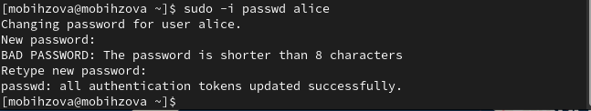

---
## Front matter
lang: ru-RU
title: "Лабораторная работа №2"
subtitle: Основы администрирования операционных систем.
author:
  - Бызова М.О.
institute:
  - Российский университет дружбы народов, Москва, Россия
date: 9 сентября 2024

## i18n babel
babel-lang: russian
babel-otherlangs: english

## Formatting pdf
toc: false
toc-title: Содержание
slide_level: 2
aspectratio: 169
section-titles: true
theme: metropolis
header-includes:
 - \metroset{progressbar=frametitle,sectionpage=progressbar,numbering=fraction}
 
## Fonts 
mainfont: PT Serif 
romanfont: PT Serif 
sansfont: PT Sans 
monofont: PT Mono 
mainfontoptions: Ligatures=TeX 
romanfontoptions: Ligatures=TeX 
sansfontoptions: Ligatures=TeX,Scale=MatchLowercase 
monofontoptions: Scale=MatchLowercase,Scale=0.9 
---

## Цель работы

Целью данной работы является получение представления о работе с учётными записями пользователей и группами пользователей в операционной системе типа Linux.

## Задание 

1. Прочитать справочное описание man по командам ls, whoami, id, groups, su, sudo, passwd, vi, visudo, useradd, usermod, userdel, groupadd, groupdel. Кулябов Д. С., Королькова А. В. Основы администрирования операционных систем
2. Выполнить действия по переключению между учётными записями пользователей, по управлению учётными записями пользователей (раздел 2.4.1).
3. Выполнить действия по созданию пользователей и управлению их учётными записями (раздел 2.4.2).
4. Выполнить действия по работе с группами пользователей (раздел 2.4.3).

## Выполнение лабораторной работы

Я вошла в систему как обычный пользователь и открыла терминал. Определила, какую учётную запись пользователя я использую, введя команду whoami. Я использую учетную запись mobihzova (рис. 1).

{#fig:001 width=70%}

## Выполнение лабораторной работы

Выведем на экран более подробную информацию, используя команду id (UID – id пользователя равный 1000. GID – id группы равный 1000) (рис. 2).

{#fig:002 width=70%}

## Выполнение лабораторной работы

Используем команду su для переключения к учётной записи root. При запросе пароля вводим пароль пользователя root. Наберём id (UID – id пользователя равный 0. GID – id группы равный 0) (рис. 3, рис. 4).

{#fig:003 width=70%}

## Выполнение лабораторной работы

{#fig:004 width=70%}

## Выполнение лабораторной работы

Далее просмотрим в безопасном режиме файл /etc/sudoers.  (рис. 5).

{#fig:005 width=70%}

## Выполнение лабораторной работы

После мы должны убедиться, что в открытом с помощью visudo файле присутствует строка %wheel ALL=(ALL) ALL (данная строка присутствует). (рис. 6).

{#fig:006 width=70%}

## Выполнение лабораторной работы

По закрытии файла создаём пользователя alice, входящего в группу wheel с помощью команды: useradd -G wheel alice (рис. 7).

{#fig:007 width=70%}

## Выполнение лабораторной работы

Нужно убедиться, что пользователь alice добавлен в группу wheel. Для этого введём команду id alice (Groups = 1001(alice),10(wheel)). (рис. 8).

{#fig:008 width=70%}

## Выполнение лабораторной работы

Следующим шагом зададим пароль для пользователя alice, набрав passwd alice. Пароль требуется ввести дважды (рис. 9).

{#fig:009 width=70%}

## Выполнение лабораторной работы

Переключаемся на учётную запись пользователя alice командой: su alice. (рис. 10).

{#fig:010 width=70%}

## Выполнение лабораторной работы

Создаём пользователя bob: sudo useradd bob (рис. 11).

{#fig:011 width=70%}

## Выполнение лабораторной работы

При запросе вводим пароль пользователя. Проверяем, что пользователь bob создан (id bob) и устанавливаем пароль для пользователя: sudo passwd bob (рис. 12).

{#fig:012 width=70%}

## Выполнение лабораторной работы

Посмотрим, в какие группы входит пользователь bob (рис. 13).

{#fig:013 width=70%}

## Выполнение лабораторной работы

Переключимся в терминале на учётную запись пользователя root. Откроем файл конфигурации /etc/login.defs для редактирования (рис. 14).

{#fig:014 width=70%}

## Выполнение лабораторной работы

В файле требуется изменить несколько параметров. Для начала найдём параметр CREATE_HOME и убедимся, что он установлен в значение yes. Теперь установим параметр USERGROUPS_ENAB no. Это позволит не добавлять нового пользователя в группу с тем же именем, что и пользователь, а использовать группу users.(рис. 15).

{#fig:015 width=35%}

## Выполнение лабораторной работы

После закрытия файла перейдём в каталог /etc/skel: cd /etc/skel. В этом каталоге создаём подкаталоги Pictures и Documents: mkdir Pictures Documents (это позволит добавить эти каталоги по умолчанию во все домашние каталоги пользователей). Выполняем проверку создания командой: ls (рис. 16).

{#fig:016 width=70%}

## Выполнение лабораторной работы

Теперь нам нужно изменить содержимое файла .bashrc, добавив строку: export EDITOR=/usr/bin/vim (эта запись означает, что текстовый редактор vim будет установлен по умолчанию для инструментов, которые нуждаются в изменении текстовых файлов) (рис. 17).

{#fig:017 width=40%}

## Выполнение лабораторной работы

Используя утилиту useradd, создаём пользователя carol: useradd carol и установим пароль для пользователя carol: passwd carol. Посмотрим информацию о пользователе carol: id carol (carol находится в группе users). Теперь нам нужно
убедитесь, что каталоги Pictures и Documents были созданы в домашнем каталоге пользователя carol: su carol и ls (рис. 18).

{#fig:018 width=35%}

## Выполнение лабораторной работы

Просмотрим информацию о пользователе carol (рис. 19)

{#fig:019 width=70%}

## Выполнение лабораторной работы

Изменим свойства пароля пользователя carol следующим образом: passwd -n 30 -w 3 -x 90 carol (рис. 20).

{#fig:020 width=70%}

## Выполнение лабораторной работы

Убедимся в изменении в строке с данными о пароле пользователя carol в файле /etc/shadow (рис. 21).

{#fig:021 width=70%}

## Выполнение лабораторной работы

Убедимся, что идентификатор alice существует во всех трёх файлах (рис. 22).

{#fig:022 width=70%}

## Выполнение лабораторной работы

Убедимся, что идентификатор carol существует не во всех трёх файлах (рис. 23).

{#fig:023 width=70%}

## Выполнение лабораторной работы

На данном этапе требуется создать две группы и добавить некоторых пользователей в эти группы. Находясь под учётной записью пользователя root, создаём группы main и third: groupadd main, groupadd third (рис. 24).

{#fig:024 width=70%}

## Выполнение лабораторной работы

Затем используем usermod для добавления пользователей alice и bob в группу main, а carol, dan, dave и david - в группу third (рис. 25).

{#fig:025 width=70%}

## Выполнение лабораторной работы

Убеждаемся, что пользователь carol правильно добавлен в группу third: id carol (пользователю carol должна быть назначена основная группа с идентификатором gid = 100 (users)). Определяем, участниками каких групп являются другие созданные
пользователи (alice и bob входят в группу main. dan, dave, david в группу third) (рис. 26).

{#fig:026 width=70%}

## Выводы

В ходе выполнения лабораторной работы были получены представление о работе с учётными записями пользователей и группами пользователей в операционной системе типа Linux.

## Список литературы{.unnumbered}

1. Робачевский А., Немнюгин С., Стесик О. Операционная система UNIX. — 2-е изд. — БХВ-Петербург, 2010.
2. Колисниченко Д. Н. Самоучитель системного администратора Linux. — СПб. : БХВ-Петербург, 2011. — (Системный администратор).
3. Таненбаум Э., Бос Х. Современные операционные системы. — 4-е изд. — СПб. : Питер, 2015. — (Классика Computer Science).
4. Neil N. J. Learning CentOS: A Beginners Guide to Learning Linux. — CreateSpace Independent Publishing Platform, 2016.
5. Unix и Linux: руководство системного администратора / Э. Немет, Г. Снайдер, Т.Хейн, Б. Уэйли, Д. Макни. — 5-е изд. — СПб. : ООО «Диалектика», 2020.

