---
## Front matter
title: "Отчёт по лабораторной работе №2"
subtitle: "Дисциплина: Основы администрирования операционных систем"
author: "Бызова Мария Олеговна"

## Generic otions
lang: ru-RU
toc-title: "Содержание"

## Bibliography
bibliography: bib/cite.bib
csl: pandoc/csl/gost-r-7-0-5-2008-numeric.csl

## Pdf output format
toc: true # Table of contents
toc-depth: 2
lof: true # List of figures
lot: true # List of tables
fontsize: 12pt
linestretch: 1.5
papersize: a4
documentclass: scrreprt
## I18n polyglossia
polyglossia-lang:
  name: russian
  options:
	- spelling=modern
	- babelshorthands=true
polyglossia-otherlangs:
  name: english
## I18n babel
babel-lang: russian
babel-otherlangs: english
## Fonts
mainfont: IBM Plex Serif
romanfont: IBM Plex Serif
sansfont: IBM Plex Sans
monofont: IBM Plex Mono
mathfont: STIX Two Math
mainfontoptions: Ligatures=Common,Ligatures=TeX,Scale=0.94
romanfontoptions: Ligatures=Common,Ligatures=TeX,Scale=0.94
sansfontoptions: Ligatures=Common,Ligatures=TeX,Scale=MatchLowercase,Scale=0.94
monofontoptions: Scale=MatchLowercase,Scale=0.94,FakeStretch=0.9
mathfontoptions:
## Biblatex
biblatex: true
biblio-style: "gost-numeric"
biblatexoptions:
  - parentracker=true
  - backend=biber
  - hyperref=auto
  - language=auto
  - autolang=other*
  - citestyle=gost-numeric
## Pandoc-crossref LaTeX customization
figureTitle: "Рис."
tableTitle: "Таблица"
listingTitle: "Листинг"
lofTitle: "Список иллюстраций"
lotTitle: "Список таблиц"
lolTitle: "Листинги"
## Misc options
indent: true
header-includes:
  - \usepackage{indentfirst}
  - \usepackage{float} # keep figures where there are in the text
  - \floatplacement{figure}{H} # keep figures where there are in the text
---

# Цель работы

Целью данной работы является получение представления о работе с учётными записями пользователей и группами пользователей в операционной системе типа Linux.

# Задание 

1. Прочитать справочное описание man по командам ls, whoami, id, groups, su, sudo, passwd, vi, visudo, useradd, usermod, userdel, groupadd, groupdel. Кулябов Д. С., Королькова А. В. Основы администрирования операционных систем
2. Выполнить действия по переключению между учётными записями пользователей, по управлению учётными записями пользователей (раздел 2.4.1).
3. Выполнить действия по созданию пользователей и управлению их учётными записями (раздел 2.4.2).
4. Выполнить действия по работе с группами пользователей (раздел 2.4.3).

# Выполнение лабораторной работы

## Переключение учётных записей пользователей

Я вошла в систему как обычный пользователь и открыла терминал. Определила, какую учётную запись пользователя я использую, введя команду whoami. Я использую учетную запись mobihzova (рис. [-@fig:001]).

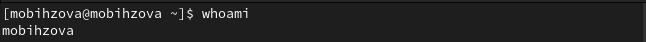{#fig:001 width=70%}

Выведем на экран более подробную информацию, используя команду id (UID – id пользователя равный 1000. GID – id группы равный 1000) (рис. [-@fig:002]).

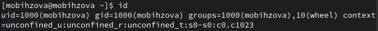{#fig:002 width=70%}

Используем команду su для переключения к учётной записи root. При запросе пароля вводим пароль пользователя root. Наберём id (UID – id пользователя равный 0. GID – id группы равный 0) (рис. [-@fig:003], рис. [-@fig:004].).

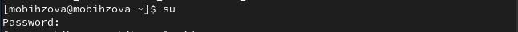{#fig:003 width=70%}

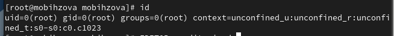{#fig:004 width=70%}

Далее просмотрим в безопасном режиме файл /etc/sudoers. Редактирование файла /etc/sudoers обычным редактором опасно из-за возможных синтаксических ошибок и проблем с правами доступа и т.д. Использование visudo является единственным безопасным способом редактирования /etc/sudoers, так как оно обеспечивает проверку синтаксиса, временную блокировку файла и возможность отмены изменений. Это гарантирует корректность конфигурации и предотвращает блокировку доступа к системе (рис. [-@fig:005]).

{#fig:005 width=70%}

После мы должны убедиться, что в открытом с помощью visudo файле присутствует строка %wheel ALL=(ALL) ALL (данная строка присутствует). Строка %wheel ALL=(ALL) ALL в файле /etc/sudoers означает, что все пользователи, входящие в группу wheel, могут выполнять любые команды от имени любого пользователя без пароля. Группа wheel обычно используется для предоставления административных привилегий пользователям (рис. [-@fig:006]).

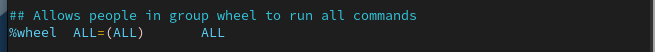{#fig:006 width=70%}

По закрытии файла создаём пользователя alice, входящего в группу wheel с помощью команды: useradd -G wheel alice (рис. [-@fig:007]).

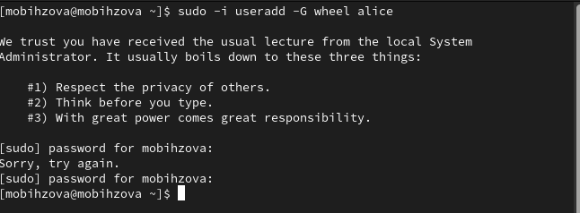{#fig:007 width=70%}

Нужно убедиться, что пользователь alice добавлен в группу wheel. Для этого введём команду id alice (Groups = 1001(alice),10(wheel)). (рис. [-@fig:008]).

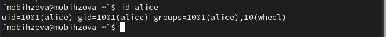{#fig:008 width=70%}

Следующим шагом зададим пароль для пользователя alice, набрав passwd alice. Пароль требуется ввести дважды (рис. [-@fig:009]).

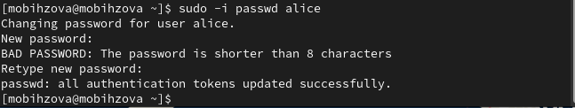{#fig:009 width=70%}

Переключаемся на учётную запись пользователя alice командой: su alice. (рис. [-@fig:010]).

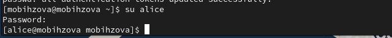{#fig:010 width=70%}

Создаём пользователя bob: sudo useradd bob (рис. [-@fig:011]).

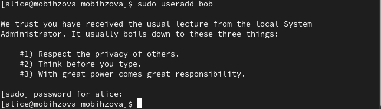{#fig:011 width=70%}

При запросе вводим пароль пользователя. Проверяем, что пользователь bob создан (id bob) и устанавливаем пароль для пользователя: sudo passwd bob (рис. [-@fig:012]).

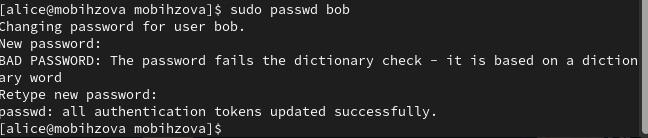{#fig:012 width=70%}

Посмотрим, в какие группы входит пользователь bob (рис. [-@fig:013]).

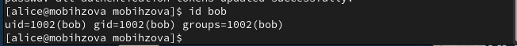{#fig:013 width=70%}

## Создание учётных записей пользователей

Переключимся в терминале на учётную запись пользователя root. Откроем файл конфигурации /etc/login.defs для редактирования (рис. [-@fig:014]).

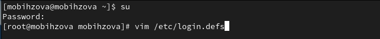{#fig:014 width=70%}

В файле требуется изменить несколько параметров. Для начала найдём параметр CREATE_HOME и убедимся, что он установлен в значение yes. Теперь установим параметр USERGROUPS_ENAB no. Это позволит не добавлять нового пользователя в группу с тем же именем, что и пользователь, а использовать группу users.(рис. [-@fig:015]).

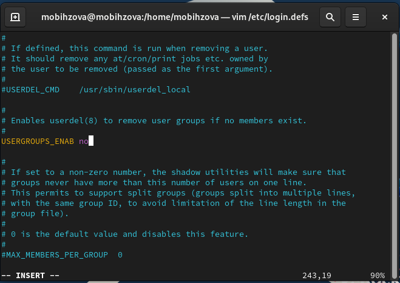{#fig:015 width=70%}

После закрытия файла перейдём в каталог /etc/skel: cd /etc/skel. В этом каталоге создаём подкаталоги Pictures и Documents: mkdir Pictures Documents (это позволит добавить эти каталоги по умолчанию во все домашние каталоги пользователей). Выполняем проверку создания командой: ls (рис. [-@fig:016]).

{#fig:016 width=70%}

Теперь нам нужно изменить содержимое файла .bashrc, добавив строку: export EDITOR=/usr/bin/vim (эта запись означает, что текстовый редактор vim будет установлен по умолчанию для инструментов, которые нуждаются в изменении текстовых файлов) (рис. [-@fig:017]).

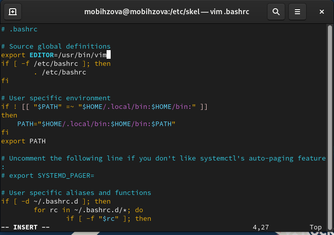{#fig:017 width=70%}

Используя утилиту useradd, создаём пользователя carol: useradd carol и установим пароль для пользователя carol: passwd carol. Посмотрим информацию о пользователе carol: id carol (carol находится в группе users). Теперь нам нужно
убедитесь, что каталоги Pictures и Documents были созданы в домашнем каталоге пользователя carol: su carol и ls (рис. [-@fig:018]).

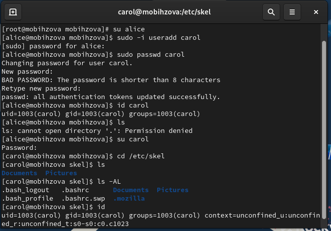{#fig:018 width=70%}

Строка записи о пароле пользователя carol в файле /etc/shadow содержит следующую информацию:

1. carol6$1Rg5xrOUXJASSr1s$ey j spMO34dMP2qMIPKc1za061HZA.LaSWBEA1b2kVn1Na27F2SyQmqDBeqIfNISKXMnsplYOVgLDNgNHhJ7r01: Это зашифрованный пароль пользователя и имя пользователя. 
2. 19974: Количество дней с 1 января 1970 года, когда пароль был изменён в последний раз.
3. 0: Количество дней до того, как пароль может быть изменён. Это поле позволяет системным администраторам использовать более строгую политику паролей, когда невозможно сразу вернуться к исходному паролю при его изменении. Обычно это поле устанавливается в значение 0.
4. 99999: Количество дней, которое может пройти, прежде чем пароль станет недействительным. Это поле содержит макси-
мальный срок действия пароля. По умолчанию установлено 99999 (около 273 лет).
5. 7: За сколько дней до истечения срока действия пароля пользователь получает предупреждение. Это поле используется для предупреждения пользователя о сроке, когда происходит принудительное изменение пароля. По умолчанию установлено значение 
6. ::: Дополнительная информация о пароле. В данном случае она отсутствует (рис. [-@fig:019]).

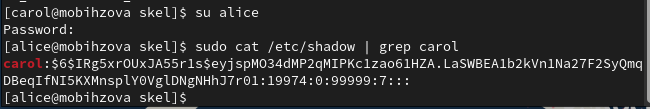{#fig:019 width=70%}

Изменим свойства пароля пользователя carol следующим образом: passwd -n 30 -w 3 -x 90 carol (в этой записи срок действия пароля истекает через 90 дней (-x 90). За три дня до истечения срока действия пользователь получит предупреждение (-w 3). Пароль должен использоваться как минимум за 30 дней (-n 30) до того, как его можно будет изменить) (рис. [-@fig:020]).

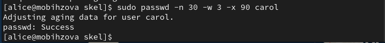{#fig:020 width=70%}

Убедимся в изменении в строке с данными о пароле пользователя carol в файле /etc/shadow (рис. [-@fig:021]).

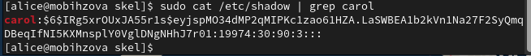{#fig:021 width=70%}

Убедимся, что идентификатор alice существует во всех трёх файлах (рис. [-@fig:022]).

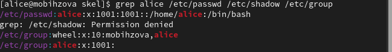{#fig:022 width=70%}

Убедимся, что идентификатор carol существует не во всех трёх файлах (рис. [-@fig:023]).

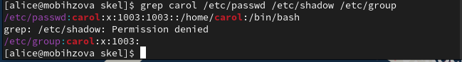{#fig:023 width=70%}

## Работа с группами

На данном этапе требуется создать две группы и добавить некоторых пользователей в эти группы. Находясь под учётной записью пользователя root, создаём группы main и third: groupadd main, groupadd third (рис. [-@fig:024]).

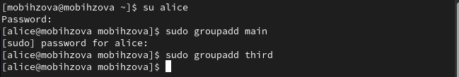{#fig:024 width=70%}

Затем используем usermod для добавления пользователей alice и bob в группу main, а carol, dan, dave и david - в группу third (рис. [-@fig:025]).

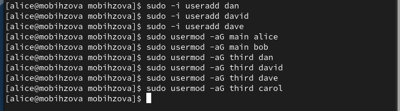{#fig:025 width=70%}

Убеждаемся, что пользователь carol правильно добавлен в группу third: id carol (пользователю carol должна быть назначена основная группа с идентификатором gid = 100 (users)). Определяем, участниками каких групп являются другие созданные
пользователи (alice и bob входят в группу main. dan, dave, david в группу third) (рис. [-@fig:026]).

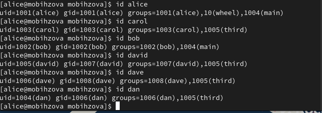{#fig:026 width=70%}

# Ответы на контрольные вопросы

1. При помощи какой команды можно получить информацию о номере, назначенном пользователю Linux, о группах, в которые включён пользователь? id.

{#fig:027 width=70%}

2. Какой UID имеет пользователь root? UID=0. Самый простой способ посмотреть идентификатор текущего пользователя - использовать команду id, она выводит не только сам UID, но и идентификатор группы пользователя, а также основные группы этого пользователя. Есть ещё несколько способов посмотреть id. Например, для текущего пользователя его можно найти в переменной окружения UID при помощи команды echo $UID. Ещё один вариант - утилита getent: getent passwd имя_пользователя. Или смотрим содержимое файла /etc/passwd с помощью команды grep: grep имя_пользователя /etc/passwd. Здесь первый цифровой параметр - это сам id, а второй, который расположен за двоеточием, - это GID.

{#fig:028 width=70%}

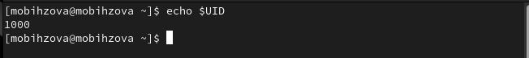{#fig:029 width=70%}

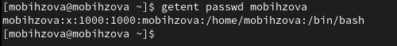{#fig:030 width=70%}

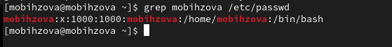{#fig:031 width=70%}

3. В чём состоит различие между командами su и sudo? Основное различие между ними заключается в пароле, который им требуется: в то время как "sudo" требует пароля текущего пользователя, "su" требует ввода пароля пользователя root. Совершенно очевидно, что "sudo" является лучшей альтернативой между ними с точки зрения безопасности.

4. В каком конфигурационном файле определяются параметры sudo? /etc/sudoers.

5. Какую команду следует использовать для безопасного изменения конфигурации sudo? Visudo.

6. Если вы хотите предоставить пользователю доступ ко всем командам администратора через sudo, членом какой группы он должен быть? Admin.

7. Какие файлы/каталоги можно использовать для определения параметров, которые будут использоваться при создании учётных записей пользователей? /etc/login.defs и /etc/default/useradd. Например, в ходе данной лабораторной работы при работе с файлом /etc/login.defs мы установили параметр USERGROUPS_ENAB на no. Это позволит не добавлять нового пользователя в группу с тем же именем, что и польователь, а использовать группу users.

8. Где хранится информация о первичной и дополнительных группах пользователей ОС типа Linux? Информация о пользователях и группах храниться в четырех файлах /etc/passwd, /etc/shadow, /etc/group, /etc/gshadow.

{#fig:032 width=70%}

Благодаря данным записям, мы можем узнать, в какие первичные и дополнительные группы входит пользователь alice (Groups = 1001(alice),10(wheel)).

9. Какие команды вы можете использовать для изменения информации о пароле пользователя (например о сроке действия пароля)? passwd и gpasswd.

{#fig:033 width=70%}

10. Какую команду следует использовать для прямого изменения информации в файле /etc/group и почему? emacs /etc/group или vim /etc/group. vigr 

Почему мы не можем просто отредактировать их с помощью текстового редактора, такого как Vi или nano, и покончить с этим? Файл /etc/passwd в настоящее время редактируется пользователем root с помощью Vi или некоторых других текстовых редакторов. В то же время другой пользователь пытается изменить свой пароль, пока пользователь root редактирует файл /etc/passwd. Таким образом, изменение пароля в этом файле может не обновляться, и пользователь может не иметь возможности войти в систему. Именно в таком случае команды vipw и vigr приходят на помощь. Команды vipw и vigr используются для безопасного редактирования файлов /etc/passwd и /etc/group в системах Linux. Они будут устанавливать соответствующие блокировки при редактировании файлов /etc/passwd и /etc/group, чтобы другие пользователи не могли вносить в них изменения и избежать повреждения файлов. Когда вы запускаете эти команды с флагом -s, они будут редактировать shadow версии этих файлов, то есть /etc/shadow и /etc/gshadow соответственно. Чтобы безопасно отредактировать файл /etc/group, запустите: sudo vigr. Теперь команды vipw и vigr заблокируют файлы /etc/passwd и /etc/group и не позволят другим пользователям вносить какие-либо изменения. Чтобы убедиться в этом, откройте два окна терминала. Запустите «sudo vipw» в одном окне и попробуйте изменить пароль пользователя в другом окне. Пароль не будет обновлен, пока вы не закроете команду vipw. Поэтому другие пользователи не cмогут случайно или намеренно внсти какие-либо изменения в файл /etc/passwd, пока вы редактируете их от пользователя root. После закрытия /etc/passwd пароль будет успешно обновлен.

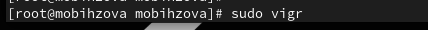{#fig:034 width=70%}

# Выводы

В ходе выполнения лабораторной работы были получены представление о работе с учётными записями пользователей и группами пользователей в операционной системе типа Linux.

# Список литературы{.unnumbered}

1. Робачевский А., Немнюгин С., Стесик О. Операционная система UNIX. — 2-е изд. — БХВ-Петербург, 2010.
2. Колисниченко Д. Н. Самоучитель системного администратора Linux. — СПб. : БХВ-Петербург, 2011. — (Системный администратор).
3. Таненбаум Э., Бос Х. Современные операционные системы. — 4-е изд. — СПб. : Питер, 2015. — (Классика Computer Science).
4. Neil N. J. Learning CentOS: A Beginners Guide to Learning Linux. — CreateSpace Independent Publishing Platform, 2016.
5. Unix и Linux: руководство системного администратора / Э. Немет, Г. Снайдер, Т.Хейн, Б. Уэйли, Д. Макни. — 5-е изд. — СПб. : ООО «Диалектика», 2020.
