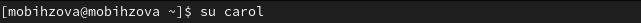

---
## Front matter
lang: ru-RU
title: "Лабораторная работа №3"
subtitle: Основы администрирования операционных систем.
author:
  - Бызова М.О.
institute:
  - Российский университет дружбы народов, Москва, Россия
date: 9 сентября 2024

## i18n babel
babel-lang: russian
babel-otherlangs: english

## Formatting pdf
toc: false
toc-title: Содержание
slide_level: 2
aspectratio: 169
section-titles: true
theme: metropolis
header-includes:
 - \metroset{progressbar=frametitle,sectionpage=progressbar,numbering=fraction}
 
## Fonts 
mainfont: PT Serif 
romanfont: PT Serif 
sansfont: PT Sans 
monofont: PT Mono 
mainfontoptions: Ligatures=TeX 
romanfontoptions: Ligatures=TeX 
sansfontoptions: Ligatures=TeX,Scale=MatchLowercase 
monofontoptions: Scale=MatchLowercase,Scale=0.9 
---

## Цель работы

Целью данной работы является получение навыков настройки базовых и специальных прав доступа для групп пользователей в операционной системе типа Linux.

## Задание

1. Прочитайте справочное описание man по командам chgrp, chmod, getfacl, setfacl.
2. Выполните действия по управлению базовыми разрешениями для групп пользователей (раздел 3.3.1).
3. Выполните действия по управлению специальными разрешениями для групп пользователей (раздел 3.3.2).
4. Выполните действия по управлению расширенными разрешениями с использованием списков ACL для групп пользователей (раздел 3.3.3).

## Выполнение лабораторной работы

Открываем терминал с учётной записью root: su - (рис. 1).

{#fig:001 width=70%}

## Выполнение лабораторной работы

В корневом каталоге создаём каталоги /data/main и /data/third командой: mkdir -p /data/main /data/third. (рис. 2).

{#fig:002 width=70%}

## Выполнение лабораторной работы

Посмотрим, кто является владельцем этих каталогов. Для этого используем: ls -Al /data. Владельцем каталогов является суперпользователь. (рис. 3).

{#fig:003 width=70%}

## Выполнение лабораторной работы

Прежде чем устанавливать разрешения, изменим владельцев этих каталогов с root на main и third соответственно: chgrp main /data/main и chgrp third /data/third. Теперь владельцем этих каталогов является main и third. (рис. 4).

{#fig:004 width=70%}

## Выполнение лабораторной работы

Далее установим разрешения, позволяющие владельцам каталогов записывать файлы в эти каталоги и запрещающие доступ к содержимому каталогов всем другим пользователям и группам: chmod 770 /data/main и chmod 770 /data/third. После этого проверим права доступа. (рис. 5).

{#fig:005 width=70%}

## Выполнение лабораторной работы

В другом терминале перейдём под учётную запись пользователя bob: su - bob (рис. 6).

{#fig:006 width=70%}

## Выполнение лабораторной работы

Под пользователем bob попробуем перейти в каталог /data/main и создать файл emptyfile в этом каталоге: cd /data/main и touch emptyfile. Так как пользователь bob является владельцем каталога main, нам удалось перейти в этот каталог и создать в нём новый файл. (рис. 7).

{#fig:007 width=70%}

## Выполнение лабораторной работы

Теперь под пользователем bob попробуем перейти в каталог /data/third и создать файл emptyfile в этом каталоге. Так как пользователь bob не является владельцем каталога third, нам не удалось перейти в этот каталог и создать в нём новый файл (рис. 8).

{#fig:008 width=70%}

## Выполнение лабораторной работы

Откроем новый терминал под пользователем alice: su - alice (рис. 9).

{#fig:009 width=70%}

## Выполнение лабораторной работы

Перейдём в каталог /data/main: cd /data/main (рис. 10).

{#fig:010 width=70%}

## Выполнение лабораторной работы

В нём создадим два файла, владельцем которых является alice: touch alice1 и touch alice2 (рис. 11).

{#fig:011 width=70%}

## Выполнение лабораторной работы

В другом терминале, под учётной записью пользователя bob (пользователь bob является членом группы main, как и alice) (рис. 12).

{#fig:012 width=70%}

## Выполнение лабораторной работы

Перейдём в каталог /data/main: cd/data/main (данный каталог уже был открыт в нашем терминале) и в этом каталоге введём: ls. Мы увидим два файла, созданные пользователем alice. Теперь попробуем удалить файлы, принадлежащие пользователю alice командой: rm -f alice*. Убедимся, что файлы будут удалены пользователем bob (рис. 13).

{#fig:013 width=70%}

## Выполнение лабораторной работы

После проверки командой ls создадим два файла, которые принадлежат пользователю bob: touch bob1 и touch bob2 (рис. 14).

{#fig:014 width=70%}

## Выполнение лабораторной работы

В терминале под пользователем root установим для каталога /data/main бит идентификатор группы, а также stiky-бит для разделяемого (общего) каталога группы: chmod g+s,o+t /data/main (рис. 15).

{#fig:015 width=70%}

## Выполнение лабораторной работы

Переходим в терминал под пользователем alice и создаём в каталоге /data/main файлы alice3 и alice4: touch alice3 и touch alice4. Теперь мы должны увидеть, что два созданных вами файла принадлежат группе main, которая является группой-владельцем каталога /data/main: ls и ls -Al /data (рис. 16).

{#fig:016 width=70%}

## Выполнение лабораторной работы

В этом же терминале попробуем удалить файлы, принадлежащие пользователю bob: rm -rf bob*. Убедимся, что sticky-bit предотвратит удаление этих файлов пользователем alice, поскольку этот пользователь не является владельцем этих файлов (Operation not permitted) (рис. 17).

{#fig:017 width=70%}

## Выполнение лабораторной работы

Откроем терминал с учётной записью root (рис. 18).

{#fig:018 width=70%}

## Выполнение лабораторной работы

Установим права на чтение и выполнение в каталоге /data/main для группы third и права на чтение и выполнение для группы main в каталоге /data/third: setfacl -m g:third:rx /data/main и setfacl -m g:main:rx /data/third (рис. 19).

{#fig:019 width=70%}

## Выполнение лабораторной работы

Теперь используем команду getfacl, чтобы убедиться в правильности установки разрешений: getfacl /data/main и getfacl /data/third (рис. 20).

{#fig:020 width=40%}

## Выполнение лабораторной работы

Далее создадим новый файл с именем newfile1 в каталоге /data/main: touch /data/main/newfile1. Используем getfacl /data main/newfile1 для проверки текущих назначений полномочий. У пользователя только чтение и запись, у группы и других только чтение (рис. 21).

{#fig:021 width=70%}

## Выполнение лабораторной работы

Выполним аналогичные действия для каталога /data/third. Видим, что ситуация аналогичная (рис. 22).

{#fig:022 width=70%}

## Выполнение лабораторной работы

Установим ACL по умолчанию для каталога /data/main: setfacl -md:g:third:rwx /data/main и для каталога /data/third: setfacl -m d:g:main:rwx /data/third. (рис. 23, рис. 24).

{#fig:023 width=70%}

## Выполнение лабораторной работы

{#fig:024 width=70%}

## Выполнение лабораторной работы

Убедимся, что настройки ACL работают, добавив новый файл в каталог /data/main: touch /data/main/newfile2. Используем getfacl /data/main/newfile2 для проверки текущих назначений полномочий. (рис. 25).

{#fig:025 width=70%}

## Выполнение лабораторной работы

Выполним аналогичные действия для каталога /data/third (рис. 26).

{#fig:026 width=70%}

## Выполнение лабораторной работы

Для проверки полномочий группы third в каталоге /data/third войдём в другом терминале под учётной записью члена группы third: su – carol (рис. 27).

{#fig:027 width=70%}

## Выполнение лабораторной работы

Проверим операции с файлами: rm /data/main/newfile1 и rm /data/main/newfile2. Система не даёт удалить данные файлы (рис. 28).

{#fig:028 width=70%}

## Выполнение лабораторной работы

Теперь проверим, возможно ли осуществить запись в файл. В файл newfile1 запись осуществить не получилось, а вот в newfile2 всё выполнилось (рис. 29).

{#fig:029 width=70%}

## Выводы

В ходе выполнения лабораторной работы были получены навыкы настройки базовых и специальных прав доступа для групп пользователей в операционной системе типа Linux.

## Список литературы{.unnumbered}

1. Робачевский А., Немнюгин С., Стесик О. Операционная система UNIX. — 2-е изд. — БХВ-Петербург, 2010.
2. Колисниченко Д. Н. Самоучитель системного администратора Linux. — СПб. : БХВ-Петербург, 2011. — (Системный администратор).
3. Таненбаум Э., Бос Х. Современные операционные системы. — 4-е изд. — СПб. : Питер, 2015. — (Классика Computer Science).
4. Neil N. J. Learning CentOS: A Beginners Guide to Learning Linux. — CreateSpace Independent Publishing Platform, 2016.
5. Unix и Linux: руководство системного администратора / Э. Немет, Г. Снайдер, Т.Хейн, Б. Уэйли, Д. Макни. — 5-е изд. — СПб. : ООО «Диалектика», 2020.

