---
## Front matter
title: "Отчёт по лабораторной работе №3"
subtitle: "Основы администрирования операционных сетей"
author: "Бызова Мария Олеговна"

## Generic otions
lang: ru-RU
toc-title: "Содержание"

## Bibliography
bibliography: bib/cite.bib
csl: pandoc/csl/gost-r-7-0-5-2008-numeric.csl

## Pdf output format
toc: true # Table of contents
toc-depth: 2
lof: true # List of figures
lot: true # List of tables
fontsize: 12pt
linestretch: 1.5
papersize: a4
documentclass: scrreprt
## I18n polyglossia
polyglossia-lang:
  name: russian
  options:
	- spelling=modern
	- babelshorthands=true
polyglossia-otherlangs:
  name: english
## I18n babel
babel-lang: russian
babel-otherlangs: english
## Fonts
mainfont: IBM Plex Serif
romanfont: IBM Plex Serif
sansfont: IBM Plex Sans
monofont: IBM Plex Mono
mathfont: STIX Two Math
mainfontoptions: Ligatures=Common,Ligatures=TeX,Scale=0.94
romanfontoptions: Ligatures=Common,Ligatures=TeX,Scale=0.94
sansfontoptions: Ligatures=Common,Ligatures=TeX,Scale=MatchLowercase,Scale=0.94
monofontoptions: Scale=MatchLowercase,Scale=0.94,FakeStretch=0.9
mathfontoptions:
## Biblatex
biblatex: true
biblio-style: "gost-numeric"
biblatexoptions:
  - parentracker=true
  - backend=biber
  - hyperref=auto
  - language=auto
  - autolang=other*
  - citestyle=gost-numeric
## Pandoc-crossref LaTeX customization
figureTitle: "Рис."
tableTitle: "Таблица"
listingTitle: "Листинг"
lofTitle: "Список иллюстраций"
lotTitle: "Список таблиц"
lolTitle: "Листинги"
## Misc options
indent: true
header-includes:
  - \usepackage{indentfirst}
  - \usepackage{float} # keep figures where there are in the text
  - \floatplacement{figure}{H} # keep figures where there are in the text
---

# Цель работы

Целью данной работы является получение навыков настройки базовых и специальных прав доступа для групп пользователей в операционной системе типа Linux.

# Задание

1. Прочитайте справочное описание man по командам chgrp, chmod, getfacl, setfacl.
2. Выполните действия по управлению базовыми разрешениями для групп пользователей (раздел 3.3.1).
3. Выполните действия по управлению специальными разрешениями для групп пользователей (раздел 3.3.2).
4. Выполните действия по управлению расширенными разрешениями с использованием списков ACL для групп пользователей (раздел 3.3.3).

# Выполнение лабораторной работы

## Управление базовыми разрешениями

Открываем терминал с учётной записью root: su - (рис. [-@fig:001]).

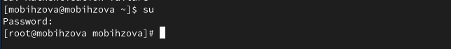{#fig:001 width=70%}

В корневом каталоге создаём каталоги /data/main и /data/third командой: mkdir -p /data/main /data/third. (рис. [-@fig:002]).

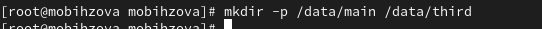{#fig:002 width=70%}

Посмотрим, кто является владельцем этих каталогов. Для этого используем: ls -Al /data. Владельцем каталогов является суперпользователь. (рис. [-@fig:003]).

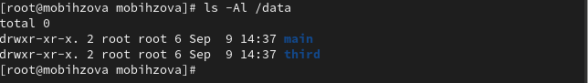{#fig:003 width=70%}

Прежде чем устанавливать разрешения, изменим владельцев этих каталогов с root на main и third соответственно: chgrp main /data/main и chgrp third /data/third. Теперь владельцем этих каталогов является main и third. (рис. [-@fig:004]).

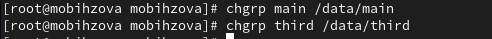{#fig:004 width=70%}

Далее установим разрешения, позволяющие владельцам каталогов записывать файлы в эти каталоги и запрещающие доступ к содержимому каталогов всем другим пользователям и группам: chmod 770 /data/main и chmod 770 /data/third. После этого проверим права доступа. (рис. [-@fig:005]).

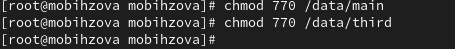{#fig:005 width=70%}

В другом терминале перейдём под учётную запись пользователя bob: su - bob (рис. [-@fig:006]).

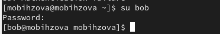{#fig:006 width=70%}

Под пользователем bob попробуем перейти в каталог /data/main и создать файл emptyfile в этом каталоге: cd /data/main и touch emptyfile. Так как пользователь bob является владельцем каталога main, нам удалось перейти в этот каталог и создать в нём новый файл. (рис. [-@fig:007]).

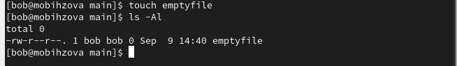{#fig:007 width=70%}

Теперь под пользователем bob попробуем перейти в каталог /data/third и создать файл emptyfile в этом каталоге. Так как пользователь bob не является владельцем каталога third, нам не удалось перейти в этот каталог и создать в нём новый файл (рис. [-@fig:008]).

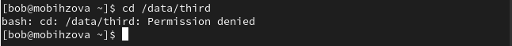{#fig:008 width=70%}

## Управление специальными разрешениями

Откроем новый терминал под пользователем alice: su - alice (рис. [-@fig:009]).

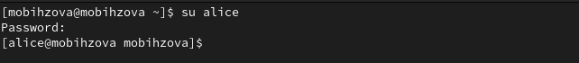{#fig:009 width=70%}

Перейдём в каталог /data/main: cd /data/main (рис. [-@fig:010]).

{#fig:010 width=70%}

В нём создадим два файла, владельцем которых является alice: touch alice1 и touch alice2 (рис. [-@fig:011]).

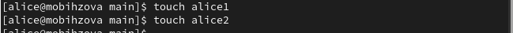{#fig:011 width=70%}

В другом терминале, под учётной записью пользователя bob (пользователь bob является членом группы main, как и alice) (рис. [-@fig:012]).

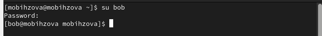{#fig:012 width=70%}

Перейдём в каталог /data/main: cd/data/main (данный каталог уже был открыт в нашем терминале) и в этом каталоге введём: ls. Мы увидим два файла, созданные пользователем alice. Теперь попробуем удалить файлы, принадлежащие пользователю alice командой: rm -f alice*. Убедимся, что файлы будут удалены пользователем bob (рис. [-@fig:013]).

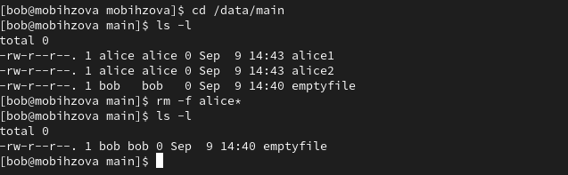{#fig:013 width=70%}

После проверки командой ls создадим два файла, которые принадлежат пользователю bob: touch bob1 и touch bob2 (рис. [-@fig:014]).

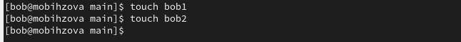{#fig:014 width=70%}

В терминале под пользователем root установим для каталога /data/main бит идентификатор группы, а также stiky-бит для разделяемого (общего) каталога группы: chmod g+s,o+t /data/main (рис. [-@fig:015]).

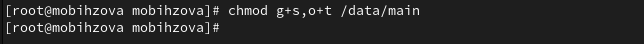{#fig:015 width=70%}

Переходим в терминал под пользователем alice и создаём в каталоге /data/main файлы alice3 и alice4: touch alice3 и touch alice4. Теперь мы должны увидеть, что два созданных вами файла принадлежат группе main, которая является группой-владельцем каталога /data/main: ls и ls -Al /data (рис. [-@fig:016]).

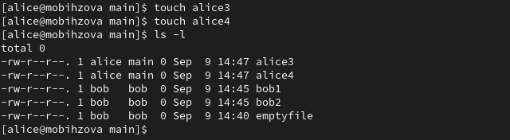{#fig:016 width=70%}

В этом же терминале попробуем удалить файлы, принадлежащие пользователю bob: rm -rf bob*. Убедимся, что sticky-bit предотвратит удаление этих файлов пользователем alice, поскольку этот пользователь не является владельцем этих файлов (Operation not permitted) (рис. [-@fig:017]).

{#fig:017 width=70%}

## Управление расширенными разрешениями с использованием списков ACL

Откроем терминал с учётной записью root (рис. [-@fig:018]).

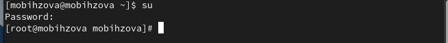{#fig:018 width=70%}

Установим права на чтение и выполнение в каталоге /data/main для группы third и права на чтение и выполнение для группы main в каталоге /data/third: setfacl -m g:third:rx /data/main и setfacl -m g:main:rx /data/third (рис. [-@fig:019]).

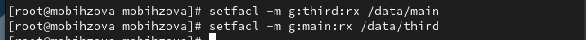{#fig:019 width=70%}

Теперь используем команду getfacl, чтобы убедиться в правильности установки разрешений: getfacl /data/main и getfacl /data/third (рис. [-@fig:020]).

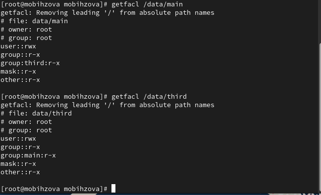{#fig:020 width=70%}

Далее создадим новый файл с именем newfile1 в каталоге /data/main: touch /data/main/newfile1. Используем getfacl /data main/newfile1 для проверки текущих назначений полномочий. У пользователя только чтение и запись, у группы и других только чтение (рис. [-@fig:021]).

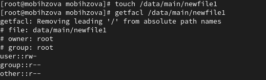{#fig:021 width=70%}

Выполним аналогичные действия для каталога /data/third. Видим, что ситуация аналогичная (рис. [-@fig:022]).

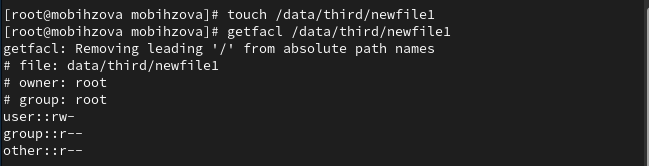{#fig:022 width=70%}

Установим ACL по умолчанию для каталога /data/main: setfacl -md:g:third:rwx /data/main и для каталога /data/third: setfacl -m d:g:main:rwx /data/third. (рис. [-@fig:023], рис. [-@fig:024]).

{#fig:023 width=70%}

{#fig:024 width=70%}

Убедимся, что настройки ACL работают, добавив новый файл в каталог /data/main: touch /data/main/newfile2. Используем getfacl /data/main/newfile2 для проверки текущих назначений полномочий. (рис. [-@fig:025]).

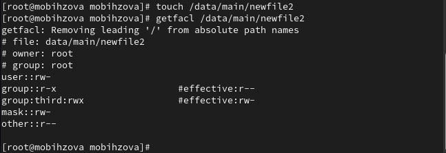{#fig:025 width=70%}

Выполним аналогичные действия для каталога /data/third (рис. [-@fig:026]).

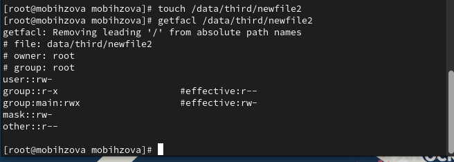{#fig:026 width=70%}

Для проверки полномочий группы third в каталоге /data/third войдём в другом терминале под учётной записью члена группы third: su – carol (рис. [-@fig:027]).

{#fig:027 width=70%}

Проверим операции с файлами: rm /data/main/newfile1 и rm /data/main/newfile2. Система не даёт удалить данные файлы (рис. [-@fig:028]).

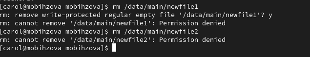{#fig:028 width=70%}

Теперь проверим, возможно ли осуществить запись в файл. В файл newfile1 запись осуществить не получилось, а вот в newfile2 всё выполнилось [-@fig:029]).

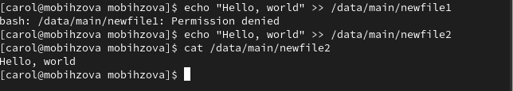{#fig:029 width=70%}

# Ответы на контрольные вопросы

1. Как следует использовать команду chown, чтобы установить владельца группы для файла? Приведите пример. chown bob:main /data/third/newfile.

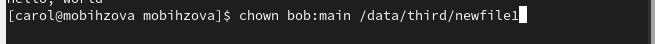{#fig:030 width=70%}

2. С помощью какой команды можно найти все файлы, принадлежащие конкретному пользователю? Приведите пример. find ~ -user bob -print.

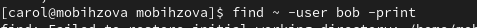{#fig:031 width=70%}

3. Как применить разрешения на чтение, запись и выполнение для всех файлов в каталоге /data для пользователей и владельцев групп, не устанавливая никаких прав для других? Приведите пример. chmod 770.

{#fig:032 width=70%}

4. Какая команда позволяет добавить разрешение на выполнение для файла, который необходимо сделать исполняемым? chmod +x file.

5. Какая команда позволяет убедиться, что групповые разрешения для всех новых файлов, создаваемых в каталоге, будут присвоены владельцу группы этого каталога? Приведите пример. getfacl “имя каталога”

{#fig:033 width=70%}

6. Необходимо, чтобы пользователи могли удалять только те файлы, владельцами которых они являются, или которые находятся в каталоге, владельцами которого они являются. С помощью какой команды можно это сделать? Приведите пример. chmod g+s,o+t /data/main.

{#fig:034 width=70%}

7. Какая команда добавляет ACL, который предоставляет членам группы права доступа на чтение для всех существующих файлов в текущем каталоге? setfacl -m g:group:r <file/dir> 
 
{#fig:035 width=70%}

8. Что нужно сделать для гарантии того, что члены группы получат разрешения на чтение для всех файлов в текущем каталоге и во всех его подкаталогах, а также для всех файлов, которые будут созданы в этом каталоге в будущем? Приведите пример. setfacl -dm g:group:r /dir.

9. Какое значение umask нужно установить, чтобы «другие» пользователи не получали какие-либо разрешения на новые файлы?
Приведите пример. 007.

10. Какая команда гарантирует, что никто не сможет удалить файл myfile случайно? sudo chattr +i myfile.

# Выводы

В ходе выполнения лабораторной работы были получены навыкы настройки базовых и специальных прав доступа для групп пользователей в операционной системе типа Linux.

# Список литературы{.unnumbered}

1. Робачевский А., Немнюгин С., Стесик О. Операционная система UNIX. — 2-е изд. — БХВ-Петербург, 2010.
2. Колисниченко Д. Н. Самоучитель системного администратора Linux. — СПб. : БХВ-Петербург, 2011. — (Системный администратор).
3. Таненбаум Э., Бос Х. Современные операционные системы. — 4-е изд. — СПб. : Питер, 2015. — (Классика Computer Science).
4. Neil N. J. Learning CentOS: A Beginners Guide to Learning Linux. — CreateSpace Independent Publishing Platform, 2016.
5. Unix и Linux: руководство системного администратора / Э. Немет, Г. Снайдер, Т.Хейн, Б. Уэйли, Д. Макни. — 5-е изд. — СПб. : ООО «Диалектика», 2020.
