---
## Front matter
lang: ru-RU
title: "Лабораторная работа №4"
subtitle: Основы администрирования операционных систем.
author:
  - Бызова М.О.
institute:
  - Российский университет дружбы народов, Москва, Россия.
date: 23 сентября 2024

## i18n babel
babel-lang: russian
babel-otherlangs: english

## Formatting pdf
toc: false
toc-title: Содержание
slide_level: 2
aspectratio: 169
section-titles: true
theme: metropolis
header-includes:
 - \metroset{progressbar=frametitle,sectionpage=progressbar,numbering=fraction}
 
## Fonts 
mainfont: PT Serif 
romanfont: PT Serif 
sansfont: PT Sans 
monofont: PT Mono 
mainfontoptions: Ligatures=TeX 
romanfontoptions: Ligatures=TeX 
sansfontoptions: Ligatures=TeX,Scale=MatchLowercase 
monofontoptions: Scale=MatchLowercase,Scale=0.9 
---

## Цель работы

Целью данной работы является получение навыков работы с репозиториями и менеджерами пакетов.

## Задание

1. Изучите, как и в каких файлах подключаются репозитории для установки программ-
ного обеспечения; изучите основные возможности (поиск, установка, обновление,
удаление пакета, работа с историей действий) команды dnf (см. раздел 4.4.1).
2. Изучите и повторите процесс установки/удаления определённого пакета с использо-
ванием возможностей dnf (см. раздел 4.4.1).
3. Изучите и повторите процесс установки/удаления определённого пакета с использо-
ванием возможностей rpm (см. раздел 4.4.2).

## Выполнение лабораторной работы

В консоли перейдём в режим работы суперпользователя (используем
команду su -) далее перейдём в каталог /etc/yum.repos.d и изучим содержание
каталога и файлов репозиториев (рис. 1):

cd /etc/yum.repos.d
ls

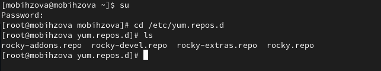{#fig:001 width=40%}

## Выполнение лабораторной работы

cat rocky-addons.repo (рис. 2):

{#fig:002 width=40%}

## Выполнение лабораторной работы

cat rocky-devel.repo (рис. 3):

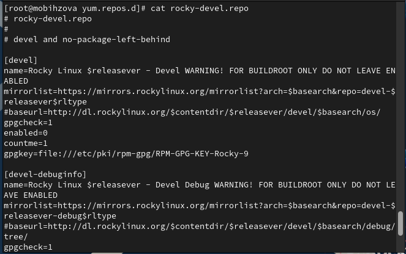{#fig:003 width=40%}

## Выполнение лабораторной работы

cat rocky-extras.repo (рис. 4):

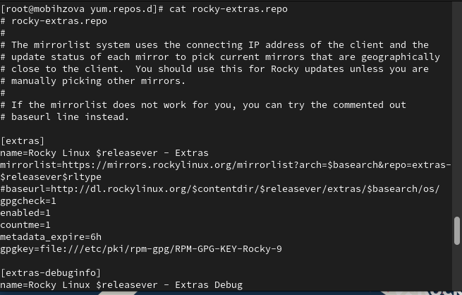{#fig:004 width=40%}

## Выполнение лабораторной работы

cat rocky.repo (рис. 5):

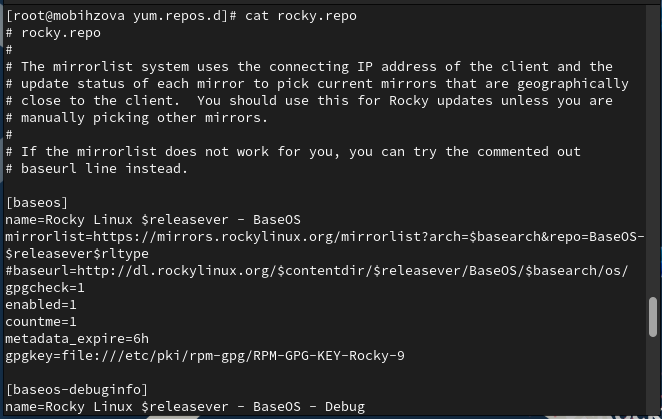{#fig:005 width=40%}

## Выполнение лабораторной работы

Выведем на экран список репозиториев: dnf repolist и список пакетов, в названии или описании которых есть слово user: dnf search user (рис. 6, рис. 7):

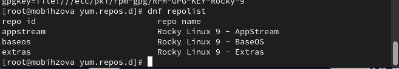{#fig:006 width=40%}

## Выполнение лабораторной работы

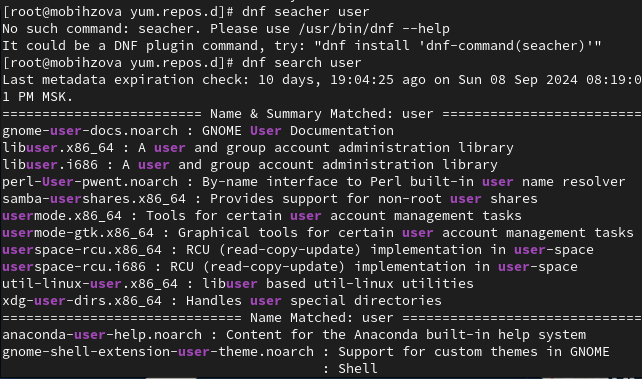{#fig:007 width=40%}

## Выполнение лабораторной работы

Установим nmap, предварительно изучив информацию по имеющимся пакетам:

dnf search nmap (рис. 8):

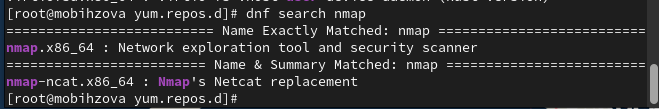{#fig:008 width=40%}

## Выполнение лабораторной работы

dnf info nmap (рис. 9):

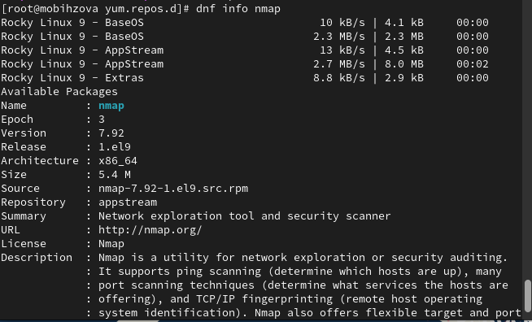{#fig:009 width=40%}

## Выполнение лабораторной работы

dnf install nmap (рис. 10):

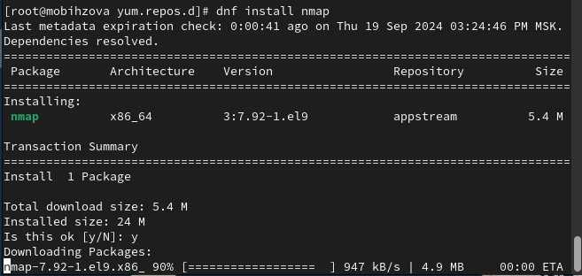{#fig:010 width=40%}

## Выполнение лабораторной работы

dnf install nmap\* (рис. 11):

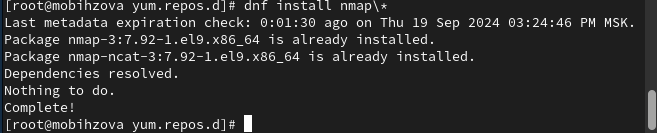{#fig:011 width=40%}

## Выполнение лабораторной работы

Удалим nmap:

dnf remove nmap (рис. 12):

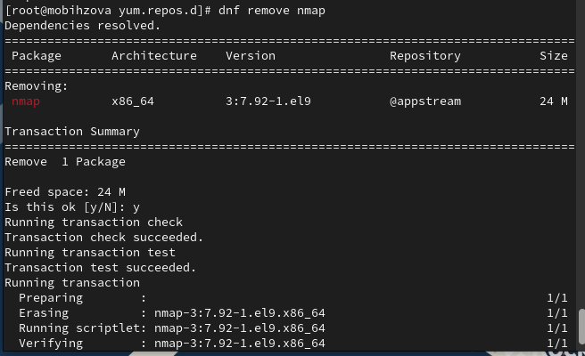{#fig:012 width=40%}

## Выполнение лабораторной работы

dnf remove nmap\* (рис. 13):

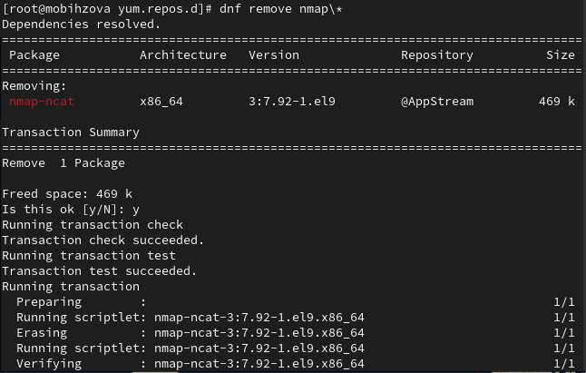{#fig:013 width=40%}

## Выполнение лабораторной работы

Получим список имеющихся групп пакетов, затем установим группу пакетов RPM Development Tools:

dnf groups list (рис. 14):

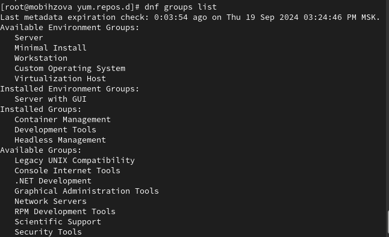{#fig:014 width=40%}

## Выполнение лабораторной работы

LANG=C dnf groups list (рис. 15):

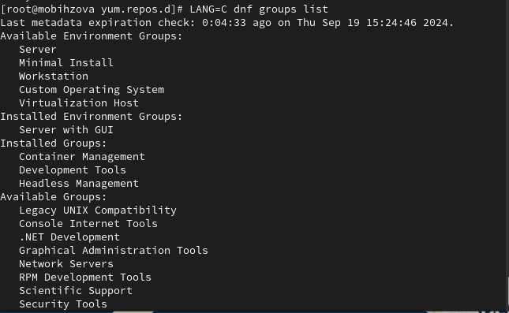{#fig:015 width=40%}

## Выполнение лабораторной работы

dnf groups info "RPM Development Tools" (рис. 16):

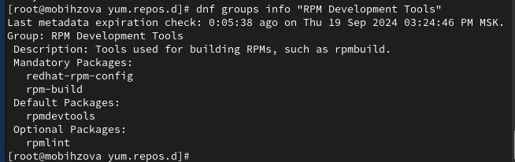{#fig:016 width=40%}

## Выполнение лабораторной работы

dnf groupinstall "RPM Development Tools" (рис. 17):

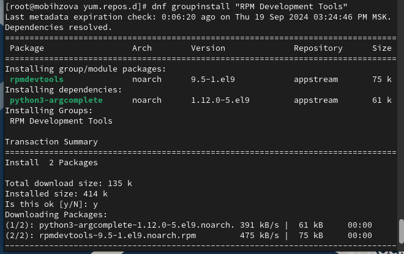{#fig:017 width=40%}

## Выполнение лабораторной работы

Теперь удалим группы пакетов RPM Development Tools командой dnf groupremove "RPM Development Tools" (рис. 18):

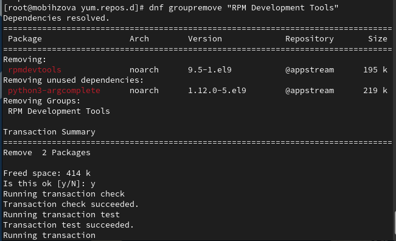{#fig:018 width=40%}

## Выполнение лабораторной работы

Посмотрим историю использования команды dnf: dnf history и отменим шестое по счёту, действие: dnf history undo 6 (рис. 19, рис. 20):

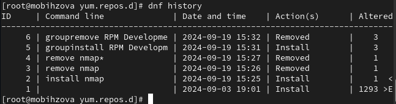{#fig:019 width=40%}

## Выполнение лабораторной работы

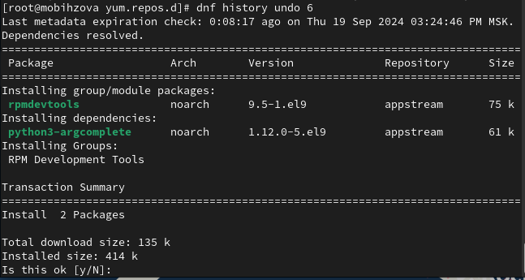{#fig:020 width=40%}

## Выполнение лабораторной работы

Скачаем rpm-пакет lynx:
dnf list lynx
dnf install lynx –downloadonly (рис. 21):

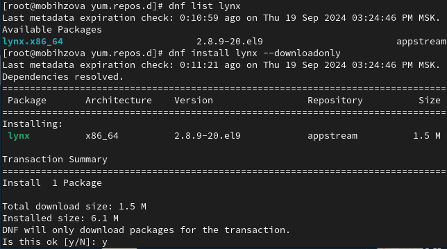{#fig:021 width=40%}

## Выполнение лабораторной работы

Найдём каталог, в который был помещён пакет после загрузки: find /var/cache/dnf/ -name lynx* и перейдём в этот каталог командой cd. Затем установим rpm-пакет: rpm -Uhv lynx-.rpm (рис. 22, рис. 23):

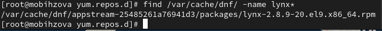{#fig:022 width=40%}

## Выполнение лабораторной работы

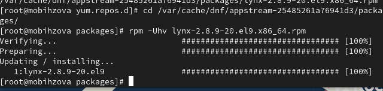{#fig:023 width=40%}

## Выполнение лабораторной работы

Определим расположение исполняемого файла: which lynx (рис. 24):

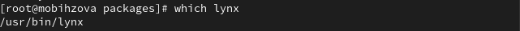{#fig:024 width=40%}

## Выполнение лабораторной работы

Используя rpm, определим по имени файла, к какому пакету принадлежит lynx: rpm -qf $(which lynx). Получим дополнительную информацию о содержимом пакета, введя: rpm -qi lynx (рис. 25):

{#fig:025 width=40%}

## Выполнение лабораторной работы

Далее получим список всех файлов в пакете, используя: rpm -ql lynx (рис. 26)

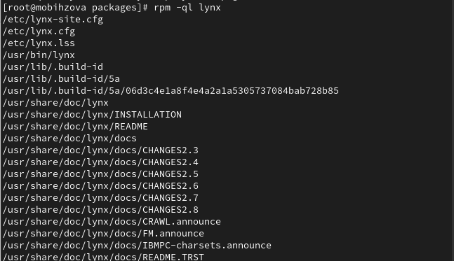{#fig:026 width=40%}

## Выполнение лабораторной работы

А также выведем перечень файлов с документацией пакета, введя: rpm -qd lynx (рис. 27) 

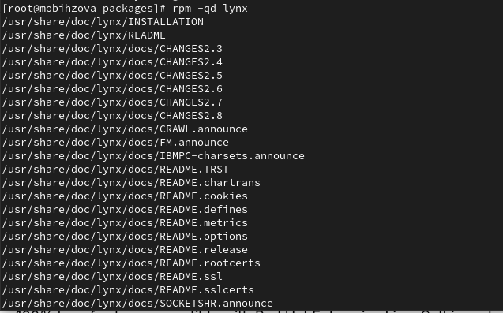{#fig:027 width=40%}

## Выполнение лабораторной работы

Посмотрим файлы документации, применив команду man lynx (рис. 28)

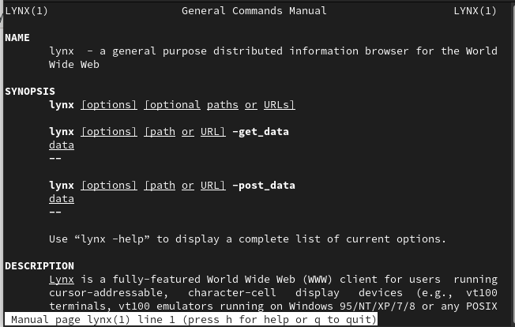{#fig:028 width=40%}

## Выполнение лабораторной работы

Выведем на экран перечень и месторасположение конфигурационных файлов пакета: rpm -qc lynx (рис. 29)

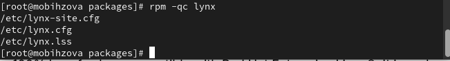{#fig:029 width=40%}

## Выполнение лабораторной работы

Выведем расположение, и содержание скриптов, выполняемых при установке пакета: rpm -q --scripts lynx (скрипты отсутствуют) (рис. 30)

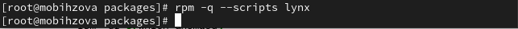{#fig:030 width=40%}

## Выполнение лабораторной работы

В отдельном терминале под своей учётной записью запустим текстовый браузер lynx, чтобы проверить корректность установки пакета (рис. 31)

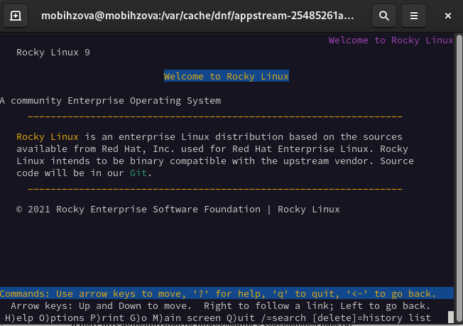{#fig:031 width=40%}

## Выполнение лабораторной работы

Вернёмся в терминал с учётной записью root и удалим пакет: rpm -e lynx и ls (рис. 32)

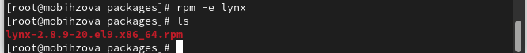{#fig:032 width=40%}

## Выполнение лабораторной работы

Предположим, что требуется из rpm-пакетов установить dnsmasq (DNS-, DHCPи TFTP-сервер). Для этого установим пакет dnsmasq: dnf list dnsmasq, dnf install dnsmasq и определим расположение исполняемого файла: which dnsmasq (рис. 33)

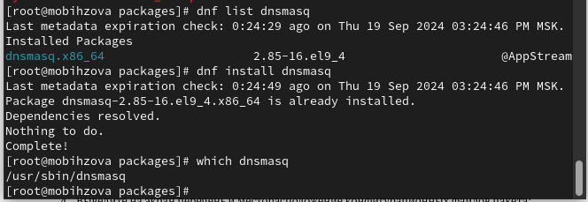{#fig:033 width=40%}

## Выполнение лабораторной работы

Определим по имени файла, к какому пакету принадлежит dnsmasq: rpm -qf $(which dnsmasq). Теперь получим дополнительную информацию о содержимом пакета: rpm -qi dnsmasq (рис. 34)

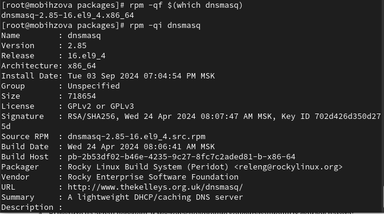{#fig:034 width=40%}

## Выполнение лабораторной работы

Далее получим список всех файлов в пакете: rpm -ql dnsmasq (рис. 35)

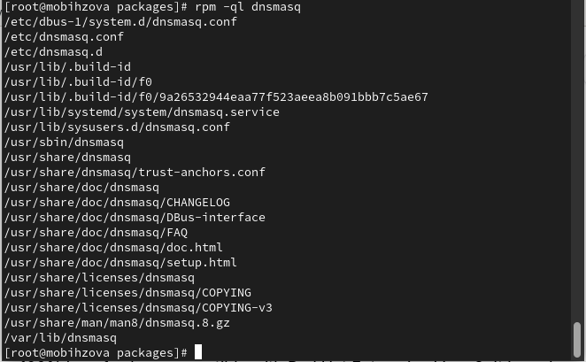{#fig:035 width=40%}

## Выполнение лабораторной работы

А также выведем перечень файлов с документацией пакета: rpm -qd dnsmasq (рис. 36)

{#fig:036 width=40%} 

## Выполнение лабораторной работы

Посмотрим файлы документации, применив команду man dnsmasq (рис. 37)

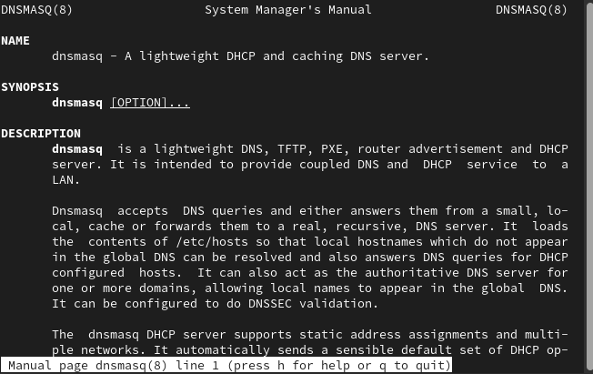{#fig:037 width=40%} 

## Выполнение лабораторной работы

Выведем на экран перечень и месторасположение конфигурационных файлов пакета: rpm -qc dnsmasq (рис. 38)

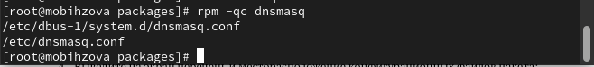{#fig:038 width=40%} 

## Выполнение лабораторной работы

Выведем на экран расположение и содержание скриптов, выполняемых при установке пакета: rpm -q --scripts dnsmasq (рис. 39)

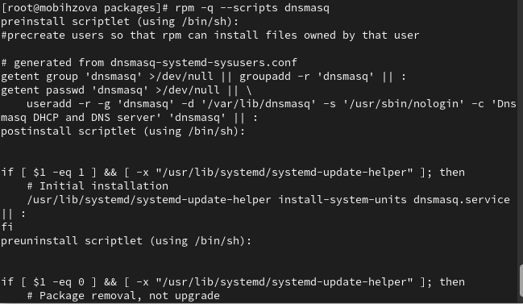{#fig:039 width=40%}

## Выполнение лабораторной работы

Вернёмся в терминал с учётной записью root и удалим пакет: rpm -e dnsmask (рис. 40)

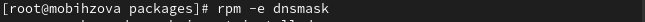{#fig:040 width=40%}

## Выводы

В ходе выполнения лабораторной работы были получены навыки работы с репозиториями и менеджерами пакетов.

## Список литературы{.unnumbered}

1. Робачевский А., Немнюгин С., Стесик О. Операционная система UNIX. — 2-е изд. — БХВ-Петербург, 2010.
2. Колисниченко Д. Н. Самоучитель системного администратора Linux. — СПб. : БХВ-Петербург, 2011. — (Системный администратор).
3. Таненбаум Э., Бос Х. Современные операционные системы. — 4-е изд. — СПб. : Питер, 2015. — (Классика Computer Science).
4. Neil N. J. Learning CentOS: A Beginners Guide to Learning Linux. — CreateSpace Independent Publishing Platform, 2016.
5. Unix и Linux: руководство системного администратора / Э. Немет, Г. Снайдер, Т.Хейн, Б. Уэйли, Д. Макни. — 5-е изд. — СПб. : ООО «Диалектика», 2020.
