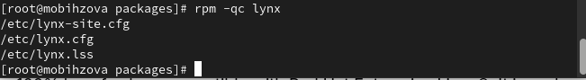

---
## Front matter
title: "Отчёт по лабораторной работе №4"
subtitle: "Дисциплина: Основы администрирования операционных систем"
author: "Бызова Мария Олеговна"

## Generic otions
lang: ru-RU
toc-title: "Содержание"

## Bibliography
bibliography: bib/cite.bib
csl: pandoc/csl/gost-r-7-0-5-2008-numeric.csl

## Pdf output format
toc: true # Table of contents
toc-depth: 2
lof: true # List of figures
lot: true # List of tables
fontsize: 12pt
linestretch: 1.5
papersize: a4
documentclass: scrreprt
## I18n polyglossia
polyglossia-lang:
  name: russian
  options:
	- spelling=modern
	- babelshorthands=true
polyglossia-otherlangs:
  name: english
## I18n babel
babel-lang: russian
babel-otherlangs: english
## Fonts
mainfont: IBM Plex Serif
romanfont: IBM Plex Serif
sansfont: IBM Plex Sans
monofont: IBM Plex Mono
mathfont: STIX Two Math
mainfontoptions: Ligatures=Common,Ligatures=TeX,Scale=0.94
romanfontoptions: Ligatures=Common,Ligatures=TeX,Scale=0.94
sansfontoptions: Ligatures=Common,Ligatures=TeX,Scale=MatchLowercase,Scale=0.94
monofontoptions: Scale=MatchLowercase,Scale=0.94,FakeStretch=0.9
mathfontoptions:
## Biblatex
biblatex: true
biblio-style: "gost-numeric"
biblatexoptions:
  - parentracker=true
  - backend=biber
  - hyperref=auto
  - language=auto
  - autolang=other*
  - citestyle=gost-numeric
## Pandoc-crossref LaTeX customization
figureTitle: "Рис."
tableTitle: "Таблица"
listingTitle: "Листинг"
lofTitle: "Список иллюстраций"
lotTitle: "Список таблиц"
lolTitle: "Листинги"
## Misc options
indent: true
header-includes:
  - \usepackage{indentfirst}
  - \usepackage{float} # keep figures where there are in the text
  - \floatplacement{figure}{H} # keep figures where there are in the text
---

# Цель работы

Целью данной работы является получение навыков работы с репозиториями и менеджерами пакетов.

# Задание

1. Изучите, как и в каких файлах подключаются репозитории для установки программ-
ного обеспечения; изучите основные возможности (поиск, установка, обновление,
удаление пакета, работа с историей действий) команды dnf (см. раздел 4.4.1).
2. Изучите и повторите процесс установки/удаления определённого пакета с использо-
ванием возможностей dnf (см. раздел 4.4.1).
3. Изучите и повторите процесс установки/удаления определённого пакета с использо-
ванием возможностей rpm (см. раздел 4.4.2).

# Выполнение лабораторной работы

## Работа с репозиториями

В консоли перейдём в режим работы суперпользователя (используем
команду su -) далее перейдём в каталог /etc/yum.repos.d и изучим содержание
каталога и файлов репозиториев (рис. [-@fig:001]):

cd /etc/yum.repos.d
ls

{#fig:001 width=70%}

cat rocky-addons.repo (рис. [-@fig:002]):

{#fig:002 width=70%}

cat rocky-devel.repo (рис. [-@fig:003]):

{#fig:003 width=70%}

cat rocky-extras.repo (рис. [-@fig:004]):

{#fig:004 width=70%}

cat rocky.repo (рис. [-@fig:005]):

{#fig:005 width=70%}

Выведем на экран список репозиториев: dnf repolist и список пакетов, в названии или описании которых есть слово user: dnf search user (рис. [-@fig:006]), (рис. [-@fig:007]):

{#fig:006 width=70%}

{#fig:007 width=70%}

Установим nmap, предварительно изучив информацию по имеющимся пакетам:

dnf search nmap (рис. [-@fig:008]):

{#fig:008 width=70%}

dnf info nmap (рис. [-@fig:009]):

{#fig:009 width=70%}

dnf install nmap (рис. [-@fig:010]):

{#fig:010 width=70%}

dnf install nmap\* (рис. [-@fig:011]):

{#fig:011 width=70%}

Удалим nmap:

dnf remove nmap (рис. [-@fig:012]):

{#fig:012 width=70%}

dnf remove nmap\* (рис. [-@fig:013]):

{#fig:013 width=70%}

Получим список имеющихся групп пакетов, затем установим группу пакетов RPM Development Tools:

dnf groups list (рис. [-@fig:014]):

{#fig:014 width=70%}

LANG=C dnf groups list (рис. [-@fig:015]):

{#fig:015 width=70%}

dnf groups info "RPM Development Tools" (рис. [-@fig:016]):

{#fig:016 width=70%}

dnf groupinstall "RPM Development Tools" (рис. [-@fig:017]):

{#fig:017 width=70%}

Теперь удалим группы пакетов RPM Development Tools командой dnf groupremove "RPM Development Tools" (рис. [-@fig:018]):

{#fig:018 width=70%}

Посмотрим историю использования команды dnf: dnf history и отменим шестое по счёту, действие: dnf history undo 6 (рис. [-@fig:019]), (рис. [-@fig:020]):

{#fig:019 width=70%}

{#fig:020 width=70%}

Скачаем rpm-пакет lynx:
dnf list lynx
dnf install lynx –downloadonly (рис. [-@fig:021]):

{#fig:021 width=70%}

Найдём каталог, в который был помещён пакет после загрузки: find /var/cache/dnf/ -name lynx* и перейдём в этот каталог командой cd. Затем установим rpm-пакет: rpm -Uhv lynx-.rpm (рис. [-@fig:022]), (рис. [-@fig:023]):

{#fig:022 width=70%}

{#fig:023 width=70%}

Определим расположение исполняемого файла: which lynx (рис. [-@fig:024]):

{#fig:024 width=70%}

Используя rpm, определим по имени файла, к какому пакету принадлежит lynx: rpm -qf $(which lynx). Получим дополнительную информацию о содержимом пакета, введя: rpm -qi lynx (рис. [-@fig:025]):

{#fig:025 width=70%}

Далее получим список всех файлов в пакете, используя: rpm -ql lynx (рис. [-@fig:026])

{#fig:026 width=70%}

А также выведем перечень файлов с документацией пакета, введя: rpm -qd lynx (рис. [-@fig:027]) 

{#fig:027 width=70%}

Посмотрим файлы документации, применив команду man lynx (рис. [-@fig:028])

{#fig:028 width=70%}

Выведем на экран перечень и месторасположение конфигурационных файлов пакета: rpm -qc lynx (рис. [-@fig:029])

{#fig:029 width=70%}

Выведем расположение, и содержание скриптов, выполняемых при установке пакета: rpm -q --scripts lynx (скрипты отсутствуют) (рис. [-@fig:030])

{#fig:030 width=70%}

В отдельном терминале под своей учётной записью запустим текстовый браузер lynx, чтобы проверить корректность установки пакета (рис. [-@fig:031])

{#fig:031 width=70%}

Вернёмся в терминал с учётной записью root и удалим пакет: rpm -e lynx и ls (рис. [-@fig:032])

{#fig:032 width=70%}

## Использование rpm

Предположим, что требуется из rpm-пакетов установить dnsmasq (DNS-, DHCPи TFTP-сервер). Для этого установим пакет dnsmasq: dnf list dnsmasq, dnf install dnsmasq и определим расположение исполняемого файла: which dnsmasq (рис. [-@fig:033])

{#fig:033 width=70%}

Определим по имени файла, к какому пакету принадлежит dnsmasq: rpm -qf $(which dnsmasq). Теперь получим дополнительную информацию о содержимом пакета: rpm -qi dnsmasq (рис. [-@fig:034])

{#fig:034 width=70%}

Далее получим список всех файлов в пакете: rpm -ql dnsmasq (рис. [-@fig:035])

{#fig:035 width=70%}

А также выведем перечень файлов с документацией пакета: rpm -qd dnsmasq (рис. [-@fig:036])

{#fig:036 width=70%} 

Посмотрим файлы документации, применив команду man dnsmasq (рис. [-@fig:037])

{#fig:037 width=70%} 

Выведем на экран перечень и месторасположение конфигурационных файлов пакета: rpm -qc dnsmasq (рис. [-@fig:038])

{#fig:038 width=70%} 

Выведем на экран расположение и содержание скриптов, выполняемых при установке пакета: rpm -q --scripts dnsmasq (рис. [-@fig:039])

{#fig:039 width=70%}

Вернёмся в терминал с учётной записью root и удалим пакет: rpm -e dnsmask (рис. [-@fig:040])

{#fig:040 width=70%}

# Ответы на контрольные вопросы

1. Какая команда позволяет вам искать пакет rpm, содержащий файл useradd? yum search useradd.

{#fig:041 width=70%}

2. Какие команды вам нужно использовать, чтобы показать имя группы dnf, которая содержит инструменты безопасности и показывает, что находится в этой группе? yum info gcl.

{#fig:042 width=70%}

3. Какая команда позволяет вам установить rpm, который вы загрузили из Интернета и который не находится в репозиториях? yum install.

4. Вы хотите убедиться, что пакет rpm, который вы загрузили, не содержит никакого опасного кода сценария. Какая команда позволяет это сделать? rpm -q -scripts.

5. Какая команда показывает всю документацию в rpm? rpm -qd.

6. Какая команда показывает, какому пакету rpm принадлежит файл? rpm -qf $(which).

# Выводы

В ходе выполнения лабораторной работы были получены навыки работы с репозиториями и менеджерами пакетов.

# Список литературы{.unnumbered}

1. Робачевский А., Немнюгин С., Стесик О. Операционная система UNIX. — 2-е изд. — БХВ-Петербург, 2010.
2. Колисниченко Д. Н. Самоучитель системного администратора Linux. — СПб. : БХВ-Петербург, 2011. — (Системный администратор).
3. Таненбаум Э., Бос Х. Современные операционные системы. — 4-е изд. — СПб. : Питер, 2015. — (Классика Computer Science).
4. Neil N. J. Learning CentOS: A Beginners Guide to Learning Linux. — CreateSpace Independent Publishing Platform, 2016.
5. Unix и Linux: руководство системного администратора / Э. Немет, Г. Снайдер, Т.Хейн, Б. Уэйли, Д. Макни. — 5-е изд. — СПб. : ООО «Диалектика», 2020.
