---
## Front matter
lang: ru-RU
title: "Лабораторная работа №5"
subtitle: Основы администрирования операционных систем.
author:
  - Бызова М.О.
institute:
  - Российский университет дружбы народов, Москва, Россия.
date: 30 сентября 2024

## i18n babel
babel-lang: russian
babel-otherlangs: english

## Formatting pdf
toc: false
toc-title: Содержание
slide_level: 2
aspectratio: 169
section-titles: true
theme: metropolis
header-includes:
 - \metroset{progressbar=frametitle,sectionpage=progressbar,numbering=fraction}

## Fonts 
mainfont: PT Serif 
romanfont: PT Serif 
sansfont: PT Sans 
monofont: PT Mono 
mainfontoptions: Ligatures=TeX 
romanfontoptions: Ligatures=TeX 
sansfontoptions: Ligatures=TeX,Scale=MatchLowercase 
monofontoptions: Scale=MatchLowercase,Scale=0.9 
---

## Цель работы

Целью данной работы является получение навыков управления системными службами операционной системы посредством systemd.

## Задание

1. Выполните основные операции по запуску (останову), определению статуса, добавле-
нию (удалению) в автозапуск и пр. службы Very Secure FTP (раздел 5.4.1).
2. Продемонстрируйте навыки по разрешению конфликтов юнитов для служб
firewalld и iptables (раздел 5.4.2).
3. Продемонстрируйте навыки работы с изолированными целями (разделы 5.4.3, 5.4.4).

# Выполнение лабораторной работы

## Управление сервисами

Для начала получим полномочия администратора su -. Затем проверим статус службы Very Secure FTP: systemctl status vsftpd. Вывод команды показывает, что сервис в настоящее время отключён, так как служба Very Secure FTP не установлена. Установим службу Very Secure FTP: dnf -y install vsftpd и запустим: systemctl start vsftpd (рис. 1).

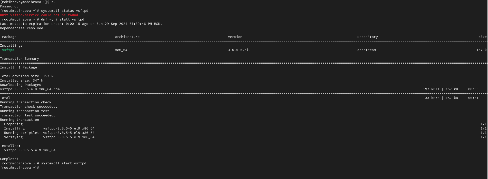{#fig:001 width=40%}

## Управление сервисами

Снова проверим статус службы Very Secure FTP: systemctl status vsftpd. Вывод команды показывает, что служба в настоящее время работает, но не будет активирована при перезапуске операционной системы (рис. 2).

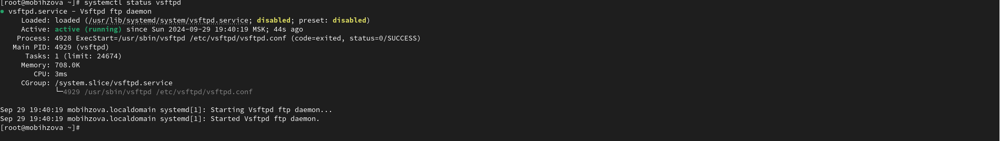{#fig:002 width=40%}

## Управление сервисами

Добавим службу Very Secure FTP в автозапуск при загрузке операционной системы, используя команду systemctl enable vsftpd. Затем проверим статус службы и удалим службу из автозапуска, используя команду systemctl disable vsftpd, и снова проверим её статус (рис. 3, рис. 4).

## Управление сервисами

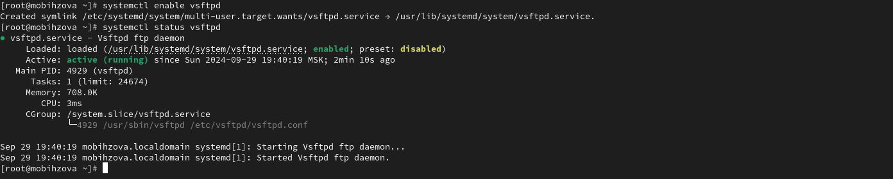{#fig:003 width=40%}

## Управление сервисами

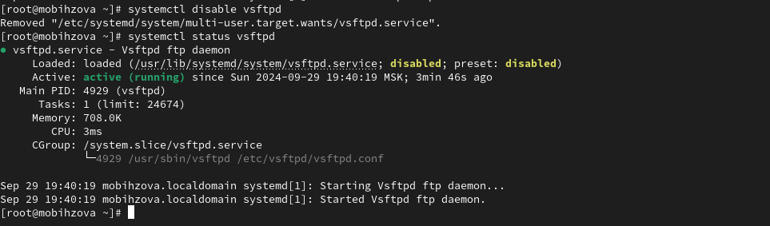{#fig:004 width=40%}

## Управление сервисами

Далее выведем на экран символические ссылки, ответственные за запуск различных сервисов. Отображается, что ссылка на vsftpd.service не существует. Снова добавляем службу Very Secure FTP в автозапуск: systemctl enable vsftpd и выводим на экран символические ссылки, ответственные за запуск различных сервисов. Вывод команды показывает, что создана символическая ссылка для файла /usr/lib/systemd/system/vsftpd.service в каталоге /etc/systemd/system/multi-
user.target.wants. Проверяем статус службы Very Secure FTP: systemctl status vsftpd. Теперь мы видим, что для файла юнита состояние изменено с disabled на enabled (рис. 5).

## Управление сервисами

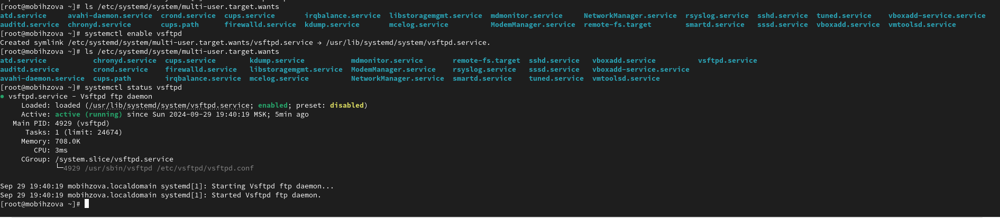{#fig:005 width=40%}

## Управление сервисами

Выведем на экран список зависимостей юнита: systemctl list-dependencies vsftpd и список юнитов, которые зависят от данного юнита: systemctl list-dependencies vsftpd –reverse (рис. 6, рис. 7).

## Управление сервисами

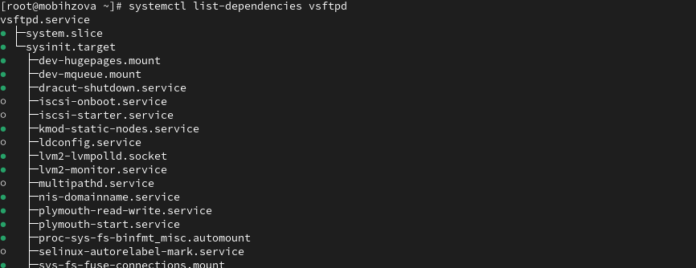{#fig:006 width=40%}

## Управление сервисами

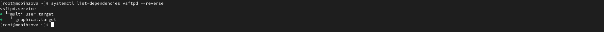{#fig:007 width=40%}

## Конфликты юнитов

Получим полномочия администратора su – и установим iptables: dnf -y install iptables\* (рис. 8).

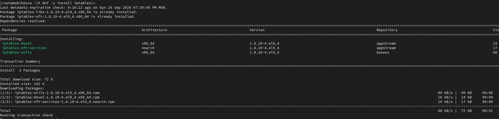{#fig:008 width=40%}

## Конфликты юнитов

Далее проверим статус firewalld и iptables: systemctl status firewalld и systemctl status iptables (рис. 9).

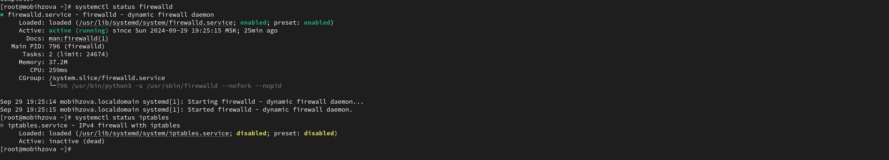{#fig:009 width=40%}

## Конфликты юнитов

Попробуем запустить firewalld и iptables: systemctl start firewalld и systemctl start iptables. Мы видем, что при запуске одной службы вторая дезактивируется или не запускается (рис. 10).

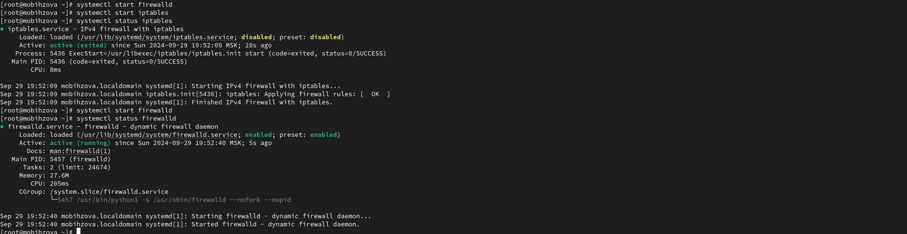{#fig:010 width=40%}

## Конфликты юнитов

Введем cat /usr/lib/systemd/system/firewalld.service и опишем настройки конфликтов для этого юнита при наличии, далее введём cat /usr/lib/systemd/system/iptables.service и опишем настройки конфликтов для этого юнита (рис. 11).

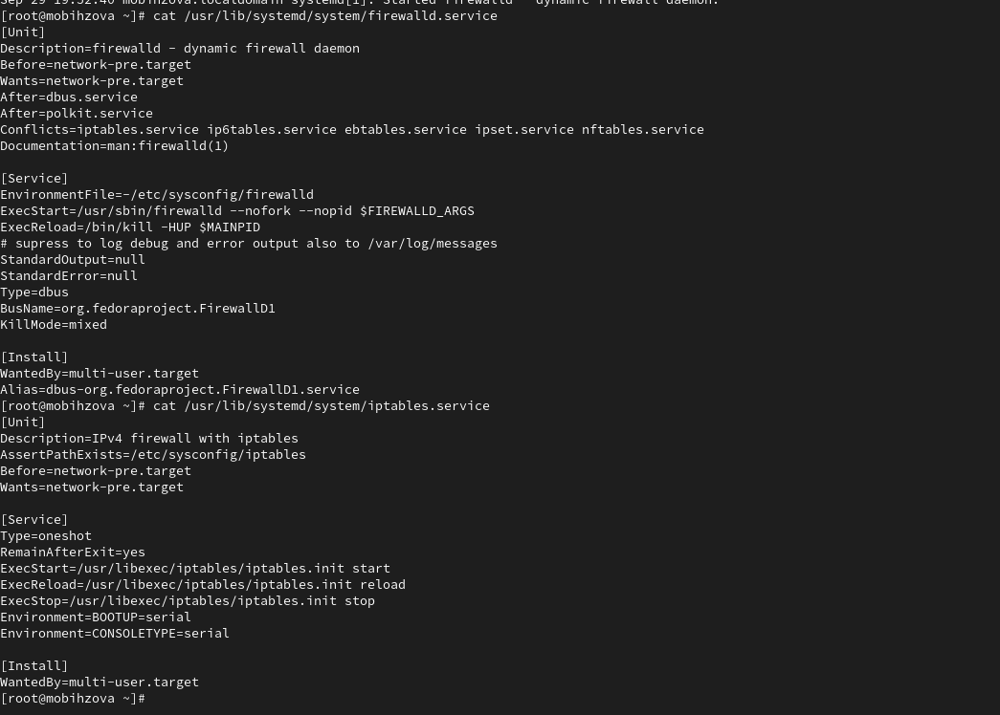{#fig:011 width=40%}

## Конфликты юнитов

Выгрузим службу iptables (на всякий случай, чтобы убедиться, что данная служба не загружена в систему): systemctl stop iptables и загрузим службу firewalld: systemctl start firewalld. Далее заблокируем запуск iptables, введя: systemctl mask iptables. Видим, как создана символическая ссылка на /dev/null для /etc/systemd/system/iptables.service. Поскольку юнит-файлы в /etc/systemd имеют приоритет над файлами в /usr/lib/systemd, то это сделает невозможным случайный запуск сервиса iptables. Для проверки попробуем запустить iptables: systemptl start iptables. После попытки запуска появилось сообщение об ошибке, указывающее, что служба замаскирована и по этой причине не может быть запущена. Теперь попробуем добавить iptables в автозапуск: systemptl enable iptables. Показывает, что сервис неактивен, а статус загрузки отображается как замаскированный (рис. 12).

## Конфликты юнитов

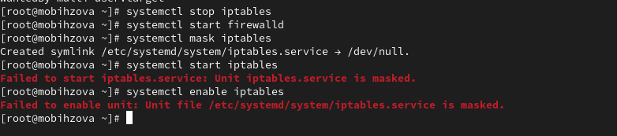{#fig:012 width=40%}

## Изолируемые цели

Получим полномочия администратора su – и перейдём в каталог systemd, найдём список всех целей, которые можно изолировать: cd /usr/lib/systemd/system grep Isolate *.target. На следующем шаге переключим операционную систему в режим восстановления: systemctl isolate rescue.target (рис. 13).

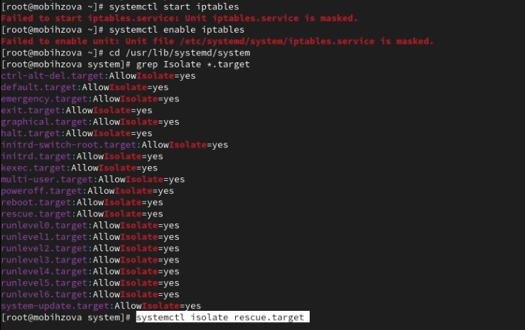{#fig:013 width=40%} 

## Изолируемые цели

Как только операционная система переключилась в режим восстановления вводим пароль root. После чего перезапустим операционную систему следующим образом: systemctl isolate reboot.target (рис. 14).

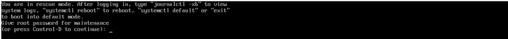{#fig:014 width=40%}

## Цель по умолчанию 

Получим полномочия администратора su – и выведем на экран цель, установленную по умолчанию: systemctl get-default. Для установки цели по умолчанию используется команда systemctl set-default. В нашем случае для запуска по умолчанию текстового режима введём systemctl set-default multi- user.target. После чего перезагрузим систему командой reboot (рис. 15).

## Цель по умолчанию 

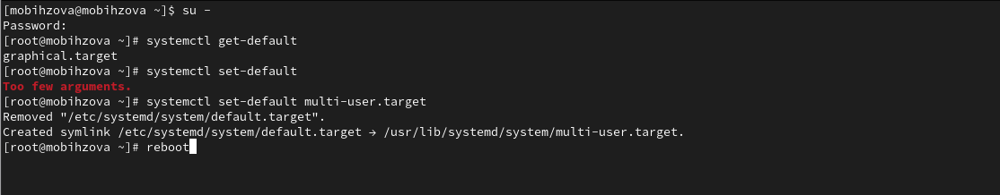{#fig:015 width=40%}

## Цель по умолчанию 

Убедимся, что система загрузилась в текстовом режиме, после чего получим полномочия администратора (для начала зайдём в пользователя momihzova, а затем в режим администратора). Для запуска по умолчанию графического режима введём systemctl set-default graphical.target и вновь перегрузим систему командой reboot. Убедимся, что система загрузилась в графическом режиме (рис. 16, рис. 17).

## Цель по умолчанию 

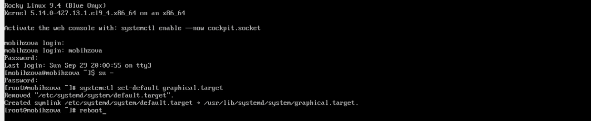{#fig:016 width=40%}

## Цель по умолчанию 

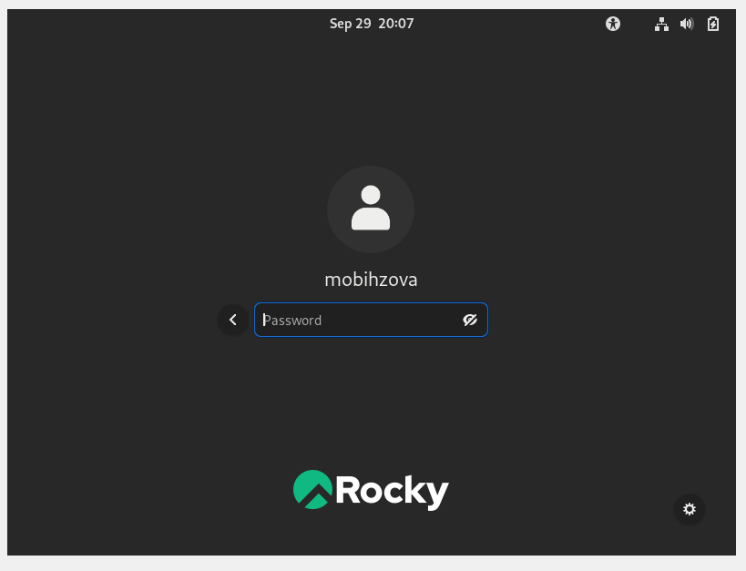{#fig:017 width=40%}

## Выводы

В ходе выполнения лабораторной работы были получены навыки управления системными службами операционной системы посредством systemd.

## Список литературы{.unnumbered}

1. Робачевский А., Немнюгин С., Стесик О. Операционная система UNIX. — 2-е изд. — БХВ-Петербург, 2010.
2. Колисниченко Д. Н. Самоучитель системного администратора Linux. — СПб. : БХВ-Петербург, 2011. — (Системный администратор).
3. Таненбаум Э., Бос Х. Современные операционные системы. — 4-е изд. — СПб. : Питер, 2015. — (Классика Computer Science).
4. Neil N. J. Learning CentOS: A Beginners Guide to Learning Linux. — CreateSpace Independent Publishing Platform, 2016.
5. Unix и Linux: руководство системного администратора / Э. Немет, Г. Снайдер, Т.Хейн, Б. Уэйли, Д. Макни. — 5-е изд. — СПб. : ООО «Диалектика», 2020.

