---
## Front matter
title: "Отчёт по лабораторной работе №5"
subtitle: "Дисциплина: Основы администрирования операционных систем"
author: "Бызова Мария Олеговна"

## Generic otions
lang: ru-RU
toc-title: "Содержание"

## Bibliography
bibliography: bib/cite.bib
csl: pandoc/csl/gost-r-7-0-5-2008-numeric.csl

## Pdf output format
toc: true # Table of contents
toc-depth: 2
lof: true # List of figures
lot: true # List of tables
fontsize: 12pt
linestretch: 1.5
papersize: a4
documentclass: scrreprt
## I18n polyglossia
polyglossia-lang:
  name: russian
  options:
	- spelling=modern
	- babelshorthands=true
polyglossia-otherlangs:
  name: english
## I18n babel
babel-lang: russian
babel-otherlangs: english
## Fonts
mainfont: IBM Plex Serif
romanfont: IBM Plex Serif
sansfont: IBM Plex Sans
monofont: IBM Plex Mono
mathfont: STIX Two Math
mainfontoptions: Ligatures=Common,Ligatures=TeX,Scale=0.94
romanfontoptions: Ligatures=Common,Ligatures=TeX,Scale=0.94
sansfontoptions: Ligatures=Common,Ligatures=TeX,Scale=MatchLowercase,Scale=0.94
monofontoptions: Scale=MatchLowercase,Scale=0.94,FakeStretch=0.9
mathfontoptions:
## Biblatex
biblatex: true
biblio-style: "gost-numeric"
biblatexoptions:
  - parentracker=true
  - backend=biber
  - hyperref=auto
  - language=auto
  - autolang=other*
  - citestyle=gost-numeric
## Pandoc-crossref LaTeX customization
figureTitle: "Рис."
tableTitle: "Таблица"
listingTitle: "Листинг"
lofTitle: "Список иллюстраций"
lotTitle: "Список таблиц"
lolTitle: "Листинги"
## Misc options
indent: true
header-includes:
  - \usepackage{indentfirst}
  - \usepackage{float} # keep figures where there are in the text
  - \floatplacement{figure}{H} # keep figures where there are in the text
---

# Цель работы

Целью данной работы является получение навыков управления системными службами операционной системы посредством systemd.

# Задание

1. Выполните основные операции по запуску (останову), определению статуса, добавле-
нию (удалению) в автозапуск и пр. службы Very Secure FTP (раздел 5.4.1).
2. Продемонстрируйте навыки по разрешению конфликтов юнитов для служб
firewalld и iptables (раздел 5.4.2).
3. Продемонстрируйте навыки работы с изолированными целями (разделы 5.4.3, 5.4.4).

# Выполнение лабораторной работы

## Управление сервисами

Для начала получим полномочия администратора su -. Затем проверим статус службы Very Secure FTP: systemctl status vsftpd. Вывод команды показывает, что сервис в настоящее время отключён, так как служба Very Secure FTP не установлена. Установим службу Very Secure FTP: dnf -y install vsftpd и запустим: systemctl start vsftpd (рис. [-@fig:001]).

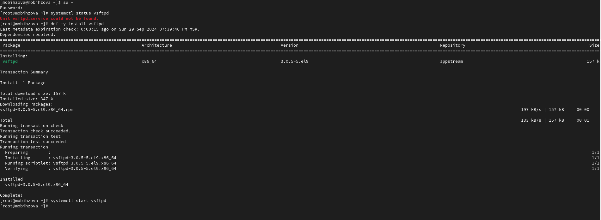{#fig:001 width=70%}

Снова проверим статус службы Very Secure FTP: systemctl status vsftpd. Вывод команды показывает, что служба в настоящее время работает, но не будет активирована при перезапуске операционной системы (рис. [-@fig:002]).

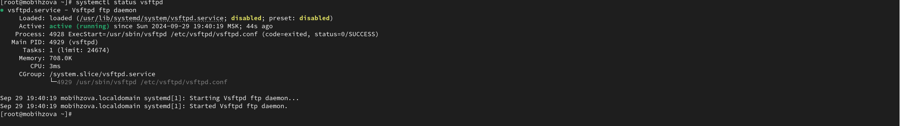{#fig:002 width=70%}

Добавим службу Very Secure FTP в автозапуск при загрузке операционной системы, используя команду systemctl enable vsftpd. Затем проверим статус службы и удалим службу из автозапуска, используя команду systemctl disable vsftpd, и снова проверим её статус (рис. [-@fig:003], рис. [-@fig:004]).

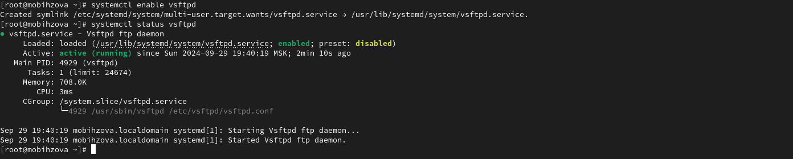{#fig:003 width=70%}

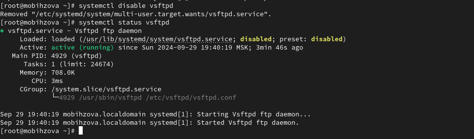{#fig:004 width=70%}

Далее выведем на экран символические ссылки, ответственные за запуск различных сервисов. Отображается, что ссылка на vsftpd.service не существует. Снова добавляем службу Very Secure FTP в автозапуск: systemctl enable vsftpd и выводим на экран символические ссылки, ответственные за запуск различных сервисов. Вывод команды показывает, что создана символическая ссылка для файла /usr/lib/systemd/system/vsftpd.service в каталоге /etc/systemd/system/multi-
user.target.wants. Проверяем статус службы Very Secure FTP: systemctl status vsftpd. Теперь мы видим, что для файла юнита состояние изменено с disabled на enabled (рис. [-@fig:005]).

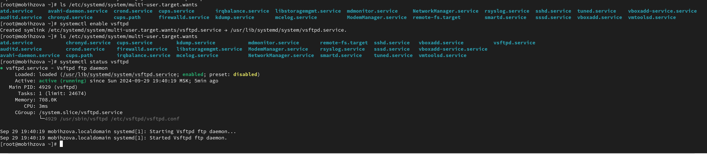{#fig:005 width=70%}

Выведем на экран список зависимостей юнита: systemctl list-dependencies vsftpd и список юнитов, которые зависят от данного юнита: systemctl list-dependencies vsftpd –reverse (рис. [-@fig:006], рис. [-@fig:007]).

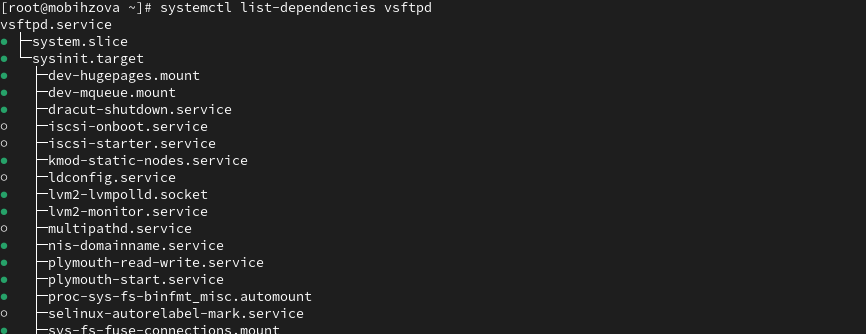{#fig:006 width=70%}

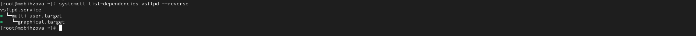{#fig:007 width=70%}

## Конфликты юнитов

Получим полномочия администратора su – и установим iptables: dnf -y install iptables\* (рис. [-@fig:008]).

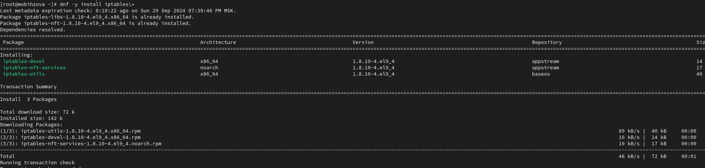{#fig:008 width=70%}

Далее проверим статус firewalld и iptables: systemctl status firewalld и systemctl status iptables (рис. [-@fig:009]).

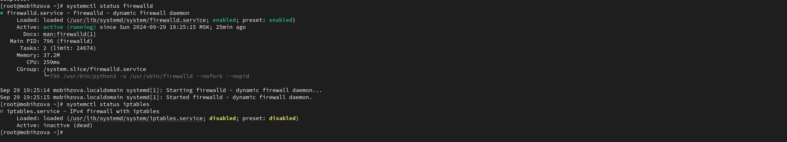{#fig:009 width=70%}

Попробуем запустить firewalld и iptables: systemctl start firewalld и systemctl start iptables. Мы видем, что при запуске одной службы вторая дезактивируется или не запускается (рис. [-@fig:010]).

{#fig:010 width=70%}

Введем cat /usr/lib/systemd/system/firewalld.service и опишем настройки конфликтов для этого юнита при наличии, далее введём cat /usr/lib/systemd/system/iptables.service и опишем настройки конфликтов для этого юнита (рис. [-@fig:011]).

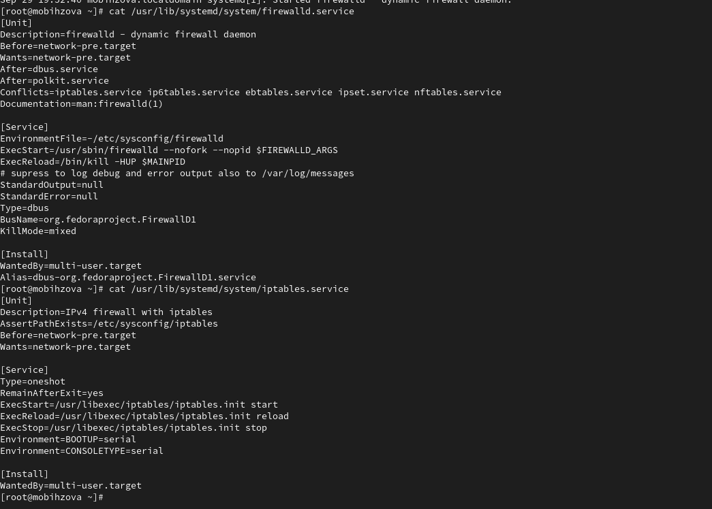{#fig:011 width=70%}

Выгрузим службу iptables (на всякий случай, чтобы убедиться, что данная служба не загружена в систему): systemctl stop iptables и загрузим службу firewalld: systemctl start firewalld. Далее заблокируем запуск iptables, введя: systemctl mask iptables. Видим, как создана символическая ссылка на /dev/null для /etc/systemd/system/iptables.service. Поскольку юнит-файлы в /etc/systemd имеют приоритет над файлами в /usr/lib/systemd, то это сделает невозможным случайный запуск сервиса iptables. Для проверки попробуем запустить iptables: systemptl start iptables. После попытки запуска появилось сообщение об ошибке, указывающее, что служба замаскирована и по этой причине не может быть запущена. Теперь попробуем добавить iptables в автозапуск: systemptl enable iptables. Показывает, что сервис неактивен, а статус загрузки отображается как замаскированный (рис. [-@fig:012]).

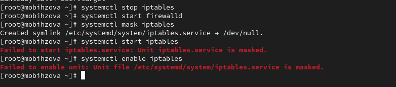{#fig:012 width=70%}

## Изолируемые цели

Получим полномочия администратора su – и перейдём в каталог systemd, найдём список всех целей, которые можно изолировать: cd /usr/lib/systemd/system grep Isolate *.target. На следующем шаге переключим операционную систему в режим восстановления: systemctl isolate rescue.target (рис. [-@fig:013]).

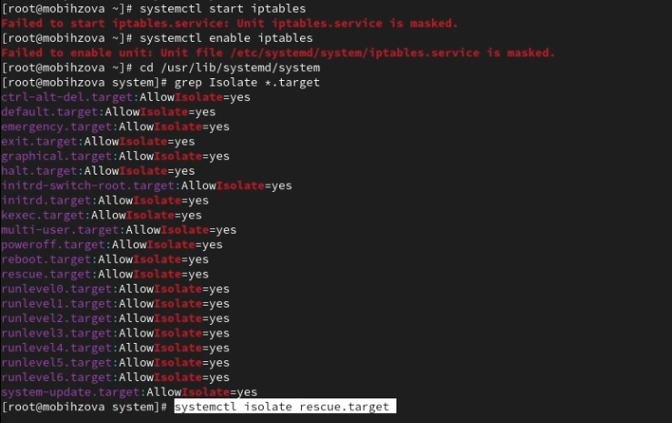{#fig:013 width=70%} 

Как только операционная система переключилась в режим восстановления вводим пароль root. После чего перезапустим операционную систему следующим образом: systemctl isolate reboot.target (рис. [-@fig:014]).

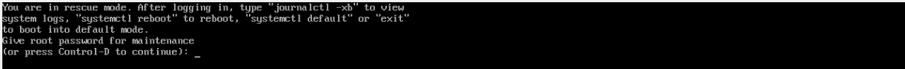{#fig:014 width=70%}

## Цель по умолчанию 

Получим полномочия администратора su – и выведем на экран цель, установленную по умолчанию: systemctl get-default. Для установки цели по умолчанию используется команда systemctl set-default. В нашем случае для запуска по умолчанию текстового режима введём systemctl set-default multi- user.target. После чего перезагрузим систему командой reboot (рис. [-@fig:015]).

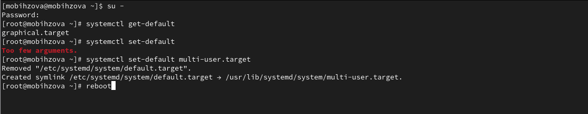{#fig:015 width=70%}

Убедимся, что система загрузилась в текстовом режиме, после чего получим полномочия администратора (для начала зайдём в пользователя mobihzova, а затем в режим администратора). Для запуска по умолчанию графического режима введём systemctl set-default graphical.target и вновь перегрузим систему командой reboot. Убедимся, что система загрузилась в графическом режиме (рис. [-@fig:016], рис. [-@fig:017]).

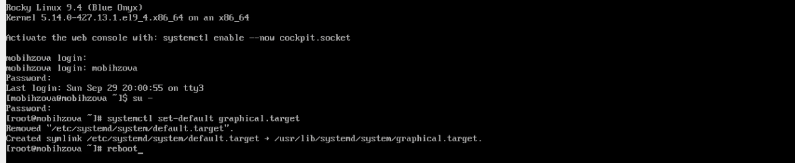{#fig:016 width=70%}

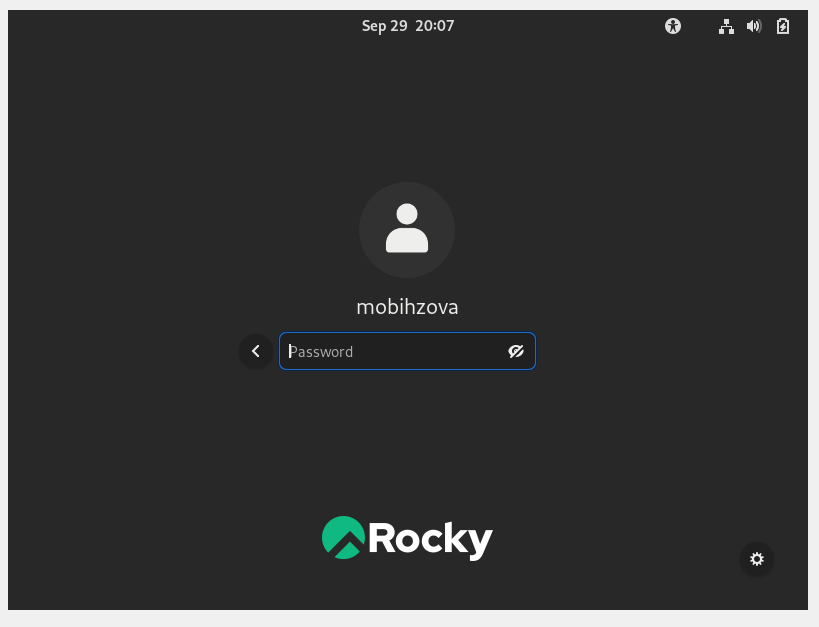{#fig:017 width=70%}

# Ответы на контрольные вопросы 

1. Что такое юнит (unit)? Приведите примеры. Unit – объект, которым может управлять система.

2. Какая команда позволяет вам убедиться, что цель больше не входит в список автоматического запуска при загрузке системы? systemctl is-enable “имя_юнита” (пример: systemctl is-enable vsftpd.service).

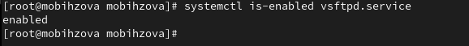{#fig:018 width=70%}

3. Какую команду вы должны использовать для отображения всех сервисных юнитов, которые в настоящее время загружены? system list-units.

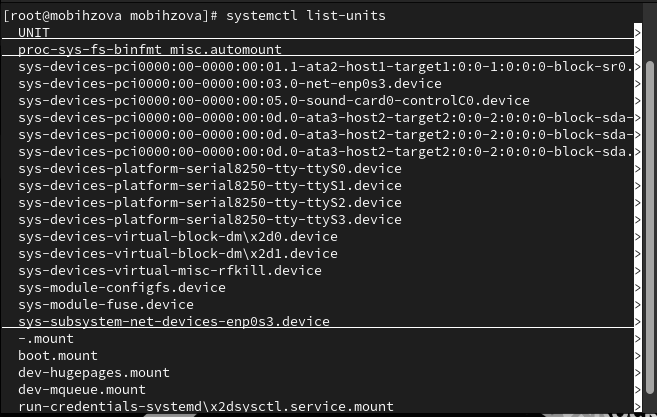{#fig:019 width=70%}

4. Как создать потребность (wants) в сервисе? Нужно внести всю необходимую информацию в переменную “Wants”, которая находится в файле имя_сервиса.service.

5. Как переключить текущее состояние на цель восстановления (rescue target)? systemctl set-default rescue.target.

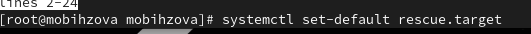{#fig:020 width=70%}

6. Поясните причину получения сообщения о том, что цель не может быть изолирована. Изолируя цель, мы запускаем эту цель со всеми её зависимостями. Не все цели могут быть изолированы (в случае, если цель является неотъемлемой частью system).

7. Вы хотите отключить службу systemd, но, прежде чем сделать это, вы хотите узнать, какие другие юниты зависят от этой службы. Какую команду вы бы использовали? systemctl list-dependencies “имя_юнита” --reverse (пример: systemctl list-dependencies firewalld.service --reverse).

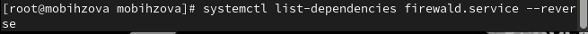{#fig:021 width=70%}

# Выводы

В ходе выполнения лабораторной работы были получены навыки управления системными службами операционной системы посредством systemd.

# Список литературы{.unnumbered}

1. Робачевский А., Немнюгин С., Стесик О. Операционная система UNIX. — 2-е изд. — БХВ-Петербург, 2010.
2. Колисниченко Д. Н. Самоучитель системного администратора Linux. — СПб. : БХВ-Петербург, 2011. — (Системный администратор).
3. Таненбаум Э., Бос Х. Современные операционные системы. — 4-е изд. — СПб. : Питер, 2015. — (Классика Computer Science).
4. Neil N. J. Learning CentOS: A Beginners Guide to Learning Linux. — CreateSpace Independent Publishing Platform, 2016.
5. Unix и Linux: руководство системного администратора / Э. Немет, Г. Снайдер, Т.Хейн, Б. Уэйли, Д. Макни. — 5-е изд. — СПб. : ООО «Диалектика», 2020.
