---
## Front matter
lang: ru-RU
title: "Лабораторная работа №6"
subtitle: Основы администрирования операционных систем.
author:
  - Бызова М.О.
institute:
  - Российский университет дружбы народов, Москва, Россия
date: 07 октября 2024

## i18n babel
babel-lang: russian
babel-otherlangs: english

## Formatting pdf
toc: false
toc-title: Содержание
slide_level: 2
aspectratio: 169
section-titles: true
theme: metropolis
header-includes:
 - \metroset{progressbar=frametitle,sectionpage=progressbar,numbering=fraction}
 
## Fonts 
mainfont: PT Serif 
romanfont: PT Serif 
sansfont: PT Sans 
monofont: PT Mono 
mainfontoptions: Ligatures=TeX 
romanfontoptions: Ligatures=TeX 
sansfontoptions: Ligatures=TeX,Scale=MatchLowercase 
monofontoptions: Scale=MatchLowercase,Scale=0.9 
---

## Цель работы

Целью данной работы является получение навыков управления процессами операционной системы.

## Задание

1. Продемонстрируйте навыки управления заданиями операционной системы (см. раз-
дел 6.4.1).
2. Продемонстрируйте навыки управления процессами операционной системы (см. раз-
дел 6.4.2).
3. Выполните задания для самостоятельной работы (см. раздел 6.5)

# Выполнение лабораторной работы

## Управление заданиями

Для начала получим полномочия администратора su – и введём следующие команды:

sleep 3600 &
dd if=/dev/zero of=/dev/null &
sleep 7200

Поскольку мы запустили последнюю команду без & после неё, у нас есть 2 часа, прежде чем мы снова получим контроль над оболочкой. Введём Ctrl + z , чтобы остановить процесс. Затем введём jobs и увидим три задания, которые мы только что запустили. Первые два имеют состояние Running, а последнее задание в настоящее время находится в состоянии Stopped. Для продолжения выполнения задания 3 в фоновом режиме введём bg 3 и с помощью команды jobs посмотрим изменения в статусе заданий (рис. 1).

## Управление заданиями

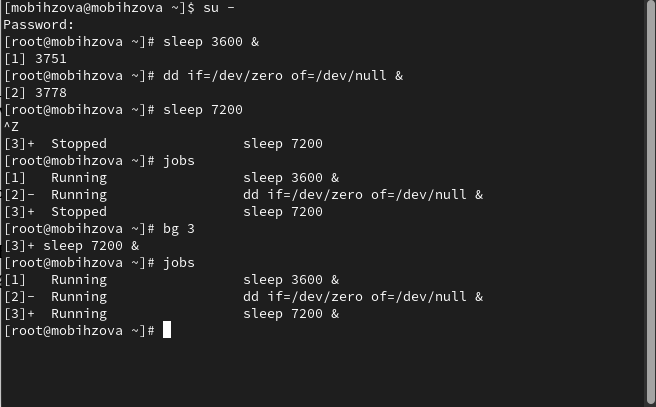{#fig:001 width=70%}

## Управление заданиями

Для перемещения задания 1 на передний план введём fg 1, далее введём Ctrl+ c, чтобы отменить задание 1. С помощью команды jobs посмотрим изменения в статусе заданий и проделаем то же самое для отмены заданий 2 и 3 (рис. 2).

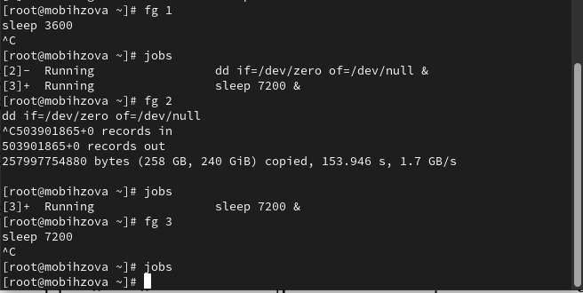{#fig:002 width=70%}

## Управление заданиями

Теперь откроем второй терминал и под учётной записью пользователя введём в нём: dd if=/dev/zero of=/dev/null &. После введём exit, чтобы закрыть второй терминал (рис. 3).

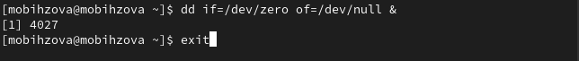{#fig:003 width=70%}

## Управление заданиями

На другом терминале под учётной записью своего пользователя запустим top. Мы увидим, что задание dd всё ещё запущено. Для выхода из top используем q и вновь запусткаем top, в нём используем k, чтобы убить задание dd. После этого выйдем из top (рис. 4).

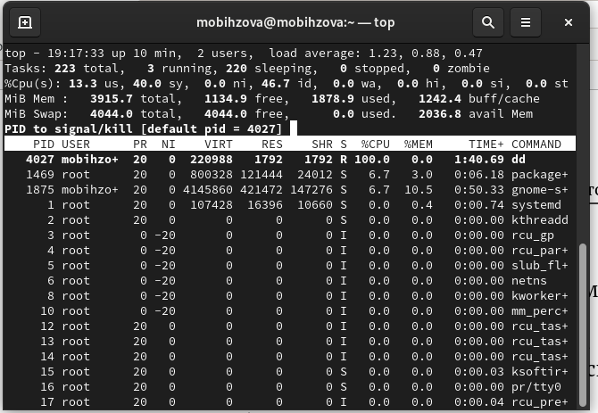{#fig:004 width=30%}

## Управление процессами

Получим полномочия администратора su - и введём следующие команды:

dd if=/dev/zero of=/dev/null &
dd if=/dev/zero of=/dev/null &
dd if=/dev/zero of=/dev/null &

После чего введём ps aux | grep dd, которое показывает все строки, в которых есть буквы dd. Запущенные процессы dd идут последними. Используем PID первого процесса dd, чтобы изменить приоритет (renice -n 5) (рис. 5).

## Управление процессами

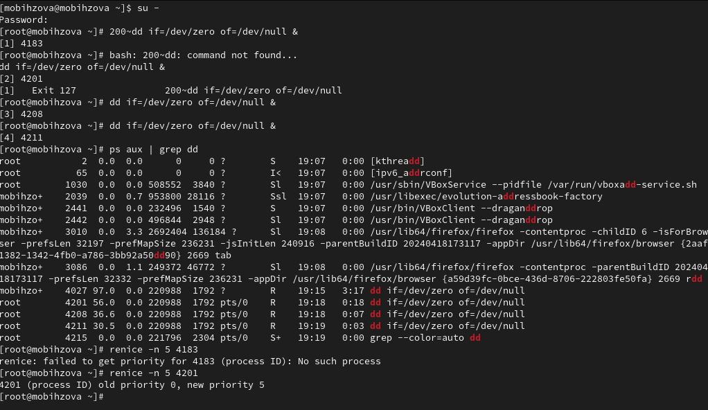{#fig:005 width=70%}

## Управление процессами

Введём ps fax | grep -B5 dd. Параметр -B5 показывает соответствующие запросу строки, включая пять строк до этого. Поскольку ps fax показывает иерархию отношений между процессами, мы также видим оболочку, из которой были запущены все процессы dd, и её PID (рис. 6).

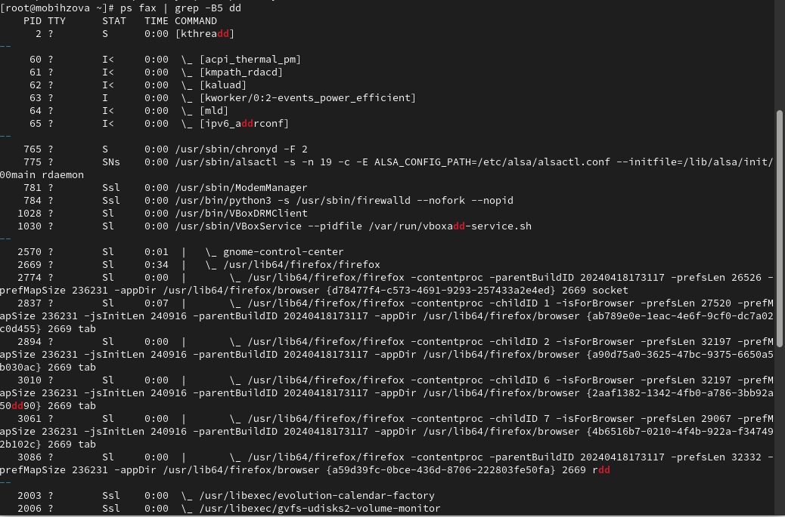{#fig:006 width=30%}

## Управление процессами

Теперь найдём PID корневой оболочки, из которой были запущены процессы dd, и введём kill -9 (указав PID оболочки). Мы увидим, что наша корневая оболочка закрылась, а вместе с ней и все процессы dd (остановка родительского процесса — простой и удобный способ остановить все его дочерние процессы) (рис. 7).

{#fig:007 width=70%}

# Выполнение заданий для самостоятельной работы 

## Самостоятельная работа (задание 1)

Получим полномочия администратора su – и запустим команду dd if=/dev/zero of=/dev/null & трижды как фоновое задание. Затем увеличим приоритет первой команды, используя значение приоритета −5, после чего изменим приоритет того же процесса ещё раз, но используем на этот раз значение −15 (мы можем менять приоритет команды от -20 (самый высокий приоритет) до 19 (самый низкий приоритет)). Завершим все процессы dd, которые мы запустили командой: killall dd (рис. 8, 9, 10, 11).

## Самостоятельная работа (задание 1)

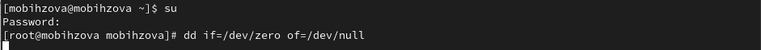{#fig:008 width=70%}

## Самостоятельная работа (задание 1)

{#fig:009 width=70%}

## Самостоятельная работа (задание 1)

{#fig:010 width=70%}

## Самостоятельная работа (задание 1)

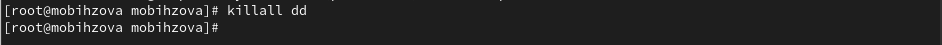{#fig:011 width=70%}

## Самостоятельная работа (задание 2)

Получим полномочия администратора su – и запустим программу yes в фоновом режиме с подавлением потока вывода, далее запустим программу yes на переднем плане с подавлением потока вывода и приостановим выполнение программы. Заново запустим программу yes с теми же параметрами, затем завершим её выполнение. Повторим действия, но уже запустим программу yes на переднем плане без подавления потока вывода Также приостановим выполнение программы и заново запустим программу yes с теми же параметрами, затем завершим её выполнение. Проверим состояния заданий, воспользовавшись командой jobs. Далее переведём процесс, который у нас выполняется в фоновом режиме, на передний план, затем остановим его. Переведём 3 процесс с подавлением потока вывода в фоновый режим (bg 3) и проверим состояния заданий, воспользовавшись командой jobs. Запустим процесс в фоновом режиме таким образом, чтобы он продолжил свою работу даже после отключения от терминала. Закроем окно и заново запустим консоль. Убедимся, что процесс продолжил свою работу (рис. 12).

## Самостоятельная работа (задание 2)

{#fig:012 width=70%}

## Самостоятельная работа (задание 2)

Сейчас получим информацию о запущенных в операционной системе процессах с помощью утилиты top (рис. 13).

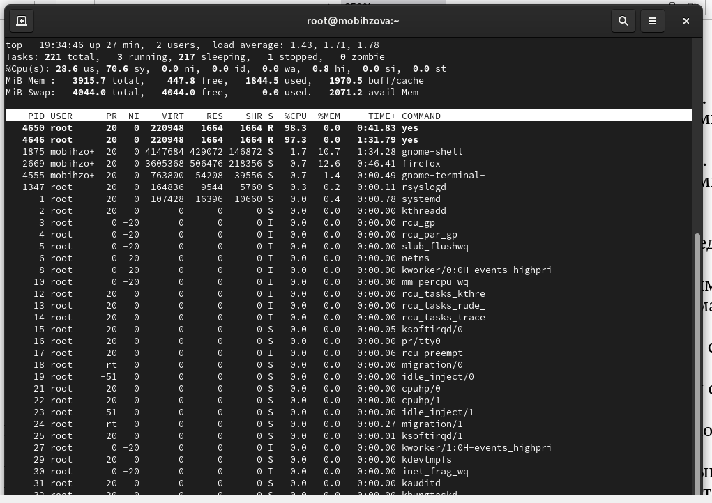{#fig:013 width=30%}

## Самостоятельная работа (задание 2)

Запустим ещё три программы yes в фоновом режиме с подавлением потока вывода (yes > /dev/null &). Убьём два процесса: для одного используем его PID (kill -9), а для другого — его идентификатор конкретного задания (fg 2 и Ctrl+c). Попробуем послать сигнал 1 (SIGHUP) процессу, запущенному с помощью nohup (kill -1), и обычному процессу (kill -1) (рис. 14).

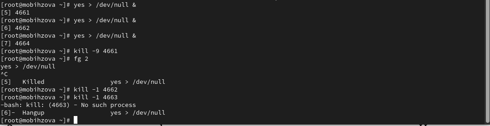{#fig:014 width=70%}

## Самостоятельная работа (задание 2)

Запустим ещё несколько программ yes в фоновом режиме с подавлением потока вывода (yes > /dev/null &) и завершим их работу одновременно, используя команду killall yes (рис. 15).

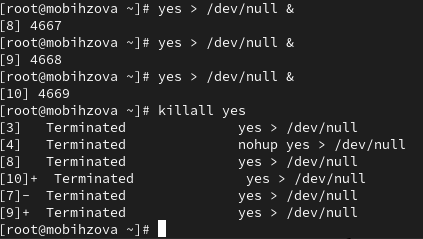{#fig:015 width=30%}

## Самостоятельная работа (задание 2)

После чего запустим программу yes в фоновом режиме с подавлением потока вывода (yes > /dev/null &). Используя утилиту nice (nice -n 15 yes), запустим программу yes с теми же параметрами и с приоритетом, большим на 5. Сравним абсолютные и относительные приоритеты у этих двух процессов (ps -l | grep yes). Используя утилиту renice, изменим приоритет у одного из потоков yes таким образом, чтобы у обоих потоков приоритеты были равны (renice -n 15) (рис. 16).

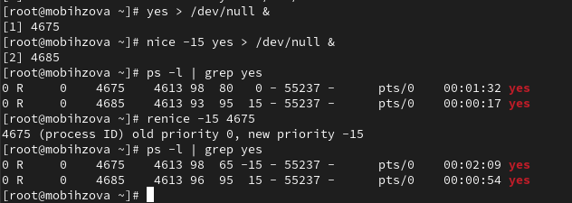{#fig:016 width=30%}

## Выводы

В ходе выполнения лабораторной работы были получены навыки управления процессами операционной системы.

## Список литературы{.unnumbered}

1. Робачевский А., Немнюгин С., Стесик О. Операционная система UNIX. — 2-е изд. — БХВ-Петербург, 2010.
2. Колисниченко Д. Н. Самоучитель системного администратора Linux. — СПб. : БХВ-Петербург, 2011. — (Системный администратор).
3. Таненбаум Э., Бос Х. Современные операционные системы. — 4-е изд. — СПб. : Питер, 2015. — (Классика Computer Science).
4. Neil N. J. Learning CentOS: A Beginners Guide to Learning Linux. — CreateSpace Independent Publishing Platform, 2016.
5. Unix и Linux: руководство системного администратора / Э. Немет, Г. Снайдер, Т.Хейн, Б. Уэйли, Д. Макни. — 5-е изд. — СПб. : ООО «Диалектика», 2020.
