---
## Front matter
title: "Отчёт по лабораторной работе №6"
subtitle: "Дисциплина: Основы администрирования операционных систем"
author: "Бызова Мария Олеговна"

## Generic otions
lang: ru-RU
toc-title: "Содержание"

## Bibliography
bibliography: bib/cite.bib
csl: pandoc/csl/gost-r-7-0-5-2008-numeric.csl

## Pdf output format
toc: true # Table of contents
toc-depth: 2
lof: true # List of figures
lot: true # List of tables
fontsize: 12pt
linestretch: 1.5
papersize: a4
documentclass: scrreprt
## I18n polyglossia
polyglossia-lang:
  name: russian
  options:
	- spelling=modern
	- babelshorthands=true
polyglossia-otherlangs:
  name: english
## I18n babel
babel-lang: russian
babel-otherlangs: english
## Fonts
mainfont: IBM Plex Serif
romanfont: IBM Plex Serif
sansfont: IBM Plex Sans
monofont: IBM Plex Mono
mathfont: STIX Two Math
mainfontoptions: Ligatures=Common,Ligatures=TeX,Scale=0.94
romanfontoptions: Ligatures=Common,Ligatures=TeX,Scale=0.94
sansfontoptions: Ligatures=Common,Ligatures=TeX,Scale=MatchLowercase,Scale=0.94
monofontoptions: Scale=MatchLowercase,Scale=0.94,FakeStretch=0.9
mathfontoptions:
## Biblatex
biblatex: true
biblio-style: "gost-numeric"
biblatexoptions:
  - parentracker=true
  - backend=biber
  - hyperref=auto
  - language=auto
  - autolang=other*
  - citestyle=gost-numeric
## Pandoc-crossref LaTeX customization
figureTitle: "Рис."
tableTitle: "Таблица"
listingTitle: "Листинг"
lofTitle: "Список иллюстраций"
lotTitle: "Список таблиц"
lolTitle: "Листинги"
## Misc options
indent: true
header-includes:
  - \usepackage{indentfirst}
  - \usepackage{float} # keep figures where there are in the text
  - \floatplacement{figure}{H} # keep figures where there are in the text
---

# Цель работы

Целью данной работы является получение навыков управления процессами операционной системы.

# Задание

1. Продемонстрируйте навыки управления заданиями операционной системы (см. раз-
дел 6.4.1).
2. Продемонстрируйте навыки управления процессами операционной системы (см. раз-
дел 6.4.2).
3. Выполните задания для самостоятельной работы (см. раздел 6.5)

# Выполнение лабораторной работы

## Управление заданиями

Для начала получим полномочия администратора su – и введём следующие команды:

sleep 3600 &
dd if=/dev/zero of=/dev/null &
sleep 7200

Поскольку мы запустили последнюю команду без & после неё, у нас есть 2 часа, прежде чем мы снова получим контроль над оболочкой. Введём Ctrl + z , чтобы остановить процесс. Затем введём jobs и увидим три задания, которые мы только что запустили. Первые два имеют состояние Running, а последнее задание в настоящее время находится в состоянии Stopped. Для продолжения выполнения задания 3 в фоновом режиме введём bg 3 и с помощью команды jobs посмотрим изменения в статусе заданий (рис. [-@fig:001]).

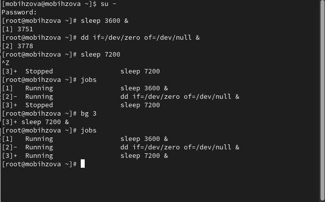{#fig:001 width=70%}

Для перемещения задания 1 на передний план введём fg 1, далее введём Ctrl+ c, чтобы отменить задание 1. С помощью команды jobs посмотрим изменения в статусе заданий и проделаем то же самое для отмены заданий 2 и 3 (рис. [-@fig:002]).

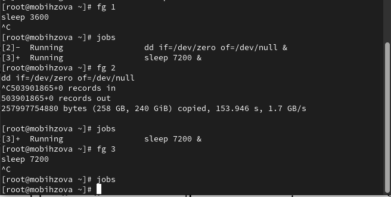{#fig:002 width=70%}

Теперь откроем второй терминал и под учётной записью пользователя введём в нём: dd if=/dev/zero of=/dev/null &. После введём exit, чтобы закрыть второй терминал (рис. [-@fig:003]).

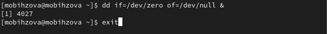{#fig:003 width=70%}

На другом терминале под учётной записью своего пользователя запустим top. Мы увидим, что задание dd всё ещё запущено. Для выхода из top используем q и вновь запусткаем top, в нём используем k, чтобы убить задание dd. После этого выйдем из top (рис. [-@fig:004]).

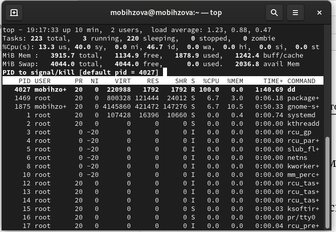{#fig:004 width=70%}

## Управление процессами

Получим полномочия администратора su - и введём следующие команды:

dd if=/dev/zero of=/dev/null &
dd if=/dev/zero of=/dev/null &
dd if=/dev/zero of=/dev/null &

После чего введём ps aux | grep dd, которое показывает все строки, в которых есть буквы dd. Запущенные процессы dd идут последними. Используем PID первого процесса dd, чтобы изменить приоритет (renice -n 5) (рис. [-@fig:005]).

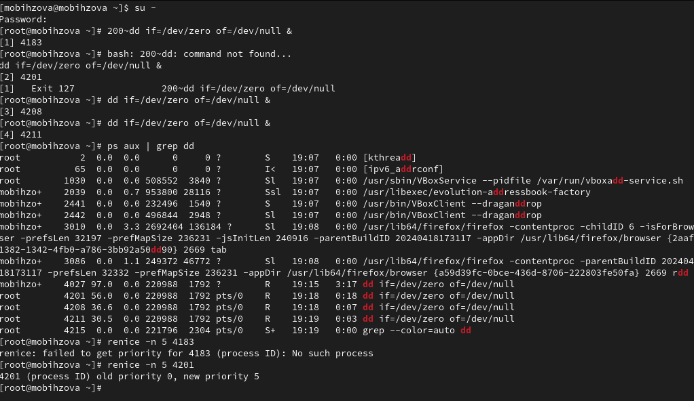{#fig:005 width=70%}

Введём ps fax | grep -B5 dd. Параметр -B5 показывает соответствующие запросу строки, включая пять строк до этого. Поскольку ps fax показывает иерархию отношений между процессами, мы также видим оболочку, из которой были запущены все процессы dd, и её PID (рис. [-@fig:006]).

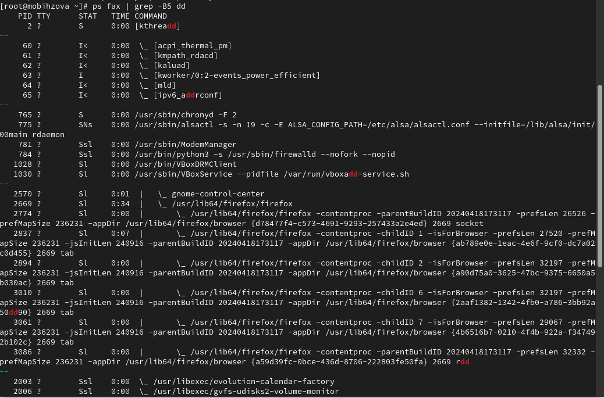{#fig:006 width=70%}

Теперь найдём PID корневой оболочки, из которой были запущены процессы dd, и введём kill -9 (указав PID оболочки). Мы увидим, что наша корневая оболочка закрылась, а вместе с ней и все процессы dd (остановка родительского процесса — простой и удобный способ остановить все его дочерние процессы) (рис. [-@fig:007]).

{#fig:007 width=70%}

# Выполнение заданий для самостоятельной работы 

## Самостоятельная работа (задание 1)

Получим полномочия администратора su – и запустим команду dd if=/dev/zero of=/dev/null & трижды как фоновое задание. Затем увеличим приоритет первой команды, используя значение приоритета −5, после чего изменим приоритет того же процесса ещё раз, но используем на этот раз значение −15 (мы можем менять приоритет команды от -20 (самый высокий приоритет) до 19 (самый низкий приоритет)). Завершим все процессы dd, которые мы запустили командой: killall dd (рис. [-@fig:008], [-@fig:009], [-@fig:010], [-@fig:011]).

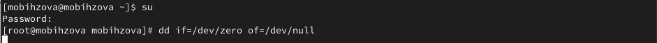{#fig:008 width=70%}

{#fig:009 width=70%}

{#fig:010 width=70%}

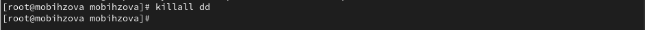{#fig:011 width=70%}

## Самостоятельная работа (задание 2)

Получим полномочия администратора su – и запустим программу yes в фоновом режиме с подавлением потока вывода (yes > /dev/null &), далее запустим программу yes на переднем плане с подавлением потока вывода и приостановим выполнение программы. Заново запустим программу yes с теми же параметрами, затем завершим её выполнение. Повторим действия, но уже запустим программу yes на переднем плане без подавления потока вывода (yes > /dev/null). Также приостановим выполнение программы и заново запустим программу yes с теми же параметрами, затем завершим её выполнение. Проверим состояния заданий, воспользовавшись командой jobs. Далее переведём процесс, который у нас выполняется в фоновом режиме, на передний план, затем остановим его (fg 1, после чего Ctrl+c). Переведём 3 процесс с подавлением потока вывода в фоновый режим (bg 3) и проверим состояния заданий, воспользовавшись командой jobs. Обратим внимание, что процесс стал выполняющимся (Running) в фоновом режиме. Запустим процесс в фоновом режиме таким образом, чтобы он продолжил свою работу даже после отключения от терминала (nohup yes > /dev/null &). Закроем окно и заново запустим консоль. Убедимся, что процесс продолжил свою работу (рис. [-@fig:012]).

{#fig:012 width=70%}

Сейчас получим информацию о запущенных в операционной системе процессах с помощью утилиты top (рис. [-@fig:013]).

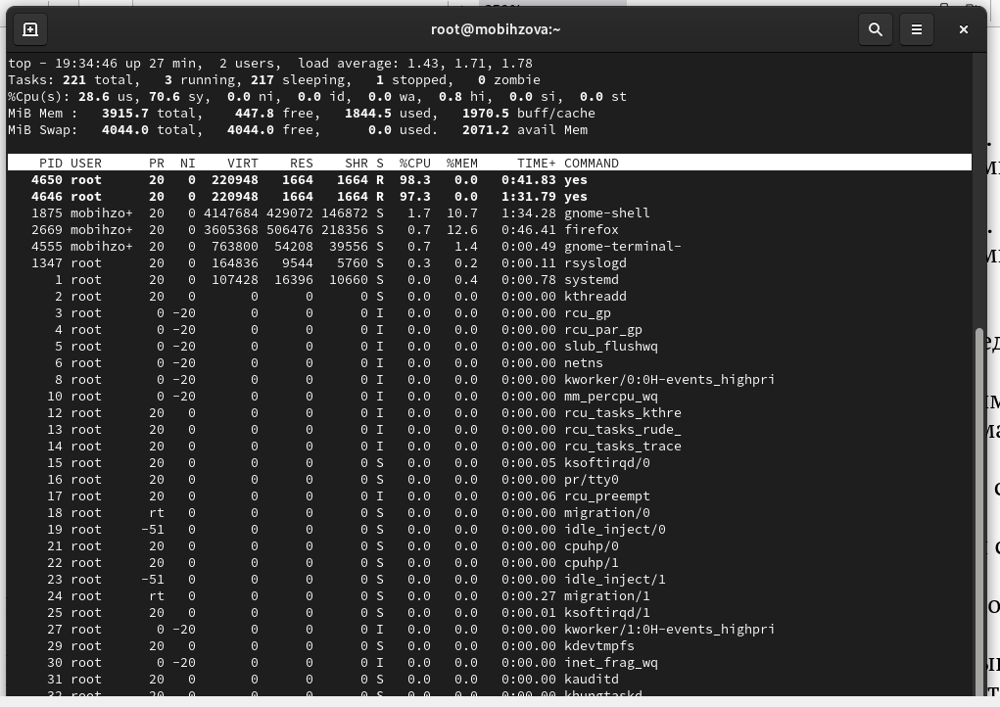{#fig:013 width=70%}

Запустим ещё три программы yes в фоновом режиме с подавлением потока вывода (yes > /dev/null &). Убьём два процесса: для одного используем его PID (kill -9), а для другого — его идентификатор конкретного задания (fg 2 и Ctrl+c). Попробуем послать сигнал 1 (SIGHUP) процессу, запущенному с помощью nohup (kill -1), и обычному процессу (kill -1) (рис. [-@fig:014]).

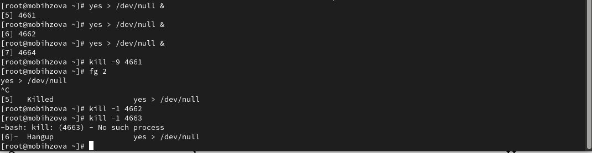{#fig:014 width=70%}

Запустим ещё несколько программ yes в фоновом режиме с подавлением потока вывода (yes > /dev/null &) и завершим их работу одновременно, используя команду killall yes (рис. [-@fig:015]).

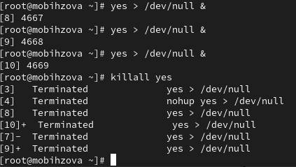{#fig:015 width=70%}

После чего запустим программу yes в фоновом режиме с подавлением потока вывода (yes > /dev/null &). Используя утилиту nice (nice -n 15 yes), запустим программу yes с теми же параметрами и с приоритетом, большим на 5. Сравним абсолютные и относительные приоритеты у этих двух процессов (ps -l | grep yes). Используя утилиту renice, изменим приоритет у одного из потоков yes таким образом, чтобы у обоих потоков приоритеты были равны (renice -n 15) (рис. [-@fig:016]).

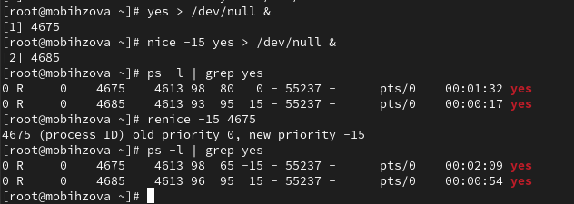{#fig:016 width=70%}

# Ответы на контрольные вопросы

1. Какая команда даёт обзор всех текущих заданий оболочки? jobs.

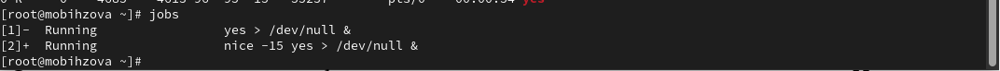{#fig:017 width=70%}

2. Как остановить текущее задание оболочки, чтобы продолжить его выполнение в фоновом режиме? bg номер_задания

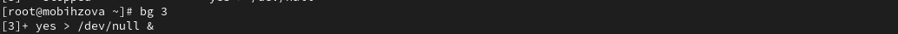{#fig:018 width=70%}

3. Какую комбинацию клавиш можно использовать для отмены текущего задания оболочки? Ctrl+c.

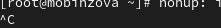{#fig:019 width=70%}

4. Необходимо отменить одно из начатых заданий. Доступ к оболочке, в которой в данный момент работает пользователь, невозможен. Что можно сделать, чтобы отменить задание? Внутри top использовать k, чтобы убить задание.

{#fig:020 width=70%}

5. Какая команда используется для отображения отношений между родительскими и дочерними процессами? ps fax.

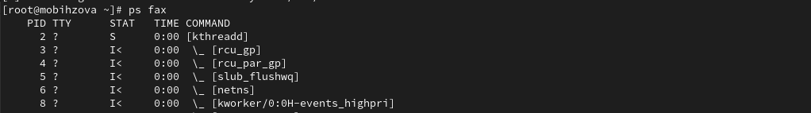{#fig:021 width=70%}

6. Какая команда позволит изменить приоритет процесса с идентификатором 1234 на более высокий? renice -n приоритет_процесса <PID>.

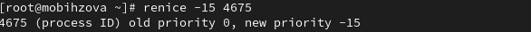{#fig:022 width=70%}

7. В системе в настоящее время запущено 20 процессов dd. Как проще всего остановить их все сразу? killall dd.

{#fig:023 width=70%}

8. Какая команда позволяет остановить команду с именем mycommand? Сначала узнаем PID процесса mycommand -ps aux | grep mycommand далее команда kill -9 <PID>.

9. Какая команда используется в top, чтобы убить процесс? k.

{#fig:024 width=70%}

10. Как запустить команду с достаточно высоким приоритетом, не рискуя, что не хватит ресурсов для других процессов? Запустить команду в фоновом режиме.

# Выводы

В ходе выполнения лабораторной работы были получены навыки управления процессами операционной системы.

# Список литературы{.unnumbered}

1. Робачевский А., Немнюгин С., Стесик О. Операционная система UNIX. — 2-е изд. — БХВ-Петербург, 2010.
2. Колисниченко Д. Н. Самоучитель системного администратора Linux. — СПб. : БХВ-Петербург, 2011. — (Системный администратор).
3. Таненбаум Э., Бос Х. Современные операционные системы. — 4-е изд. — СПб. : Питер, 2015. — (Классика Computer Science).
4. Neil N. J. Learning CentOS: A Beginners Guide to Learning Linux. — CreateSpace Independent Publishing Platform, 2016.
5. Unix и Linux: руководство системного администратора / Э. Немет, Г. Снайдер, Т.Хейн, Б. Уэйли, Д. Макни. — 5-е изд. — СПб. : ООО «Диалектика», 2020.
