---
## Front matter
lang: ru-RU
title: "Лабораторная работа №7"
subtitle: Основы администрирования операционных систем.
author:
  - Бызова М.О.
institute:
  - Российский университет дружбы народов, Москва, Россия
date: 14 октября 2024

## i18n babel
babel-lang: russian
babel-otherlangs: english

## Formatting pdf
toc: false
toc-title: Содержание
slide_level: 2
aspectratio: 169
section-titles: true
theme: metropolis
header-includes:
 - \metroset{progressbar=frametitle,sectionpage=progressbar,numbering=fraction}
 
## Fonts 
mainfont: PT Serif 
romanfont: PT Serif 
sansfont: PT Sans 
monofont: PT Mono 
mainfontoptions: Ligatures=TeX 
romanfontoptions: Ligatures=TeX 
sansfontoptions: Ligatures=TeX,Scale=MatchLowercase 
monofontoptions: Scale=MatchLowercase,Scale=0.9
---

## Цель работы

Целью данной работы является получение навыков работы с журналами мониторинга различных событий в системе.

## Задание

1. Продемонстрируйте навыки работы с журналом мониторинга событий в реальном времени (см. раздел 7.4.1).
2. Продемонстрируйте навыки создания и настройки отдельного файла конфигурации мониторинга отслеживания событий веб-службы (см. раздел 7.4.2).
3. Продемонстрируйте навыки работы с journalctl (см. раздел 7.4.3).
4. Продемонстрируйте навыки работы с journald (см. раздел 7.4.4).

# Выполнение лабораторной работы

## Мониторинг журнала системных событий в реальном времени

Для начала запустим три вкладки терминала и в каждом из них получим полномочия администратора: su -. На второй вкладке терминала запустим мониторинг системных событий в реальном времени: tail -f /var/log/messages (рис. 1)

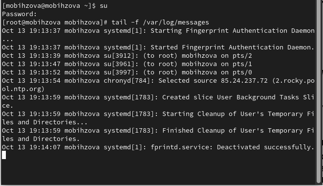{#fig:001 width=40%}

## Мониторинг журнала системных событий в реальном времени

В третьей вкладке терминала вернёмся к учётной записи своего пользователя (нажав Ctrl + d) и попробуем получить полномочия администратора, но при этом вводим неправильный пароль (рис. 2)

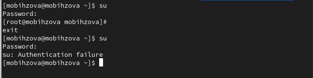{#fig:002 width=40%}

## Мониторинг журнала системных событий в реальном времени

Обратим внимание, что во второй вкладке терминала с мониторингом событий появилось сообщение «FAILED SU (to root) mobihzova on pts/2». Отображаемые на экране сообщения также фиксируются в файле /var/log/messages (рис. 3)

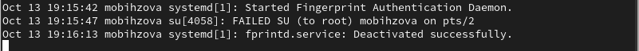{#fig:003 width=70%}

## Мониторинг журнала системных событий в реальном времени

В третьей вкладке терминала из оболочки пользователя введём: logger hello (рис. 4)

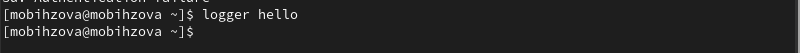{#fig:004 width=70%}

## Мониторинг журнала системных событий в реальном времени

Далее возвращаемся во вторую вкладку терминала с мониторингом событий и видим сообщение, которое также будет зафиксировано в файле /var/log/messages («hello»). В этой же вкладке терминала с мониторингом остановим трассировку файла сообщений мониторинга реального времени, используя Ctrl + c. Затем запустим мониторинг сообщений безопасности (последние 20 строк соответствующего файла логов): tail -n 20 /var/log/secure. Мы видим сообщения, которые ранее были зафиксированы во время ошибки авторизации при вводе команды su - (рис. 5)

## Мониторинг журнала системных событий в реальном времени

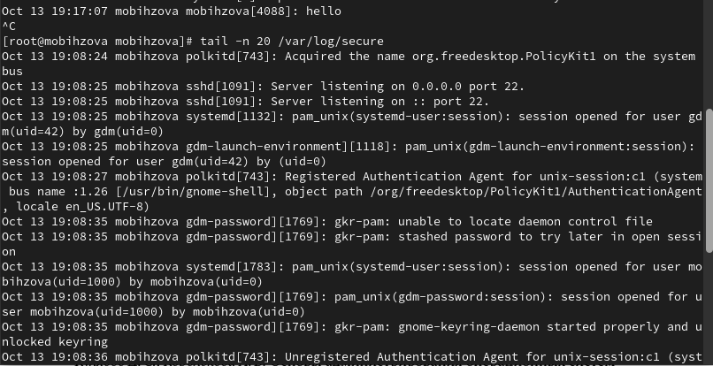{#fig:005 width=70%}

## Изменение правил rsyslog.conf

В первой вкладке терминала установим Apache: dnf -y install httpd (рис. 6).

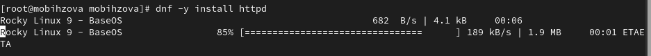{#fig:006 width=70%}

## Изменение правил rsyslog.conf

После окончания процесса установки запустим веб-службу: systemctl start httpd и systemctl enable httpd (рис. 7)

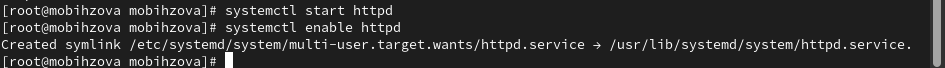{#fig:007 width=70%}

## Изменение правил rsyslog.conf

Во второй вкладке терминала посмотрим журнал сообщений об ошибках веб- службы: tail -f /var/log/httpd/error_log. Чтобы закрыть трассировку файла журнала, используем Ctrl + c (рис. 8)

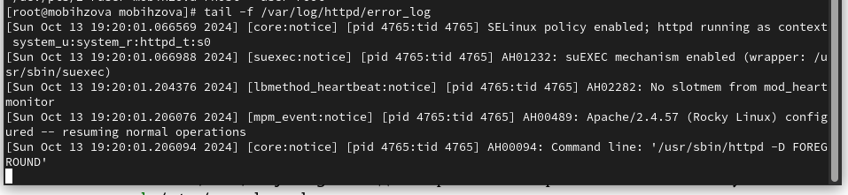{#fig:008 width=70%}

## Изменение правил rsyslog.conf

В третьей вкладке терминала получим полномочия администратора и в файле конфигурации /etc/httpd/conf/httpd.conf в конце
добавляем следующую строку: ErrorLog syslog:local (рис. 9, рис. 10).

Здесь local0 — local7 — это «настраиваемые» средства (объекты), которые syslog предоставляет пользователю для регистрации событий приложения в системном журнале.

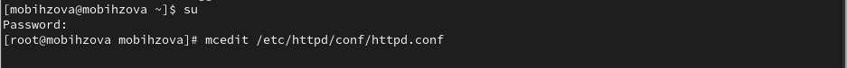{#fig:009 width=70%}

## Изменение правил rsyslog.conf

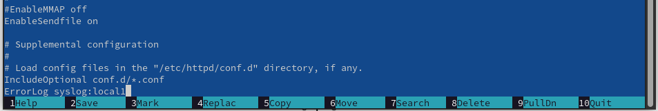{#fig:010 width=70%}

## Изменение правил rsyslog.conf

В каталоге /etc/rsyslog.d создаём файл мониторинга событий веб-службы:

cd /etc/rsyslog.d
touch httpd.conf

Открыв его на редактирование, пропишем в нём local1.* -/var/log/httpd-error.log (Рис. 2.7). Эта строка позволит отправлять все сообщения, получаемые для объекта local1 (который теперь используется службой httpd), в файл /var/log/httpderror.log (рис. 11, рис. 12).

## Изменение правил rsyslog.conf

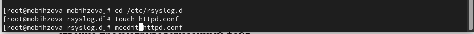{#fig:011 width=70%}

## Изменение правил rsyslog.conf

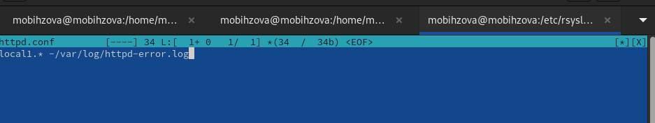{#fig:012 width=70%}

## Изменение правил rsyslog.conf

Перейдём в первую вкладку терминала и перезагрузим конфигурацию rsyslogd и веб-службу: 

systemctl restart rsyslog.service
systemctl restart httpd

Все сообщения об ошибках веб-службы теперь будут записаны в файл /var/log/httpd-error.log, что можно наблюдать или в режиме реального времени, используя команду tail с соответствующими параметрами, или непосредственно просматривая указанный файл. (рис. 13).

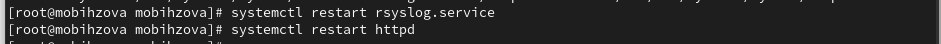{#fig:013 width=70%}

## Изменение правил rsyslog.conf

В третьей вкладке терминала создаём отдельный файл конфигурации для мониторинга отладочной информации:

cd /etc/rsyslog.d
touch debug.conf

В этом же терминале вводим: echo "*.debug /var/log/messages-debug" > /etc/rsyslog.d/debug.conf (рис. 14]).

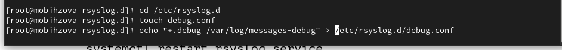{#fig:014 width=70%}

## Изменение правил rsyslog.conf

В первой вкладке терминала снова перезапустим rsyslogd: systemctl restart rsyslog.service (рис. 15).

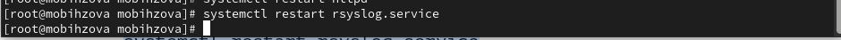{#fig:015 width=70%}

## Изменение правил rsyslog.conf

Во второй вкладке терминала запустим мониторинг отладочной информации: tail -f /var/log/messages-debug (рис. 16).

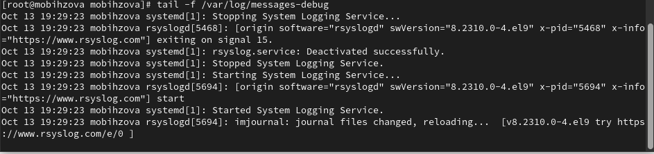{#fig:016 width=70%}

## Изменение правил rsyslog.conf

В третьей вкладке терминала введём: logger -p daemon.debug "Daemon Debug Message" (рис. 17).

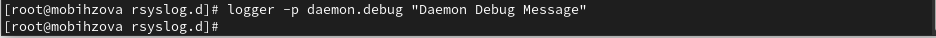{#fig:017 width=70%}

## Изменение правил rsyslog.conf

В терминале с мониторингом посмотрим сообщение отладки. Чтобы закрыть трассировку файла журнала, используем Ctrl + c (рис. 18).

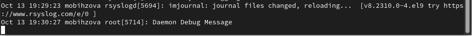{#fig:018 width=70%}

## Использование journalctl

Во второй вкладке терминала посмотрим содержимое журнала с событиями с момента последнего запуска системы: journalctl. Для пролистывания журнала можно использовать или Enter (построчный просмотр), или пробел (постраничный просмотр). Для выхода из просмотра используется q (рис. 19).

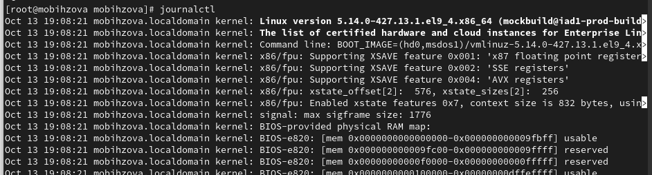{#fig:019 width=70%}

## Использование journalctl

Просмотрим содержимое журнала без использования пейджера: journalctl -- no-pager (рис. 20).

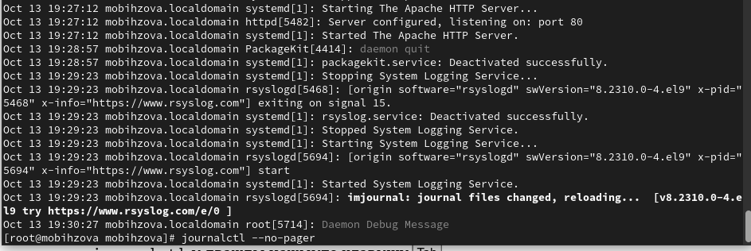{#fig:020 width=70%}

## Использование journalctl

Режим просмотра журнала в реальном времени: journalctl -f. Для прерывания просмотра: Ctrl + c (рис. 21).

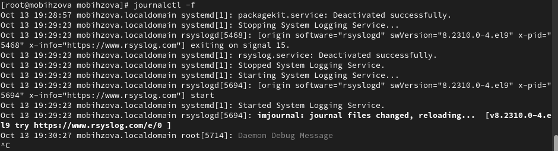{#fig:021 width=70%}

## Использование journalctl

Просмотрим события для UID0: journalctl _UID=0 (рис. 22).

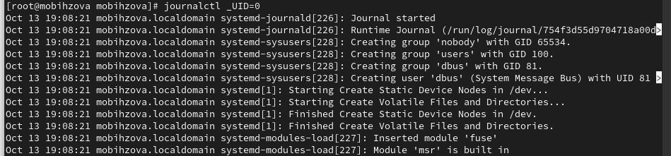{#fig:022 width=70%}

## Использование journalctl

Для отображения последних 20 строк журнала введём: journalctl -n 20 (рис. 23).

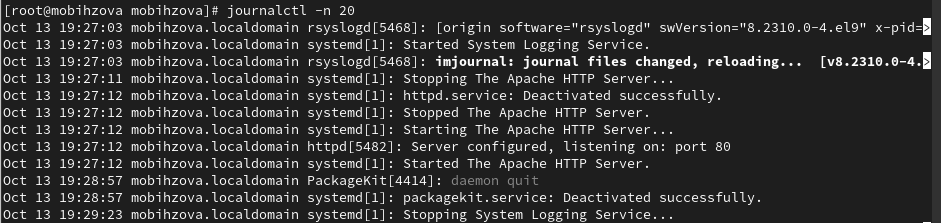{#fig:023 width=70%}

## Использование journalctl

Для просмотра только сообщений об ошибках введём: journalctl -p err (рис. 24).

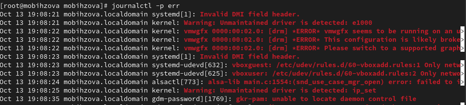{#fig:024 width=70%}

## Использование journalctl

Если мы хотим просмотреть сообщения журнала, записанные за определённый период времени, мы можем использовать параметры --since и -- until. Обе опции принимают параметр времени в формате YYYY-MM-DD hh:mm:ss Кроме того, мы можем использовать yesterday, today и tomorrow в качестве параметров. Например, для просмотра всех сообщений со вчерашнего дня введём: journalctl --since yesterday (рис. 25).

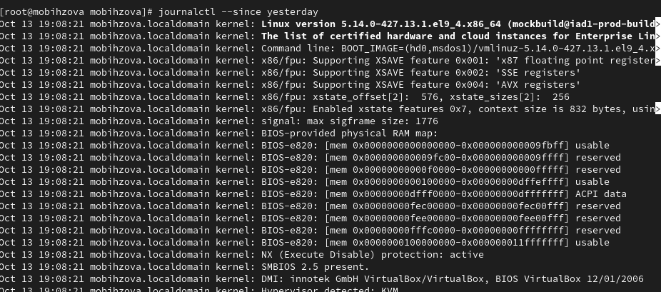{#fig:025 width=40%}

## Использование journalctl

Если мы хотим показать все сообщения с ошибкой приоритета, которые были зафиксированы со вчерашнего дня, то используем: journalctl --since yesterday - p err, а если нам нужна детальная информация, то используем: journalctl -o verbose (рис. 26).

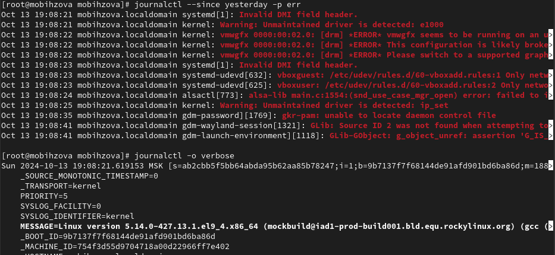{#fig:026 width=50%}

## Использование journalctl

Для просмотра дополнительной информации о модуле sshd введём: journalctl _SYSTEMD_UNIT=sshd.service (рис. 27).

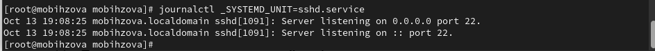{#fig:027 width=70%}

## Постоянный журнал journald 

Запустим терминал и получим полномочия администратора: su -. Далее создадим каталог для хранения записей журнала: mkdir -p /var/log/journal и скорректируем права доступа для каталога /var/log/journal, чтобы journald смог записывать в него информацию:

chown root:systemd-journal /var/log/journal
chmod 2755 /var/log/journal

Для принятия изменений необходимо использовать команду: killall -USR1 systemd-journald. Журнал systemd теперь постоянный. Если мы хотим видеть сообщения журнала с момента последней перезагрузки, используем: journalctl -b (рис. 28).

## Постоянный журнал journald 

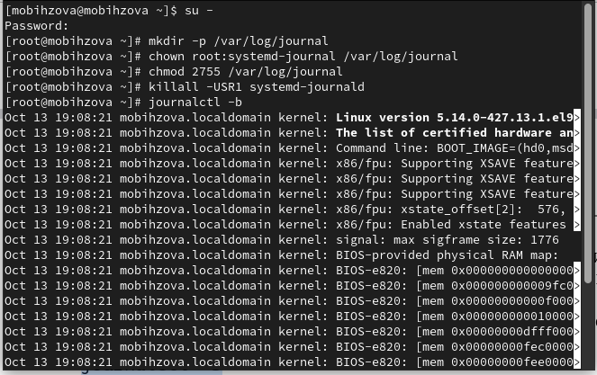{#fig:028 width=50%}

## Выводы

В ходе выполнения лабораторной работы были получены навыки работы с журналами мониторинга различных событий в системе.

## Список литературы{.unnumbered}

1. Робачевский А., Немнюгин С., Стесик О. Операционная система UNIX. — 2-е изд. — БХВ-Петербург, 2010.
2. Колисниченко Д. Н. Самоучитель системного администратора Linux. — СПб. : БХВ-Петербург, 2011. — (Системный администратор).
3. Таненбаум Э., Бос Х. Современные операционные системы. — 4-е изд. — СПб. : Питер, 2015. — (Классика Computer Science).
4. Neil N. J. Learning CentOS: A Beginners Guide to Learning Linux. — CreateSpace Independent Publishing Platform, 2016.
5. Unix и Linux: руководство системного администратора / Э. Немет, Г. Снайдер, Т.Хейн, Б. Уэйли, Д. Макни. — 5-е изд. — СПб. : ООО «Диалектика», 2020.

