---
## Front matter
title: "Отчёт по лабораторной работе №8"
subtitle: "Дисциплина: Основы администрирования операционных систем"
author: "Бызова Мария Олеговна"

## Generic otions
lang: ru-RU
toc-title: "Содержание"

## Bibliography
bibliography: bib/cite.bib
csl: pandoc/csl/gost-r-7-0-5-2008-numeric.csl

## Pdf output format
toc: true # Table of contents
toc-depth: 2
lof: true # List of figures
lot: true # List of tables
fontsize: 12pt
linestretch: 1.5
papersize: a4
documentclass: scrreprt
## I18n polyglossia
polyglossia-lang:
  name: russian
  options:
	- spelling=modern
	- babelshorthands=true
polyglossia-otherlangs:
  name: english
## I18n babel
babel-lang: russian
babel-otherlangs: english
## Fonts
mainfont: IBM Plex Serif
romanfont: IBM Plex Serif
sansfont: IBM Plex Sans
monofont: IBM Plex Mono
mathfont: STIX Two Math
mainfontoptions: Ligatures=Common,Ligatures=TeX,Scale=0.94
romanfontoptions: Ligatures=Common,Ligatures=TeX,Scale=0.94
sansfontoptions: Ligatures=Common,Ligatures=TeX,Scale=MatchLowercase,Scale=0.94
monofontoptions: Scale=MatchLowercase,Scale=0.94,FakeStretch=0.9
mathfontoptions:
## Biblatex
biblatex: true
biblio-style: "gost-numeric"
biblatexoptions:
  - parentracker=true
  - backend=biber
  - hyperref=auto
  - language=auto
  - autolang=other*
  - citestyle=gost-numeric
## Pandoc-crossref LaTeX customization
figureTitle: "Рис."
tableTitle: "Таблица"
listingTitle: "Листинг"
lofTitle: "Список иллюстраций"
lotTitle: "Список таблиц"
lolTitle: "Листинги"
## Misc options
indent: true
header-includes:
  - \usepackage{indentfirst}
  - \usepackage{float} # keep figures where there are in the text
  - \floatplacement{figure}{H} # keep figures where there are in the text
---

# Цель работы

Целью данной работы является получение навыков работы с планировщиками событий cron и at.

# Задание

1. Выполните задания по планированию задач с помощью crond (см. раздел 8.4.1).
2. Выполните задания по планированию задач с помощью atd (см. раздел 8.4.2).

# Выполнение лабораторной работы

## Планирование задач с помощью cron

Запустим терминал и получим полномочия администратора: su -. Просмотрим статус демона crond: systemctl status crond -l и содержимое файла конфигурации /etc/crontab: cat /etc/crontab (рис. [-@fig:001]).

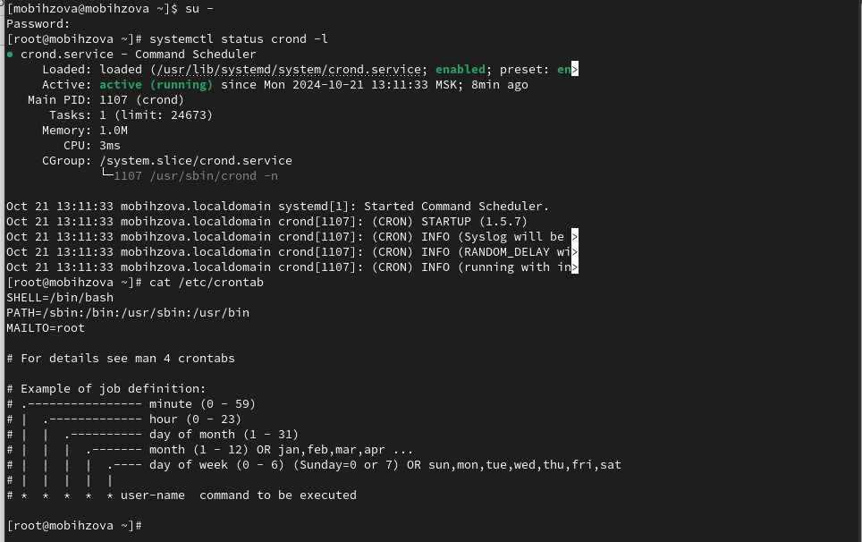{#fig:001 width=70%}

Теперь просмотрим список заданий в расписании: crontab -l. Ничего не отобразилось, так как расписание ещё не задано. Далее откроем файл расписания на редактирование: crontab -e (рис. [-@fig:002]).

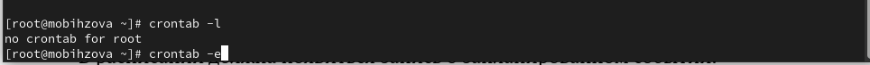{#fig:002 width=70%}

Предыдущая команда запустила интерфейс редактора (по умолчанию используется vi). Добавим следующую строку в файл расписания (запись сообщения в системный журнал), используя Ins для перехода в vi в режим ввода: */1 * * * * logger This message is written from root cron. Закроем сеанс редактирования vi и сохраним изменения, используя команду vi: Esc : wq. (рис. [-@fig:003]).

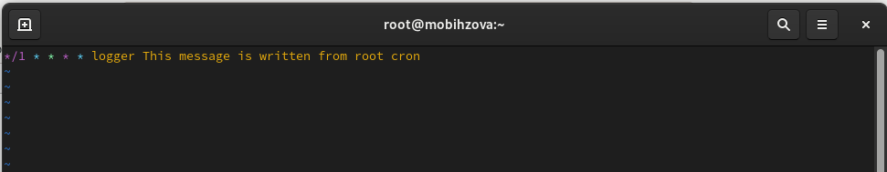{#fig:003 width=70%}

Давайте разберём синтаксис этой записи: 
 
1. */1 - Запуск задания каждую минуту. Частота определяется первой звездочкой: */1 означает "каждую минуту". Часто вместо */1 можно увидеть просто *, так как каждую минуту является условием по умолчанию. 
2. ****  - Упоминание отдельных звездочек говорит о том, что задание будет выполняться каждую минуту каждого часа, дня, месяца, и дня недели, поскольку второе, третье, четвертое и пятое поля - это день месяца, месяц и день недели, соответственно. 
3. logger - Команда, которая будет выполняться каждый раз, когда cron запускает задачу. В данном случае это команда logger. 
4. This message is written from root cron - Сообщение, отправляемое командой logger в системный журнал. 
 
Таким образом, эта запись установит задачу, которая будет каждые 60 секунд записывать сообщение "This message is written from root cron" в системный журнал вашего компьютера.

Просмотрим список заданий в расписании: crontab -l (в расписании появилась запись о запланированном событии). Не выключая систему, через некоторое время (2–3 минуты) просмотрим журнал системных событий: grep written /var/log/messages (рис. [-@fig:004]).

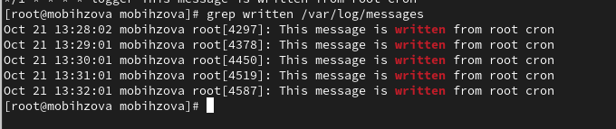{#fig:004 width=70%}

Вернёмся в текстовый редактор vi и изменим запись в расписании crontab на следующую: 0 */1 * * 1-5 logger This message is written from root cron (рис. [-@fig:005]).

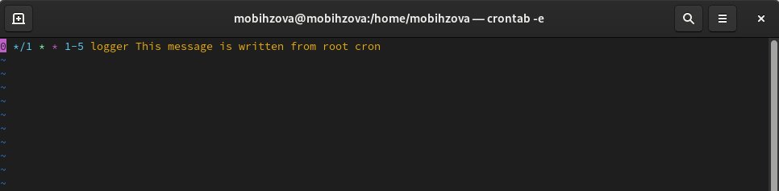{#fig:005 width=70%}

Синтаксис записи в crontab: 
 
1. 0 */1 * * 1-5 -  это шаблон запуска задачи.  Он состоит из пяти полей, разделенных пробелами: 
2. * 0 - Минута. Задача будет запускаться в 0-ю минуту каждого часа. 
3. * */1 - Час. Звездочка (*) означает "каждый", /1  означает "каждый час". 
4. * - День месяца. Звездочка означает "каждый день месяца". 
5. * - Месяц. Звездочка означает "каждый месяц". 
6. 1-5 - День недели.  Диапазон 1-5 означает "с понедельника по пятницу". 
7. logger This message is written from root cron -  Это команда, которая будет выполняться по расписанию. В данном случае команда logger записывает сообщение в системный журнал (syslog). 
 
В итоге, данная запись crontab означает: "Каждую минуту, начиная с 0-ой минуты каждого часа, с понедельника по пятницу, запускать команду logger с сообщением This message is written from root cron".

Теперь просмотрим список заданий в расписании: crontab -l (рис. [-@fig:006]).

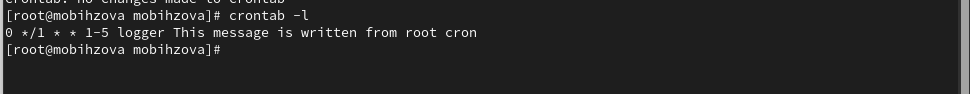{#fig:006 width=70%}

Перейдём в каталог /etc/cron.hourly и создадим в нём файл сценария с именем eachhour (рис. [-@fig:007]).

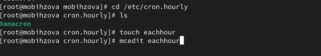{#fig:007 width=70%}

Далее откроем файл eachhour для редактирования и пропишем в нём следующий скрипт (запись сообщения в системный журнал) (рис. [-@fig:008]).

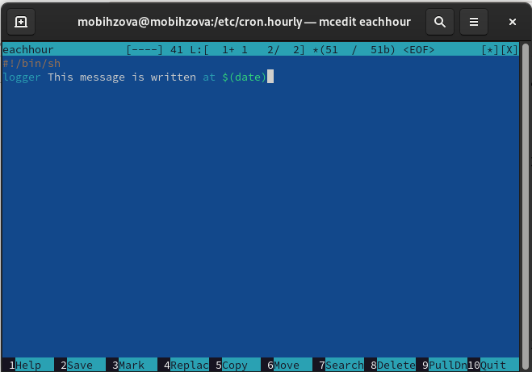{#fig:008 width=70%}

Сделаем файл сценария eachhour исполняемым. Теперь перейдём в каталог /etc/crond.d и создадим в нём файл с расписанием
eachhour (рис. [-@fig:009]).

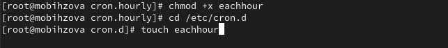{#fig:009 width=70%}

Откроем этот файл для редактирования и поместим в него следующее содержимое (рис. [-@fig:010]).

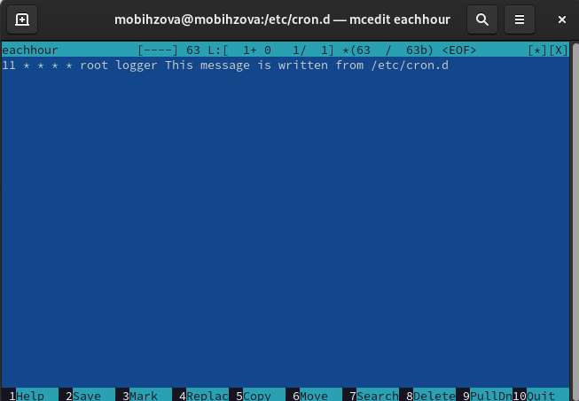{#fig:010 width=70%}

Синтаксис записи в crontab: 
 
1. 11 * * * * -  это шаблон запуска задачи.  Он состоит из пяти полей, разделенных пробелами: 
2. 11 - Минута. Задача будет запускаться в 11-ю минуту каждого часа. 
3. * - Час. Звездочка означает "каждый час". 
4. * - День месяца. Звездочка означает "каждый день месяца". 
5. * - Месяц. Звездочка означает "каждый месяц". 
6. * - День недели. Звездочка означает "каждый день недели". 
7. root -  Это имя пользователя, от которого будет запускаться задание. В данном случае, задание будет запускаться от пользователя root. 
8. logger This message is written from /etc/cron.d -  Это команда, которая будет выполняться по расписанию. В данном случае команда logger записывает сообщение в системный журнал (syslog). 
 
В итоге, данная запись crontab означает: "Каждую минуту, начиная с 11-ой минуты каждого часа, запускать от имени пользователя root команду logger с сообщением This message is written from /etc/cron.d".

Не выключая систему, через некоторое время (2 часа) просмотрим журнал системных событий. По журналу видим, что запуск сценария eachhour в соответствии с заданным расписанием был осуществлён (рис. [-@fig:011]).

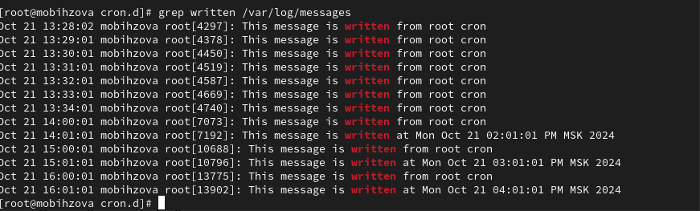{#fig:011 width=70%}

## Планирование заданий с помощью at

Запустим терминал и получим полномочия администратора: su -. Проверим, что служба atd загружена и включена: systemctl status atd. Зададим выполнение команды logger message from at в 17:00. Для этого введём at 17:00, а затем logger message from at. Используем Ctrl + d, чтобы закрыть оболочку. Убедимся, что задание действительно запланировано: atq. С помощью команды grep from at /var/log/messages посмотрим, появилось ли соответствующее сообщение в лог- файле в указанное вами время (сообщение появилось) (рис. [-@fig:012]).

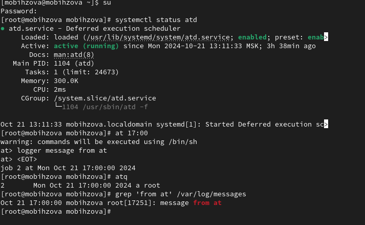{#fig:012 width=70%}

# Ответы на контрольные вопросы 

1. Как настроить задание cron, чтобы оно выполнялось раз в 2 недели? 00 00 1,15 * * logger task

2. Как настроить задание cron, чтобы оно выполнялось 1-го и 15-го числа каждого месяца в 2 часа ночи? 00 02 1,15 * * logger task

3. Как настроить задание cron, чтобы оно выполнялось каждые 2 минуты каждый день? */2 * * * * logger task

4. Как настроить задание cron, чтобы оно выполнялось 19 сентября ежегодно? * * 19 9 logger task

5. Как настроить задание cron, чтобы оно выполнялось каждый четверг сентября ежегодно? * * * * 4 logger task

6. Какая команда позволяет вам назначить задание cron для пользователя alice? Приведите подтверждающий пример. * * * * alice logger task

7. Как указать, что пользователю bob никогда не разрешено назначать задания через cron? Приведите подтверждающий пример. Записать его в /etc/cron.deny

8. Вам нужно убедиться, что задание выполняется каждый день, даже если сервер во время выполнения временно недоступен. Как это сделать? Найти задание в логах grep cron /var/log/messages 

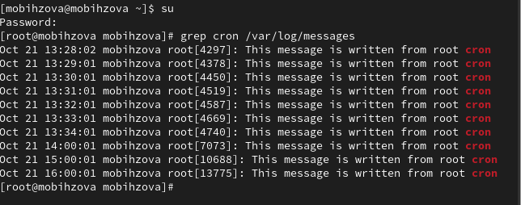{#fig:013 width=70%}

9. Какая команда позволяет узнать, запланированы ли какие-либо задания на выполнение планировщиком atd? atq

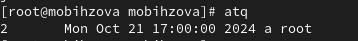{#fig:014 width=70%}

# Выводы

В ходе выполнения лабораторной работы были получены навыки работы с планировщиками событий cron и at.

# Список литературы{.unnumbered}

1. Робачевский А., Немнюгин С., Стесик О. Операционная система UNIX. — 2-е изд. — БХВ-Петербург, 2010.
2. Колисниченко Д. Н. Самоучитель системного администратора Linux. — СПб. : БХВ-Петербург, 2011. — (Системный администратор).
3. Таненбаум Э., Бос Х. Современные операционные системы. — 4-е изд. — СПб. : Питер, 2015. — (Классика Computer Science).
4. Neil N. J. Learning CentOS: A Beginners Guide to Learning Linux. — CreateSpace Independent Publishing Platform, 2016.
5. Unix и Linux: руководство системного администратора / Э. Немет, Г. Снайдер, Т.Хейн, Б. Уэйли, Д. Макни. — 5-е изд. — СПб. : ООО «Диалектика», 2020.
